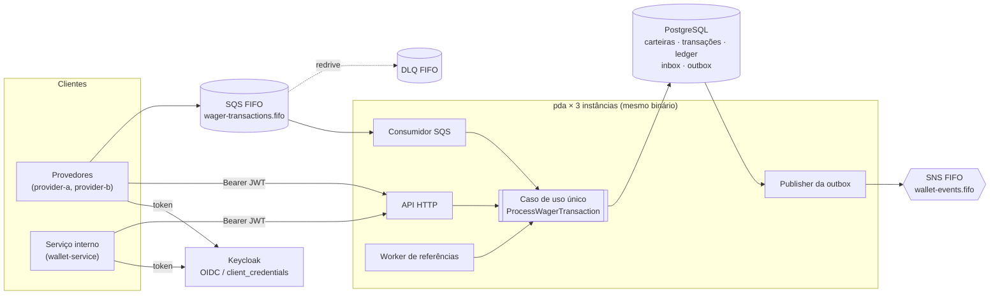

# Arquitetura

Serviço em Go que movimenta carteiras de jogadores a partir de operações de provedores de jogos (`BET`, `WIN`, `LOSS`, `REFUND`, `ROLLBACK`), recebidas por **HTTP** e por **SQS**, com as mesmas garantias nos dois canais: precisão monetária, ledger auditável, idempotência persistente, coordenação entre várias instâncias e recuperação de falhas.

Este documento é **autossuficiente**: cada seção traz a decisão, o motivo e as consequências. Os detalhes operacionais (DDL, catálogos completos, parâmetros e roteiros de teste) estão nos documentos de [`docs/`](docs/), indicados em cada seção. O enunciado original está em [`CHALLENGE.md`](CHALLENGE.md).

> **Documento vivo.** Escrito antes da implementação, a partir das decisões registradas em [`docs/decisions.md`](docs/decisions.md). Ele é atualizado ao fim de cada marco se a implementação detalhar ou alterar alguma decisão. As seções de limitações e de trabalho não concluído são fechadas na entrega.

---

## 1. Visão geral

- **Um binário, quatro papéis:** API HTTP, consumidor SQS, publisher da outbox e worker de referências, habilitáveis por variável de ambiente. O `docker compose` sobe **3 réplicas** independentes, cada uma com seu pool de conexões e sua memória.
- **Um único caso de uso** (`ProcessWagerTransaction`) atende HTTP, SQS e o worker. Só a borda muda, então as garantias são as mesmas nos três caminhos.
- **O PostgreSQL é a fonte da verdade** de todas as garantias: unicidade, não negatividade, imutabilidade, idempotência, agendas de retentativa e eventos pendentes. Nenhuma correção depende de estado em memória, de uma instância específica ou da deduplicação do SQS.
- **Camadas:**
  - `domain` (entidades e regras, só stdlib);
  - `app` (casos de uso e portas);
  - `adapters` (PostgreSQL, HTTP, SQS, SNS, workers);
  - `bootstrap` (composição Fx).

  O domínio não conhece Fx, HTTP, SQS nem o driver do banco, e isso é verificado por lint (`depguard`) e por teste. Detalhes em [`docs/structure.md`](docs/structure.md).

**Stack:** Go 1.27.1, Uber Fx, `net/http`, PostgreSQL 18 com `pgx/v5`, Keycloak 26, SQS e SNS no MiniStack, `golang-migrate`, `log/slog` e Prometheus. Versões e ferramentas em [`docs/stack.md`](docs/stack.md).

---

## 2. Dinheiro

**Decisão:** `Money` é um value object imutável com `int64` em **unidades mínimas** (centavos) e a moeda ISO 4217. Nenhum `float32`/`float64` aparece no parsing, no cálculo, na serialização ou na persistência.

- **Por que `int64` e não uma biblioteca decimal:** com escala fixa de 2 casas, inteiros são exatos, rápidos, triviais de comparar e mapeiam direto para `BIGINT`. Uma biblioteca decimal resolveria um problema que não temos (escala variável) ao custo de uma dependência.
- **Limites:** de −92.233.720.368.547.758,08 a 92.233.720.368.547.758,07. Parsing, soma, subtração e negação verificam overflow e devolvem erro tipado, inclusive `-MinInt64`.
- **Entrada estrita, sem normalização:** `amount` precisa casar com `^(0|[1-9][0-9]*)\.[0-9]{2}$`. Portanto `""`, `"25"`, `"25.0"`, `"025.00"`, `"+1.00"`, `"-1.00"`, `"1e3"`, `"NaN"` e `"Infinity"` são rejeitados, e nada é arredondado. A moeda precisa estar em maiúsculas e entre as suportadas: `BRL`, `USD` e `EUR`, todas com 2 casas. Como não existem formas equivalentes aceitas, a string recebida já é a forma canônica usada no hash de idempotência.
- **Sinal:** valores negativos existem só em cálculos internos (`difference` da reconciliação, `Negate`). O saldo nunca fica negativo (§4).
- **Moedas:** toda operação ou comparação exige a mesma moeda. O contrário gera `ErrCurrencyMismatch`, verificável com `errors.Is`.
- **Serialização:** sempre `{"amount":"25.00","currency":"BRL"}`, com marshal e unmarshal próprios. Valores negativos só aparecem em respostas (ex.: `difference` = `"-5.00"`); na entrada, são rejeitados.
- **Persistência:** colunas `*_minor BIGINT` + `currency CHAR(3)`. As somas no banco (reconciliação) retornam `numeric` e são convertidas para `int64` com verificação de overflow.
- **Garantia contra float:** o linter `forbidigo` proíbe `float32`/`float64` e `strconv.ParseFloat` fora do pacote de observabilidade, e um teste que analisa a AST do pacote `money` falha se encontrar ponto flutuante.

Detalhes: [`docs/decisions.md`](docs/decisions.md) D-03.

---

## 3. Persistência e transações

### 3.1 Biblioteca

**`pgx/v5` com SQL explícito**, sem ORM e sem geração de código. É a opção preferencial do desafio e mantém **visíveis** no código tudo o que sustenta as garantias: `SELECT … FOR UPDATE`, `SET LOCAL lock_timeout`, `FOR UPDATE SKIP LOCKED` e constraints nomeadas. As migrations usam `golang-migrate`, com arquivos `up`/`down` versionados.

### 3.2 Delimitação da transação SQL

- **Unit of Work explícito:** `uow.Do(ctx, func(r Repos) error)`. `Repos` expõe os repositórios de carteira, transação, ledger, inbox e outbox, **todos ligados à mesma `pgx.Tx`**. Se a função retornar `nil`, há commit; qualquer erro ou `panic` leva a rollback.
- **A transação não fica escondida no `context`.** Quem recebe `Repos` está dentro da transação, e isso aparece na assinatura. As interfaces pertencem à camada `app`, e o domínio não conhece o UoW.
- **Uma operação financeira é uma única transação:**
  1. trava a carteira;
  2. insere a transação no estado final;
  3. atualiza saldo e versão;
  4. grava o lançamento no ledger;
  5. grava os eventos na outbox;
  6. registra a mensagem na inbox, quando vem do SQS;
  7. antecipa as pendências que dependiam desta operação.

  Ou tudo é confirmado, ou nada é.

### 3.3 Garantias impostas pelo banco

As invariantes valem mesmo com bugs no código e com várias instâncias, porque estão no schema:

| Garantia | Mecanismo |
| --- | --- |
| Saldo nunca negativo | `CHECK (balance_minor >= 0)` |
| Uma carteira por `(playerId, currency)` | `UNIQUE` |
| Versão incrementada só quando o saldo muda | Trigger em `wallets` |
| Todo saldo alterado, e toda transação `PROCESSED` com movimento, tem o lançamento correspondente | Trigger `BEFORE INSERT` no ledger (coerência com a carteira) + constraint triggers **adiadas para o commit** em `wallets` e em `wager_transactions` |
| `LOSS` e operações não processadas não geram lançamento; valor, moeda e direção batem com a transação | Trigger `BEFORE INSERT` no ledger |
| `balanceAfter = balanceBefore ± amount` | `CHECK` no ledger |
| Um lançamento por `(walletId, transactionId)` | `UNIQUE` |
| Ledger append-only: correções financeiras só por novos lançamentos (reversões) | Triggers bloqueiam `UPDATE`/`DELETE`/`TRUNCATE` (valem até para o dono das tabelas) + a role da aplicação sem esses privilégios |
| Transação terminal imutável | Trigger em `wager_transactions` |
| Origem interna × externa, um único `OPENING` por carteira | `CHECK`s de coerência + índice único parcial |
| Idempotência | `UNIQUE (provider_id, idempotency_key)` e `UNIQUE (provider_id, external_transaction_id)` |
| Uma compensação bem-sucedida por referência | Índice único parcial (§8) |
| Snapshot da outbox imutável | Trigger |

- **Separação de roles:** as migrations rodam com `pda_owner`, e a aplicação usa `pda_app`, sem DDL e sem `UPDATE`/`DELETE` no ledger.
- **Ledger de entrada simples, por escolha.** Cada lançamento registra saldo anterior, saldo posterior e a versão da carteira (`UNIQUE (wallet_id, wallet_version)`). Isso forma uma **cadeia verificável** por carteira, suficiente para auditoria e reconciliação. O ledger de partidas dobradas (diferencial opcional) não foi adotado: ele exigiria contas de contrapartida (casa e provedor) sem ganho para as garantias pedidas.

Detalhes: [`docs/data-model.md`](docs/data-model.md) e [`docs/decisions.md`](docs/decisions.md) D-01, D-14, D-16 e D-17.

---

## 4. Concorrência e locks

**Decisão:** **lock pessimista por carteira.** Cada operação financeira faz `SET LOCAL lock_timeout = '5s'` e `SELECT … FROM wallets WHERE id = $1 FOR UPDATE` dentro da transação.

- **Sem lost update:** o lock serializa os escritores da mesma carteira. O `UPDATE` ainda confere `version = $old`, como segunda proteção, e o `CHECK (balance_minor >= 0)` é a última linha de defesa.
- **Sem lock global:** carteiras diferentes não disputam nada e avançam em paralelo. Um teste segura o lock da carteira X e confirma que operações na carteira Y seguem normalmente.
- **Sem deadlock:**
  - cada operação trava uma única carteira;
  - o worker de referências trava sempre **carteira → transação**, na mesma ordem do caminho HTTP;
  - a busca de pendências usa `SKIP LOCKED` e é feita em uma transação separada.
- **Independência de instância:** a coordenação é inteira no banco, então não depende de locks em memória, de afinidade de instância nem da deduplicação do SQS FIFO.
- **Contenção extrema:** um lock timeout é tratado como falha **transitória**: HTTP 503 com `Retry-After`, ou retry no SQS. A métrica `concurrency_conflicts_total` é incrementada.
- **Por que não controle otimista:** sob disputa real (o caso 100 vs 2×80), o otimista gera conflitos e retries que precisariam de limite e métricas próprios. O pessimista é determinístico e deixa o `balanceBefore` do ledger trivialmente correto.

**Caso obrigatório:** carteira com 100.00 e duas apostas simultâneas de 80.00. A primeira trava, debita e deixa 20.00. A segunda espera o lock, lê 20.00 e é `REJECTED` com `INSUFFICIENT_FUNDS`. Resultado: um débito no ledger, saldo 20.00, e os reenvios devolvem os mesmos resultados.

Detalhes: [`docs/decisions.md`](docs/decisions.md) D-09.

---

## 5. Máquina de estados e falhas

| Estado | Persistido? | Significado |
| --- | --- | --- |
| `PENDING` | **Não** | Estado inicial em memória. As operações sem dependência são concluídas na mesma transação |
| `PENDING_REFERENCE` | Sim | Aguarda uma referência; sempre com agenda de retentativa |
| `PROCESSED` | Sim, terminal | Concluída com sucesso |
| `REJECTED` | Sim, terminal | Recusada por regra de negócio, com `failureCode` estável |
| `FAILED` | Sim, terminal | Falha permanente de infraestrutura, registrada para auditoria |

- **Processamento síncrono:** o desafio permite concluir operações sem dependências "de forma síncrona, sem commit intermediário de aceite". Por isso `PENDING` nunca é persistido: o `CHECK` do status o exclui. Assim, "todo `PENDING` confirmado tem retomada durável" vale por construção. O único estado de espera persistido é `PENDING_REFERENCE`, que o worker retoma a partir de qualquer instância (§7).
- **Transições:** as transições são validadas no domínio (`ErrInvalidTransition`) e, para estados terminais, também no banco (trigger). A reidratação reconstrói o estado sem passar por transições e sem gerar eventos.
- **Classificação de falhas:** fica em um único ponto (`apperrors.Classify`), alimentado pelos adaptadores.

| Classe | Exemplos | Efeito |
| --- | --- | --- |
| **Transitória** | Rede, timeout, SQLSTATE `08*`, `40001`, `40P01`, `55P03`, `57P01`, `53300`, throttling ou 5xx da AWS | Nada é persistido. HTTP responde 503; o SQS faz retry com backoff; os workers tentam na próxima varredura |
| **Permanente** | Violação de proteção do banco (SQLSTATEs próprios `PDA01`–`PDA05`), constraint imprevista, overflow, dado que não pode ser reidratado | `FAILED` gravado em uma transação separada, sem efeito financeiro. HTTP 500; no SQS, a inbox é gravada junto e a mensagem vai para a DLQ |
| **Regra de negócio** | Saldo insuficiente, divergência de referência etc. | `REJECTED` persistido e replayável. HTTP 422 |
| **Entrada inválida** | Formato, campo ausente, `OPENING` externo, carteira inexistente | Nada é persistido. HTTP 400; no SQS, a mensagem vai para a DLQ |

Detalhes: [`docs/transaction-lifecycle.md`](docs/transaction-lifecycle.md) §1 e §8.

---

## 6. Idempotência

- **Persistente e no banco:** duas constraints sobre as transações externas.
  - `UNIQUE (provider_id, idempotency_key)`: a chave vale **por provedor**;
  - `UNIQUE (provider_id, external_transaction_id)`: a mesma operação financeira não pode ser reaplicada com outra chave.
- **Fluxo:**
  1. Busca por `(provedor do token, chave)`. Se o hash for igual, devolve o **resultado persistido** com `idempotentReplay: true`; se for diferente, 409 `IDEMPOTENCY_KEY_REUSED`.
  2. Busca por `(provedor, externalTransactionId)`. Se encontrar, é a mesma operação com outra chave: 409 `EXTERNAL_TRANSACTION_ID_CONFLICT`.
  3. Processa. Se houver corrida, a segunda requisição cai na `UNIQUE`, faz rollback e relê. A mesma verificação é repetida já sob o lock da carteira.
- **Replay fiel:** a transação guarda o saldo observado no processamento (`result_balance_minor`). O replay devolve **esse** saldo e o mesmo status HTTP original, mesmo que a carteira tenha mudado depois.
- **Hash do payload:** SHA-256 em hex sobre **JSON canônico**, com chaves em ordem lexicográfica e sem espaços.
  - **Campos:** `providerId`, `externalTransactionId`, `playerId`, `walletId`, `roundId`, `gameId`, `kind`, `money.amount`, `money.currency` e `referenceExternalTransactionId` (omitido quando ausente).
  - **Excluídos:** a chave de idempotência, `messageId`, `type`, `occurredAt`, headers e o canal de entrada.
  - **Única normalização:** os UUIDs são convertidos para a forma canônica em minúsculas.
- **HTTP ≡ SQS:** o hash é calculado a partir do comando de domínio já validado, que é o mesmo nos dois canais. A mesma operação enviada por HTTP e por SQS é reconhecida como replay, e isso é coberto por testes que cruzam os canais.
- **Segunda camada no SQS:** a inbox deduplica por `(consumerName, messageId)` na mesma transação do tratamento (§9).

Detalhes: [`docs/decisions.md`](docs/decisions.md) D-08.

---

## 7. Referências pendentes

- **Quando:** um `REFUND` ou `ROLLBACK` (ou um `WIN` que informa referência) chega antes da transação referenciada, ou a referência ainda está em `PENDING_REFERENCE`. A operação é persistida como `PENDING_REFERENCE` e o evento `WagerTransactionPendingReference` é emitido. O HTTP responde **202**, e no SQS a mensagem é concluída depois do commit da pendência.
- **Worker:** qualquer instância busca as pendências vencidas com `FOR UPDATE SKIP LOCKED` e processa cada uma em sua própria transação, travando carteira → transação. A agenda (`attempts`, `next_attempt_at`, `expires_at`) fica toda no banco, então sobrevive a reinícios.
- **Backoff exponencial:** `min(1 s × 2^tentativas, 60 s)` com ±20% de jitter.
- **Limite:** 8 tentativas **ou** 10 minutos de TTL, o que vier primeiro. Com os padrões, as tentativas se esgotam em cerca de 3 min; o TTL limita a espera em tempo de relógio, inclusive com todas as instâncias paradas. Ao esgotar, a operação vira `REJECTED` com `REFERENCE_NOT_FOUND` e o evento `WagerTransactionRejected` é emitido. Tudo é configurável por ambiente.
- **Referência existente mas pendente:** continua aguardando, e o tempo conta para o mesmo limite.
- **Referência que terminou sem sucesso** (`REJECTED` ou `FAILED`): rejeição imediata com `REFERENCE_NOT_PROCESSED`. Esperar mais não mudaria o resultado.
- **Retomada antecipada:** quando uma operação chega a um estado terminal (processada, rejeitada ou com falha), a mesma transação antecipa as pendências que a referenciam. Na prática, a pendência é resolvida (ou rejeitada com `REFERENCE_NOT_PROCESSED`) logo depois que a referência chega, sem esperar o backoff.

Detalhes: [`docs/transaction-lifecycle.md`](docs/transaction-lifecycle.md) §4 e [`docs/decisions.md`](docs/decisions.md) D-11.

---

## 8. Reversões

| Operação | Referências aceitas | Movimento |
| --- | --- | --- |
| `REFUND` | `BET` processada | Crédito do valor da aposta |
| `ROLLBACK` | `BET` / `WIN` / `REFUND` processada | Movimento contrário: crédito para `BET`; débito para `WIN` e `REFUND` |

- **Concordância obrigatória** com a referência em provedor (garantido pela busca), jogador, carteira, moeda e rodada (`REFERENCE_MISMATCH`), além de valor **exatamente igual**, sem reversão parcial (`REVERSAL_AMOUNT_MISMATCH`).
- **REFUND + ROLLBACK sobre a mesma aposta:** cada referência aceita **no máximo uma compensação bem-sucedida**. Para uma `BET`, isso significa um `REFUND` **ou** um `ROLLBACK`, nunca os dois; a segunda tentativa recebe `REJECTED` com `ALREADY_REVERSED`. A garantia está no banco: índice único parcial em `reference_transaction_id` para `REFUND`/`ROLLBACK` em `PROCESSED`. Isso é mais estrito que "não repetir o mesmo tipo" e torna impossível devolver o mesmo débito duas vezes.
- **`ROLLBACK` de um `REFUND`** é permitido uma vez: ele volta a cobrar a aposta. A `BET` continua com sua compensação registrada, então um novo `REFUND` é rejeitado. `ROLLBACK` de `ROLLBACK` não é aceito (`INVALID_REFERENCE_KIND`).
- **Reversão sem saldo:** um `ROLLBACK` que precisaria debitar mais que o saldo disponível é `REJECTED` com **`REVERSAL_INSUFFICIENT_FUNDS`**, diferente do `INSUFFICIENT_FUNDS` usado para `BET`. Fica persistido e auditável.
- **Sem efeito em cascata:** reverter uma aposta não reverte automaticamente o `WIN` da mesma rodada.

Detalhes: [`docs/decisions.md`](docs/decisions.md) D-10 e catálogo de códigos em [`docs/transaction-lifecycle.md`](docs/transaction-lifecycle.md) §5.

---

## 9. Inbox, outbox e mensageria

### 9.1 Entrada (SQS)

- **Filas:** `wager-transactions.fifo`, com redrive para `wager-transactions-dlq.fifo` após **10** recebimentos. O provisionamento é automático e idempotente.
- **`MessageGroupId = walletId`**: ordem dentro da carteira e paralelismo entre carteiras. **`MessageDeduplicationId = messageId`**: apenas uma otimização, porque a garantia vem da inbox e da idempotência.
- **Inbox:** `UNIQUE (consumer_name, message_id)` e hash do conteúdo, gravados **na mesma transação** do domínio, do ledger e da outbox. Na reentrega de uma mensagem já tratada, a mensagem é removida sem efeito. O mesmo `messageId` com conteúdo diferente vai para a DLQ.
- **Remoção só depois do commit.** Rejeições de negócio, pendências de referência e replays também são concluídos e removidos. Um crash entre o commit e a remoção resulta em reentrega, que a inbox absorve.
- **Falha transitória:** a mensagem não é removida e a visibilidade é ajustada com backoff `min(2^recebimentos s, 300 s)`, cerca de 18 minutos até a DLQ. Numa queda geral do PostgreSQL, os consumidores **param de buscar mensagens** até o banco voltar, para não consumir tentativas nem mandar mensagens válidas para a DLQ.
- **Erro permanente:** mensagem inválida (formato, validação, `OPENING`, conflito de idempotência) ou falha permanente de infraestrutura (`FAILED`, registrado no banco junto com a inbox). Nos dois casos, envio explícito para a DLQ com o atributo `errorCode`, seguido da remoção.
- **Visibility timeout de 30 s** e prazo de processamento de 10 s por mensagem.

### 9.2 Saída (transactional outbox)

- **Os eventos são gravados na outbox na mesma transação** da mudança que os originou. O payload é o envelope completo, serializado uma única vez e **imutável** (trigger).
- **Publisher (qualquer instância):**
  1. reserva lotes com `FOR UPDATE SKIP LOCKED` e lease de 30 s;
  2. publica no **SNS FIFO** `wallet-events.fifo` fora da transação;
  3. confirma `published_at` só se ainda for o dono do lease;
  4. em caso de falha, faz backoff de até 5 min sem nunca descartar o evento.

  Um lease vencido indica trabalho abandonado, e outra instância o reassume.
- **Nenhuma publicação antes do commit:** o publisher só enxerga linhas confirmadas. Um teste segura uma transação aberta e confirma que nada é publicado.
- **Recuperação:** um crash entre o commit e a publicação faz o evento ficar pendente até ser publicado. Um crash entre a publicação e a confirmação faz o evento ser **republicado com o mesmo `eventId`** e os mesmos bytes. O SNS FIFO deduplica dentro de 5 min, e os consumidores deduplicam pelo `eventId`.
- **Eventos:** `WagerTransactionProcessed` (inclusive `LOSS` e `OPENING`), `WagerTransactionRejected`, `WalletBalanceChanged` e `WagerTransactionPendingReference`.
  - Cada evento tem um tipo concreto, e o construtor define o tipo e a versão.
  - O envelope traz `eventId`, `eventType`, `version`, `aggregateId`, `correlationId`, `causationId` (opcional), `occurredAt` (RFC 3339 UTC) e `data` tipado. Os valores monetários vão como strings decimais.
- **Contrato de consumo:**
  - a entrega é at-least-once, então o consumidor deduplica pelo `eventId`;
  - o `MessageGroupId` é o `walletId`;
  - o `walletVersion` ordena as mudanças de saldo;
  - uma fila `wallet-events-audit.fifo` assina o tópico e serve de consumidor de referência.

Detalhes: [`docs/messaging.md`](docs/messaging.md) e [`docs/decisions.md`](docs/decisions.md) D-12 e D-13.

---

## 10. Autenticação e autorização

### 10.1 Escolha do IdP: Keycloak

- **Padrões:** é um IdP OAuth 2.0/OIDC completo, com `client_credentials` para comunicação entre serviços, JWKS e discovery. É também a recomendação do desafio.
- **Provisionamento declarativo:** o realm inteiro (clients, roles, mappers e identidades de teste) é **importado de JSON** na subida do container. Assim, qualquer pessoa reproduz o ambiente autenticado a partir de um checkout limpo, sem passos manuais.
- **Claims controladas pelo IdP:** *protocol mappers* incluem no token uma claim `provider_id` fixa por client e a audiência da API. **É a identidade autenticada que determina o provedor**, nunca o corpo da requisição.
- **Alternativas mais leves**, como Dex ou Ory Hydra, exigiriam mais montagem para ter claims customizadas por client e um provisionamento declarativo equivalente.

### 10.2 Validação de credenciais

- Tokens `Bearer` JWT validados localmente com `go-oidc`:
  - assinatura **RS256** (qualquer outro algoritmo, inclusive `none`, é recusado);
  - chaves obtidas por **JWKS**, com cache;
  - `iss`, `aud = pda-api` e `exp`/`nbf`, com tolerância de 30 s.
- **Issuer e URL do JWKS configurados separadamente**, porque o `iss` público (`localhost`) difere do endereço interno do Keycloak na rede do compose.
- **Resposta 401 uniforme** (`WWW-Authenticate: Bearer error="invalid_token"`) para token ausente, inválido ou expirado, sem revelar qual foi o caso.

### 10.3 Modelo de permissões

| Client (identidade) | Role em `pda-api` | Claim `provider_id` |
| --- | --- | --- |
| `provider-a`, `provider-b` | `provider` | `provider-a`, `provider-b` |
| `wallet-service` | `wallet-internal` | — |

| Rota | `provider` | `wallet-internal` | Pública |
| --- | --- | --- | --- |
| `/health/*`, `/docs`, `/openapi.yaml` | | | ✅ |
| `POST /wallets`, `GET /wallets/{id}`, `GET /wallets/{id}/ledger`, `POST /wallets/{id}/reconciliation` | 403 | ✅ | |
| `POST /wagering/transactions` | ✅ se `providerId` do corpo = token; senão 403 | 403 | |
| `GET /wagering/transactions/{id}` | ✅ só as próprias; de outro provedor → **404** | ✅ | |
| `GET /providers/{providerId}/wagering/transactions/{extId}` | ✅ se `providerId` do path = token; senão 403 | ✅ | |

- **Por que roles + claim, e não scopes:**
  - Os clients de `client_credentials` são identidades fixas de serviço.
  - A **role** responde "que tipo de chamador é este" (provedor ou serviço interno), e a **claim** responde "qual provedor". São duas dimensões diferentes: permissão de rota e escopo dos dados.
  - As roles de client vêm sempre no token. Scopes opcionais do Keycloak precisariam ser pedidos a cada emissão, o que abre espaço para erro de configuração.
  - Todas as decisões ficam em um único ponto (`auth/policy.go`).
- **Sem efeito nem vazamento:**
  - A autorização roda **antes** de qualquer leitura ou escrita, e a busca de idempotência usa o provedor do token. Um provedor não consegue fazer replay da operação de outro.
  - O 403 por divergência de provedor não depende da existência do recurso, e o 404 por id opaco não revela se o recurso existe. Os dois caminhos evitam enumeração.
- **Mensageria:** o acesso às filas e ao tópico é controlado por credenciais e **políticas de recurso** do broker. Os provedores podem só enviar; o serviço pode consumir, publicar e enviar para a DLQ. O consumidor aplica **todas** as validações de domínio sem confiar na origem (ver limitações).

Detalhes: [`docs/decisions.md`](docs/decisions.md) D-07 e [`docs/messaging.md`](docs/messaging.md) §2.1.

---

## 11. Composição com Uber Fx

- **Módulos:** um `fx.Module` por componente, registrados nesta ordem: `config`, `observability`, `postgres`, `aws`, `auth`, `app`, `references`, `outbox`, `sqsconsumer` e `httpapi`. Os construtores (configuração, conexões, repositórios, Unit of Work, casos de uso, handlers e workers) são injetados com `fx.Provide`, e `fx.Invoke` instancia os componentes com ciclo de vida (servidor e workers).
- **Fx só nas bordas:** `domain` e `app` são Go puro. `bootstrap` registra os construtores dos casos de uso, e cada adaptador conecta os próprios hooks.
- **Inicialização com validação (fail fast):**
  - configuração validada antes de qualquer conexão;
  - ping no PostgreSQL;
  - busca inicial do JWKS;
  - verificação das filas.

  Qualquer falha impede o start com um erro claro.
- **Workers observáveis:** cada worker recebe um `context` cancelável e um `WaitGroup`, com prazos por item e logs de início e fim. O `OnStop` cancela e espera até o prazo.
- **Papéis por ambiente:** `HTTP_ENABLED`, `CONSUMER_ENABLED`, `OUTBOX_PUBLISHER_ENABLED` e `REFERENCE_WORKER_ENABLED`. Os módulos desligados nem são incluídos no grafo.
- **Verificação:** testes de `fx.ValidateApp`, de start/stop com tráfego real e de ausência de goroutines vazadas (`goleak`).

Detalhes: [`docs/structure.md`](docs/structure.md) §3 e [`docs/decisions.md`](docs/decisions.md) D-15.

---

## 12. Shutdown

O Fx executa os `OnStart` na ordem de registro e os `OnStop` na ordem inversa. As dependências são registradas primeiro e o HTTP por último: o HTTP só aceita tráfego com tudo pronto, **as entradas param antes e as dependências fecham por último**. Prazo total: `fx.StopTimeout` de 30 s; o shutdown dos componentes usa 20 s.

1. **HTTP:** `http.Server.Shutdown` deixa de aceitar conexões e conclui as requisições em andamento.
2. **Consumidor SQS:**
   - cancela o long polling na hora;
   - libera a visibilidade das mensagens recebidas e ainda não iniciadas;
   - espera as que estão em andamento até o prazo;
   - se o prazo vencer, cancela as restantes, faz rollback e libera a visibilidade para reentrega segura.
3. **Publisher e worker de referências:** param de reservar trabalho e terminam o item atual. Um lease reservado e não publicado vence e é reassumido por outra instância.
4. **Dependências:** o pool do PostgreSQL e os clientes são fechados **depois** que todos os componentes que os usam terminaram.

**Encerramento abrupto (`SIGKILL`) é seguro por construção:** nada é removido do SQS sem commit, o lease da outbox expira e as pendências ficam agendadas no banco. Isso é demonstrado com pontos de falha injetados nos testes e2e.

---

## 13. Observabilidade

### 13.1 Logs

JSON estruturado (`log/slog`), com chaves em `camelCase`:
- **Identificadores**, quando disponíveis: `correlationId`, `messageId`, `transactionId`, `walletId`, `providerId`.
- **Propagação do `correlationId`:** vem do header `X-Correlation-Id` (ou é gerado), ou do atributo da mensagem SQS. É gravado na transação e segue nos eventos.
- **Nunca são registrados:** tokens, headers de autorização, segredos e payloads financeiros completos.

### 13.2 Métricas

As métricas Prometheus ficam em `/metrics`, em uma porta administrativa separada da API.

| Métrica | Tipo | Labels | Atende |
| --- | --- | --- | --- |
| `wager_transactions_total` | counter | `channel`, `kind`, `outcome`, `failure_code` | Resultados por status |
| `wager_processing_duration_seconds` | histogram | `channel`, `outcome` | Latência de processamento |
| `wager_duplicates_total` | counter | `channel`, `layer` (`inbox`, `idempotency`) | Duplicatas |
| `concurrency_conflicts_total` | counter | `reason` (`lock_timeout`, `unique_race`, `version_mismatch`) | Conflitos de concorrência |
| `reference_pending_transactions` | gauge | — | Pendências abertas |
| `reference_retries_total` / `reference_expired_total` | counter | — | Retries e expirações de referência |
| `sqs_messages_processed_total` | counter | `outcome` | Resultados no SQS |
| `sqs_retries_total` | counter | `reason` | Retries |
| `sqs_dlq_sent_total` / `sqs_dlq_depth` | counter / gauge | `reason` / `queue` | DLQ |
| `sqs_processing_duration_seconds` | histogram | `outcome` | Latência no consumidor |
| `outbox_pending_events` / `outbox_oldest_pending_age_seconds` | gauge | — | Atraso da outbox |
| `outbox_publish_lag_seconds` | histogram | `event_type` | Atraso da outbox (publicação − ocorrência) |
| `outbox_published_total` / `outbox_publish_failures_total` / `outbox_lease_reclaims_total` | counter | `event_type` / — | Publicação, retries e recuperação |
| `reconciliation_runs_total` | counter | `consistent` | Reconciliações |
| `reconciliation_divergences_total` | counter | — | Divergências de reconciliação |
| `auth_failures_total` | counter | `reason` (`unauthenticated`, `forbidden`, `provider_mismatch`) | Diagnóstico de acesso |
| `http_requests_total` / `http_request_duration_seconds` | counter / histogram | `route`, `method`, `status` | Tráfego HTTP |

Métricas auxiliares do consumidor (`sqs_messages_received_total`, `sqs_receive_errors_total`) estão em [`docs/messaging.md`](docs/messaging.md) §8.

### 13.3 Health checks

- `GET /health/live`: o processo está de pé.
- `GET /health/ready`: PostgreSQL (ping) **e** SQS (`GetQueueAttributes`), com 2 s de timeout cada. Responde 503 enquanto uma dependência estiver indisponível.

**Reconciliação:** `POST /wallets/{id}/reconciliation` reconstrói o saldo a partir do ledger em uma transação `REPEATABLE READ READ ONLY` (visão consistente). Calcula `difference = stored − calculated`. As divergências aparecem na resposta, no log e na métrica, e **nada é alterado**.

---

## 14. Contrato HTTP e documentação da API

- **Contrato único:** `api/openapi.yaml` (OpenAPI 3.0.3, escrito à mão antes dos handlers), servido em `GET /openapi.yaml`. O Swagger UI em `GET /docs` permite obter o token no Keycloak e chamar qualquer uma das 3 instâncias. Todos os testes HTTP validam requisição e resposta contra o documento.
- **Situações distinguíveis pelo contrato:**

| Situação | Status | Corpo |
| --- | --- | --- |
| Processada (nova ou replay) | 200 | Resultado da transação (`transactionId`, `status`, `balance`, `idempotentReplay`) |
| Aguardando referência | 202 | Resultado da transação |
| Rejeição de negócio | 422 | Resultado da transação + `failureCode` + `failureCategory` |
| Falha permanente | 500 | Resultado da transação + `failureCode` + `failureCategory` |
| Entrada inválida | 400 | `application/problem+json` (RFC 9457) com `code` estável |
| Não autenticado / proibido / não encontrado | 401 / 403 / 404 | `problem+json` |
| Conflito de idempotência / carteira duplicada | 409 | `problem+json` |
| Indisponibilidade transitória | 503 | `problem+json` + `Retry-After` |

- **Categorias de falha:** cada código é `CORRECTABLE` (corrigir a entrada), `DEFINITIVE` (resultado de negócio, e reenviar não muda nada) ou `TRANSIENT` (tentar de novo).
- **Acompanhamento de pendências:** `GET /wagering/transactions/{id}` e `GET /providers/{providerId}/wagering/transactions/{extId}` devolvem a representação completa da transação, inclusive `failureCode` e, para pendências, `attempts`, `nextAttemptAt` e `expiresAt`.

Detalhes: [`docs/decisions.md`](docs/decisions.md) D-04 e D-20, e o catálogo completo em [`docs/transaction-lifecycle.md`](docs/transaction-lifecycle.md) §5.

---

## 15. Interpretações adotadas

Pontos em que o desafio deixa margem, e a leitura adotada:

1. **Processamento síncrono.** HTTP e SQS concluem a operação na hora. `PENDING` não é persistido, e o único estado de espera é `PENDING_REFERENCE` (§5).
2. **Rejeição de negócio é persistida e replayável** (422), enquanto a entrada inválida verificável sem estado não é persistida (400). O critério é depender ou não do estado do banco.
3. **`Idempotency-Key` vale por provedor.** Dois provedores podem usar a mesma chave sem conflito.
4. **O mesmo `(providerId, externalTransactionId)` com outra chave é conflito (409)**, e nunca replay. É a leitura literal de "não pode ser reaplicada usando outra chave".
5. **O replay devolve o status HTTP e o saldo originais**, inclusive para rejeições (422 com `idempotentReplay: true`).
6. **"Duas reversões do mesmo tipo"** foi lido de forma mais estrita: uma única compensação bem-sucedida por referência (§8).
7. **`WIN` com referência:** a referência, quando informada, é validada como `BET` processada da mesma rodada e, se ainda não existir, aguarda como as reversões. O valor do `WIN` pode ser diferente do da aposta.
8. **Referência `REJECTED`/`FAILED`** leva a rejeição imediata (`REFERENCE_NOT_PROCESSED`). Uma referência ainda pendente mantém a espera.
9. **Operações de carteira** (abertura, leitura, ledger, reconciliação) são exclusivas do serviço interno. O provedor vê o saldo apenas nos resultados das suas transações.
10. **Divergência de provedor → 403, recurso de outro provedor por id → 404.** As duas respostas evitam enumeração.
11. **`POST /wallets` não usa `Idempotency-Key`.** A unicidade `(playerId, currency)` torna a repetição um conflito (409), como o desafio pede.
12. **`LOSS` devolve o saldo corrente e não altera a versão.** Emite só `WagerTransactionProcessed`.
13. **Formato monetário estrito, sem normalização**, e moedas limitadas a BRL, USD e EUR (2 casas).
14. **A reconciliação sempre responde 200.** A divergência é sinalizada por `consistent: false`, log e métrica.
15. **`FAILED` só para falha permanente fora das regras de negócio**, registrada em uma transação separada, sem efeito financeiro. No SQS, a mensagem correspondente também vai para a DLQ, que o desafio exige para erros permanentes.
16. **Mensagens SQS não carregam token.** A autorização do canal é do broker (§10.3).

---

## 16. Limitações conhecidas

1. **Políticas do broker não são avaliadas localmente.** Nenhum emulador gratuito (MiniStack, LocalStack sem plano pago) aplica políticas IAM. Elas são provisionadas e documentadas como valeriam em produção, mas localmente não barram acessos. *Por que MiniStack:* a imagem atual do LocalStack exige conta e token, o que impediria reproduzir a solução a partir de um checkout limpo.
2. **O `providerId` no SQS não está vinculado a um principal autenticado.** Uma única fila recebe todos os provedores. Em produção, cada provedor teria sua fila ou principal IAM, e o `providerId` seria derivado da origem.
3. **A ordem dos eventos por carteira não é estrita** com vários publishers. Os consumidores ordenam pelo `walletVersion` e deduplicam pelo `eventId`.
4. **O envio explícito para a DLQ seguido de remoção não é atômico.** Um crash entre os dois passos pode deixar uma cópia a mais na DLQ, que a deduplicação FIFO reduz.
5. **Contenção extrema em uma única carteira** gera 503 por lock timeout (5 s) em vez de enfileirar indefinidamente.
6. **Inbox e outbox crescem sem limpeza.** Produção exigiria retenção ou arquivamento dos registros concluídos.
7. **Ledger de entrada simples** (§3.3). Partidas dobradas não foram implementadas.
8. **O `/docs` carrega o Swagger UI por CDN.** Sem internet, é preciso usar o `/openapi.yaml` ou o `api/requests.http`.
9. **Segredos** do `.env.example` e do realm são valores locais de teste. Não há integração com um gerenciador de segredos nem rotação de credenciais.
10. **Não há rate limiting** nem cotas por provedor.
11. **A espera por referências é finita.** Uma reversão cuja referência fique retida além do limite (por exemplo, numa indisponibilidade prolongada da fila) é rejeitada com `REFERENCE_NOT_FOUND`. O limite é configurável (`REFERENCE_MAX_ATTEMPTS`, `REFERENCE_TTL`).

*Esta lista é revisada ao fim de cada marco e fechada na entrega.*

---

## 17. Trabalho não concluído

*Preenchido na entrega.* Estado em 28/09/2026: arquitetura e contratos definidos; implementação ainda não iniciada. Os diferenciais opcionais (tracing com OpenTelemetry, dashboards, teste de carga e ledger de partidas dobradas) só serão feitos se houver folga ([`docs/implementation-plan.md`](docs/implementation-plan.md) M12).

---

## 18. Mapa da documentação

| Documento | Conteúdo |
| --- | --- |
| [`README.md`](README.md) | Como executar, configurar e testar |
| [`docs/decisions.md`](docs/decisions.md) | Registro detalhado de decisões (D-01 a D-20) |
| [`docs/data-model.md`](docs/data-model.md) | Schema, constraints, triggers, roles, consultas críticas e migrations |
| [`docs/transaction-lifecycle.md`](docs/transaction-lifecycle.md) | Máquina de estados, regras por tipo, referências, catálogo de códigos e pipelines |
| [`docs/messaging.md`](docs/messaging.md) | Filas, consumidor, DLQ, outbox e contratos dos eventos |
| [`docs/test-plan.md`](docs/test-plan.md) | Estratégia e casos de teste, rastreados até os requisitos |
| [`docs/structure.md`](docs/structure.md) | Organização do código e regras de dependência |
| [`docs/stack.md`](docs/stack.md) | Stack, versões, lint e formatação |
| [`docs/delivery-requirements.md`](docs/delivery-requirements.md) | Checklist dos requisitos do desafio |
| [`docs/implementation-plan.md`](docs/implementation-plan.md) | Marcos, riscos e ordem de corte |
| [`docs/development-workflow.md`](docs/development-workflow.md) | Fluxo spec → plano → TDD → verificação |
