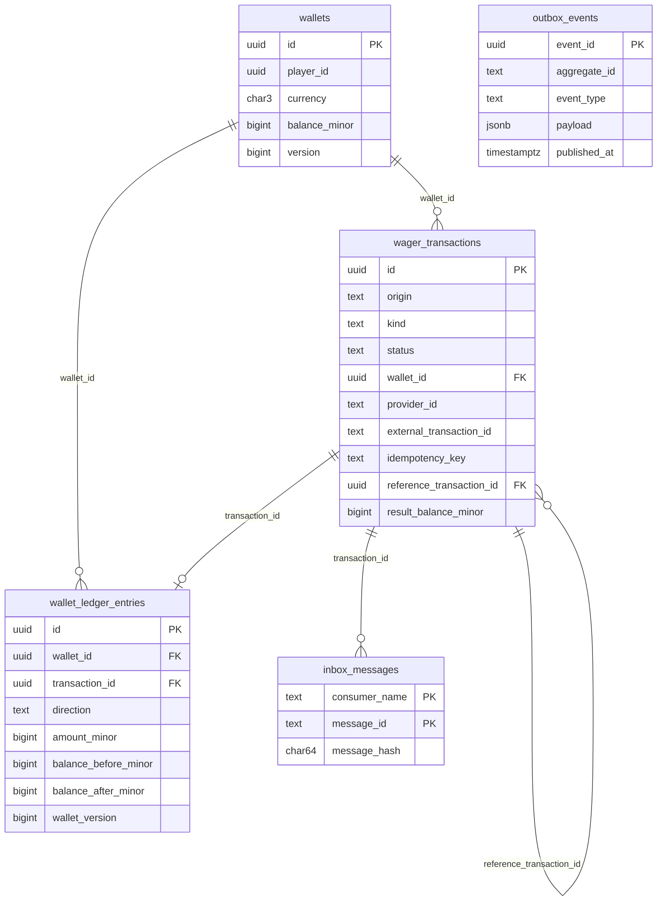

# Modelo de Dados

Schema PostgreSQL da solução: tabelas, constraints, índices, triggers e permissões. Serve de especificação para as migrations. As decisões que o fundamentam estão em [`decisions.md`](decisions.md) e os requisitos em [`delivery-requirements.md`](delivery-requirements.md).

**Princípio:** toda invariante financeira que puder ser expressa no banco **é** expressa no banco (§5.3, §5.8). O domínio valida primeiro, para dar erros claros, e o banco é a última linha de defesa, que funciona mesmo com vários processos e com bugs no código.

---

## 1. Visão geral



| Tabela | Papel | Mutabilidade |
| --- | --- | --- |
| `wallets` | Raiz do agregado: saldo e versão | `UPDATE` só de saldo, versão e `updated_at` |
| `wager_transactions` | Operações internas (`OPENING`) e externas | `UPDATE` só enquanto não terminal, e só de colunas de estado |
| `wallet_ledger_entries` | Lançamentos financeiros | **Append-only** |
| `inbox_messages` | Deduplicação de mensagens SQS por consumidor | Append-only |
| `outbox_events` | Eventos a publicar | Snapshot imutável; só as colunas de controle mudam |

---

## 2. Convenções

- **Dinheiro:** colunas `*_minor BIGINT` em unidades mínimas + `currency CHAR(3)` (D-03). `SUM(bigint)` no PostgreSQL devolve `numeric`, então somas não estouram no banco; a conversão para `int64` no Go verifica overflow.
- **Tempo:** `TIMESTAMPTZ`. O Go grava sempre em UTC truncado para microssegundos, que é a precisão do PostgreSQL. Assim a reidratação devolve exatamente o mesmo valor.
- **IDs:** `UUID`, gerados no Go (UUIDv7). O banco não gera IDs, para que o domínio conheça a identidade antes do `INSERT`.
- **Enums:** `TEXT` + `CHECK (col IN (...))`, e não `CREATE TYPE ... ENUM`, que é mais difícil de reverter em migrations `down`.
- **Hashes:** `CHAR(64)` com `CHECK (col ~ '^[0-9a-f]{64}$')`, SHA-256 em hex minúsculo.
- **Nomes:** `snake_case` no banco e `camelCase` no JSON.
- **Erros próprios:** triggers usam SQLSTATEs dedicados, que o Go classifica como **permanentes**:

  | SQLSTATE | Significado |
  | --- | --- |
  | `PDA01` | Tentativa de alterar ou excluir o ledger |
  | `PDA02` | Transição a partir de um estado terminal, ou alteração de coluna imutável de `wager_transactions` |
  | `PDA03` | Alteração inválida em `wallets` (versão incoerente ou coluna imutável) |
  | `PDA04` | Incoerência entre carteira, transação e ledger: saldo alterado sem lançamento, lançamento incoerente com a carteira ou com a transação, ou transação `PROCESSED` com movimento sem lançamento |
  | `PDA05` | Alteração do snapshot da outbox |

---

## 3. Tabelas

### 3.1 `wallets`

```sql
CREATE TABLE wallets (
    id            UUID        PRIMARY KEY,
    player_id     UUID        NOT NULL,
    currency      CHAR(3)     NOT NULL CHECK (currency ~ '^[A-Z]{3}$'),
    balance_minor BIGINT      NOT NULL CHECK (balance_minor >= 0),          -- WAL-04
    version       BIGINT      NOT NULL CHECK (version >= 1),                -- WAL-07
    created_at    TIMESTAMPTZ NOT NULL,
    updated_at    TIMESTAMPTZ NOT NULL,
    CONSTRAINT wallets_player_currency_uq UNIQUE (player_id, currency),     -- WAL-03
    CONSTRAINT wallets_updated_after_created CHECK (updated_at >= created_at)
);
```

- A lista de moedas suportadas (BRL, USD, EUR) é validada no domínio. O banco só garante o formato ISO, para que suportar uma moeda nova não exija migration.
- A violação de `wallets_player_currency_uq` vira 409 `WALLET_ALREADY_EXISTS`.

### 3.2 `wager_transactions`

```sql
CREATE TABLE wager_transactions (
    id                                UUID        PRIMARY KEY,
    origin                            TEXT        NOT NULL CHECK (origin IN ('INTERNAL','EXTERNAL')),
    kind                              TEXT        NOT NULL CHECK (kind IN ('OPENING','BET','WIN','LOSS','REFUND','ROLLBACK')),
    status                            TEXT        NOT NULL CHECK (status IN ('PENDING_REFERENCE','PROCESSED','REJECTED','FAILED')),
    wallet_id                         UUID        NOT NULL REFERENCES wallets(id),
    player_id                         UUID        NOT NULL,
    amount_minor                      BIGINT      NOT NULL CHECK (amount_minor >= 0),
    currency                          CHAR(3)     NOT NULL CHECK (currency ~ '^[A-Z]{3}$'),

    -- Metadados externos (NULL em OPENING)
    provider_id                       TEXT,
    external_transaction_id           TEXT,
    idempotency_key                   TEXT,
    payload_hash                      CHAR(64)    CHECK (payload_hash ~ '^[0-9a-f]{64}$'),
    round_id                          TEXT,
    game_id                           TEXT,
    reference_external_transaction_id TEXT,
    received_via                      TEXT        CHECK (received_via IN ('HTTP','SQS')),

    -- Resultado
    reference_transaction_id          UUID        REFERENCES wager_transactions(id),
    failure_code                      TEXT,
    result_balance_minor              BIGINT      CHECK (result_balance_minor >= 0),

    -- Agenda de resolução de referência (D-11)
    attempts                          INT         NOT NULL DEFAULT 0 CHECK (attempts >= 0),
    next_attempt_at                   TIMESTAMPTZ,
    expires_at                        TIMESTAMPTZ,

    correlation_id                    TEXT        NOT NULL,
    created_at                        TIMESTAMPTZ NOT NULL,
    updated_at                        TIMESTAMPTZ NOT NULL,
    completed_at                      TIMESTAMPTZ,

    -- Suporte à FK composta do ledger
    CONSTRAINT wager_tx_id_wallet_uq UNIQUE (id, wallet_id),

    -- Origem × tipo (TX-01, TX-04, TX-05)
    CONSTRAINT wager_tx_origin_kind CHECK ((origin = 'INTERNAL') = (kind = 'OPENING')),
    CONSTRAINT wager_tx_internal_fields CHECK (
        origin <> 'INTERNAL' OR (
            provider_id IS NULL AND external_transaction_id IS NULL AND idempotency_key IS NULL
            AND payload_hash IS NULL AND round_id IS NULL AND game_id IS NULL
            AND reference_external_transaction_id IS NULL AND reference_transaction_id IS NULL
            AND received_via IS NULL
            AND status = 'PROCESSED' AND amount_minor > 0
        )
    ),
    CONSTRAINT wager_tx_external_fields CHECK (
        origin <> 'EXTERNAL' OR (
            provider_id IS NOT NULL AND external_transaction_id IS NOT NULL
            AND idempotency_key IS NOT NULL AND payload_hash IS NOT NULL
            AND round_id IS NOT NULL AND game_id IS NOT NULL AND received_via IS NOT NULL
        )
    ),

    -- Política de valores por tipo (OPS-03, OPS-15)
    CONSTRAINT wager_tx_amount_policy CHECK (
        (kind = 'LOSS' AND amount_minor = 0) OR (kind <> 'LOSS' AND amount_minor > 0)
    ),

    -- Referências por tipo (OPS-06)
    CONSTRAINT wager_tx_reference_policy CHECK (
        CASE kind
            WHEN 'REFUND'   THEN reference_external_transaction_id IS NOT NULL
            WHEN 'ROLLBACK' THEN reference_external_transaction_id IS NOT NULL
            WHEN 'WIN'      THEN TRUE
            ELSE reference_external_transaction_id IS NULL
        END
    ),
    CONSTRAINT wager_tx_resolved_reference CHECK (
        NOT (status = 'PROCESSED' AND kind IN ('REFUND','ROLLBACK')) OR reference_transaction_id IS NOT NULL
    ),
    CONSTRAINT wager_tx_resolved_win_reference CHECK (
        NOT (status = 'PROCESSED' AND kind = 'WIN' AND reference_external_transaction_id IS NOT NULL)
        OR reference_transaction_id IS NOT NULL
    ),

    -- Coerência estado × resultado (TX-03, TX-06)
    CONSTRAINT wager_tx_failure_code CHECK (
        (status IN ('REJECTED','FAILED')) = (failure_code IS NOT NULL)
    ),
    CONSTRAINT wager_tx_result_balance CHECK (
        status NOT IN ('PROCESSED','REJECTED') OR result_balance_minor IS NOT NULL
    ),
    CONSTRAINT wager_tx_completed_at CHECK (
        (status IN ('PROCESSED','REJECTED','FAILED')) = (completed_at IS NOT NULL)
    ),
    CONSTRAINT wager_tx_pending_schedule CHECK (
        status <> 'PENDING_REFERENCE' OR (next_attempt_at IS NOT NULL AND expires_at IS NOT NULL)
    )
);
```

**Pontos importantes:**
- **`PENDING` não é um status persistível** (D-05). O `CHECK` de `status` o exclui, então "todo `PENDING` confirmado tem retomada" (TX-09) vale por construção. O único estado de espera persistido é `PENDING_REFERENCE`, e ele sempre tem agenda de retentativa.
- `result_balance_minor` é o saldo observado no processamento, devolvido nos replays (IDEM-08). Em `REJECTED`, é o saldo lido no momento da rejeição. Na rejeição por expiração, é o saldo no momento em que o worker rejeitou. Como é um saldo da carteira, está **na moeda da carteira**, que difere da `currency` da transação numa rejeição `CURRENCY_MISMATCH`; por isso as leituras de transação fazem `JOIN wallets` para reconstruí-lo.
- A `currency` da transação é gravada como recebida. Uma divergência com a carteira vira `REJECTED` com `CURRENCY_MISMATCH` e fica auditável.
- `received_via` é apenas auditoria e fica **fora** do hash (IDEM-03).

**Índices:**

```sql
-- Idempotência (IDEM-02, IDEM-07)
CREATE UNIQUE INDEX wager_tx_idempotency_uq
    ON wager_transactions (provider_id, idempotency_key) WHERE origin = 'EXTERNAL';
CREATE UNIQUE INDEX wager_tx_external_id_uq
    ON wager_transactions (provider_id, external_transaction_id) WHERE origin = 'EXTERNAL';

-- Uma única abertura por carteira (TX-05)
CREATE UNIQUE INDEX wager_tx_single_opening_uq
    ON wager_transactions (wallet_id) WHERE kind = 'OPENING';

-- Uma compensação bem-sucedida por referência (OPS-08, D-10)
CREATE UNIQUE INDEX wager_tx_single_reversal_uq
    ON wager_transactions (reference_transaction_id)
    WHERE kind IN ('REFUND','ROLLBACK') AND status = 'PROCESSED';

-- Worker de referências (D-11)
CREATE INDEX wager_tx_pending_due_idx
    ON wager_transactions (next_attempt_at) WHERE status = 'PENDING_REFERENCE';
CREATE INDEX wager_tx_pending_by_reference_idx
    ON wager_transactions (provider_id, reference_external_transaction_id)
    WHERE status = 'PENDING_REFERENCE';

-- Consultas por carteira
CREATE INDEX wager_tx_wallet_created_idx ON wager_transactions (wallet_id, created_at);
```

| Índice violado | Tradução no Go |
| --- | --- |
| `wager_tx_idempotency_uq` / `wager_tx_external_id_uq` | Corrida de idempotência: rollback, releitura e caminho de replay ou 409 (D-08) |
| `wager_tx_single_opening_uq` | Erro permanente (bug), já que `wallets_player_currency_uq` barra antes |
| `wager_tx_single_reversal_uq` | Não deve ocorrer, porque o lock da carteira serializa. Se ocorrer, rollback e reprocessamento, que termina em `ALREADY_REVERSED` |

### 3.3 `wallet_ledger_entries`

```sql
CREATE TABLE wallet_ledger_entries (
    id                   UUID        PRIMARY KEY,
    wallet_id            UUID        NOT NULL REFERENCES wallets(id),
    transaction_id       UUID        NOT NULL,
    direction            TEXT        NOT NULL CHECK (direction IN ('DEBIT','CREDIT')),
    amount_minor         BIGINT      NOT NULL CHECK (amount_minor > 0),
    currency             CHAR(3)     NOT NULL CHECK (currency ~ '^[A-Z]{3}$'),
    balance_before_minor BIGINT      NOT NULL CHECK (balance_before_minor >= 0),
    balance_after_minor  BIGINT      NOT NULL CHECK (balance_after_minor >= 0),
    wallet_version       BIGINT      NOT NULL CHECK (wallet_version >= 1),
    created_at           TIMESTAMPTZ NOT NULL,

    CONSTRAINT ledger_wallet_tx_uq      UNIQUE (wallet_id, transaction_id),  -- LED-03
    CONSTRAINT ledger_wallet_version_uq UNIQUE (wallet_id, wallet_version),  -- D-16
    CONSTRAINT ledger_tx_wallet_fk FOREIGN KEY (transaction_id, wallet_id)
        REFERENCES wager_transactions (id, wallet_id),
    CONSTRAINT ledger_balance_math CHECK (                                    -- LED-02
        (direction = 'CREDIT' AND balance_after_minor = balance_before_minor + amount_minor) OR
        (direction = 'DEBIT'  AND balance_after_minor = balance_before_minor - amount_minor)
    )
);
```

- **Garantias por constraint:**
  - A FK composta `(transaction_id, wallet_id)` impede um lançamento apontar para uma transação de outra carteira.
  - `ledger_wallet_version_uq` forma uma cadeia: cada versão da carteira tem no máximo um lançamento. A paginação usa `wallet_version ASC` como ordem estável (HTTP-03).
- **Coerência com a transação (LED-05):** o trigger de §4.2 só aceita lançamento de transação `PROCESSED` que não seja `LOSS`, com o mesmo valor e moeda, e com a direção coerente com o tipo. Assim `LOSS` e operações rejeitadas nunca geram lançamento, também no banco. Por isso a transação é gravada (ou atualizada) no estado final **antes** do lançamento.
- **Aritmética:** a coluna é `BIGINT`. Se `balance_before + amount` estourar, o PostgreSQL levanta `22003 numeric_value_out_of_range`, e esse erro é classificado como permanente.

### 3.4 `inbox_messages`

```sql
CREATE TABLE inbox_messages (
    consumer_name  TEXT        NOT NULL,
    message_id     TEXT        NOT NULL,
    message_hash   CHAR(64)    NOT NULL CHECK (message_hash ~ '^[0-9a-f]{64}$'),
    message_type   TEXT        NOT NULL,
    transaction_id UUID        REFERENCES wager_transactions(id),
    outcome        TEXT        NOT NULL CHECK (outcome IN ('PROCESSED','REJECTED','PENDING_REFERENCE','IDEMPOTENT_REPLAY','FAILED')),
    received_at    TIMESTAMPTZ NOT NULL,
    processed_at   TIMESTAMPTZ NOT NULL,
    CONSTRAINT inbox_pk PRIMARY KEY (consumer_name, message_id)   -- SQS-03
);
```

- A linha é inserida **na mesma transação** das alterações de domínio (SQS-04), então só existe se o tratamento foi confirmado. Por isso `processed_at` é `NOT NULL`.
- `received_at` é o instante do primeiro recebimento observado pelo consumidor. `processed_at` é o instante do commit.
- `IDEMPOTENT_REPLAY` registra uma mensagem nova (outro `messageId`) que caiu em uma operação já existente, pela mesma chave de idempotência.
- `FAILED` registra a mensagem cuja operação terminou em falha permanente. A inbox é gravada na mesma transação que grava o `FAILED`, e a mensagem é enviada à DLQ (D-05).
- Mensagens inválidas **não** entram na inbox: vão para a DLQ (D-12).

### 3.5 `outbox_events`

```sql
CREATE TABLE outbox_events (
    event_id        UUID        PRIMARY KEY,
    aggregate_type  TEXT        NOT NULL CHECK (aggregate_type IN ('Wallet','WagerTransaction')),
    aggregate_id    TEXT        NOT NULL,
    message_group_id TEXT       NOT NULL,   -- sempre o walletId (MessageGroupId do SNS)
    event_type      TEXT        NOT NULL CHECK (event_type IN (
                        'WagerTransactionProcessed','WagerTransactionRejected',
                        'WalletBalanceChanged','WagerTransactionPendingReference')),
    event_version   INT         NOT NULL CHECK (event_version >= 1),
    payload         JSONB       NOT NULL,
    correlation_id  TEXT        NOT NULL,
    causation_id    TEXT,
    occurred_at     TIMESTAMPTZ NOT NULL,

    -- Controle de publicação (D-13)
    attempts        INT         NOT NULL DEFAULT 0 CHECK (attempts >= 0),
    next_attempt_at TIMESTAMPTZ NOT NULL,
    locked_by       TEXT,
    locked_until    TIMESTAMPTZ,
    published_at    TIMESTAMPTZ,
    last_error      TEXT,

    CONSTRAINT outbox_lock_pair CHECK ((locked_by IS NULL) = (locked_until IS NULL))
);

CREATE INDEX outbox_due_idx ON outbox_events (next_attempt_at) WHERE published_at IS NULL;
CREATE INDEX outbox_aggregate_idx ON outbox_events (aggregate_id, occurred_at);
```

- `payload` guarda o **envelope completo** já serializado (OUT-09, OUT-12). O publisher envia o JSON lido da coluna, sem remontar nada, e por isso a republicação preserva `eventId` e o conteúdo (OUT-05). Por ser `JSONB`, o PostgreSQL normaliza o texto na gravação (ordem das chaves e espaços): o conteúdo é o do envelope e é idêntico em toda republicação, mas os bytes não são os do `MarshalJSON`.
- `aggregate_id` recebe o `walletId` nos eventos de saldo e o `transactionId` nos demais. `message_group_id` guarda sempre o `walletId`, usado como `MessageGroupId` no SNS ([`messaging.md`](messaging.md) §5.2).
- `last_error` é truncado em 1 KB e nunca contém o payload.
- No `INSERT`, `next_attempt_at = now()` do banco: o claim (§6) compara com o mesmo relógio.

---

## 4. Triggers de proteção

Todas as funções são `plpgsql`. Os triggers valem **também** para o owner das tabelas, então protegem até contra uma conexão com privilégios amplos.

### 4.1 Ledger append-only (LED-04) — `PDA01`

```sql
CREATE FUNCTION ledger_block_mutation() RETURNS trigger LANGUAGE plpgsql AS $$
BEGIN
    RAISE EXCEPTION 'wallet_ledger_entries is append-only (% blocked)', TG_OP
        USING ERRCODE = 'PDA01';
END $$;

CREATE TRIGGER ledger_no_update_delete BEFORE UPDATE OR DELETE ON wallet_ledger_entries
    FOR EACH ROW EXECUTE FUNCTION ledger_block_mutation();
CREATE TRIGGER ledger_no_truncate BEFORE TRUNCATE ON wallet_ledger_entries
    FOR EACH STATEMENT EXECUTE FUNCTION ledger_block_mutation();
```

### 4.2 Coerência ledger × carteira × transação (WAL-06, LED-05) — `PDA04`

`BEFORE INSERT` no ledger: o lançamento precisa refletir o estado **atual** da carteira **e** a transação que o origina. O fluxo é: gravar a transação no estado final, atualizar a carteira e só então inserir o lançamento.

```sql
CREATE FUNCTION ledger_check_wallet() RETURNS trigger LANGUAGE plpgsql AS $$
DECLARE
    w        wallets%ROWTYPE;
    t        wager_transactions%ROWTYPE;
    expected TEXT;
BEGIN
    -- 1. O lançamento reflete o estado atual da carteira
    SELECT * INTO w FROM wallets WHERE id = NEW.wallet_id;
    IF NEW.currency <> w.currency
       OR NEW.balance_after_minor <> w.balance_minor
       OR NEW.wallet_version <> w.version THEN
        RAISE EXCEPTION 'ledger entry does not match wallet % state', NEW.wallet_id
            USING ERRCODE = 'PDA04';
    END IF;

    -- 2. Só transações PROCESSED com movimento geram lançamento, com o mesmo valor e moeda
    SELECT * INTO t FROM wager_transactions WHERE id = NEW.transaction_id;
    IF t.status <> 'PROCESSED' OR t.kind = 'LOSS'
       OR NEW.amount_minor <> t.amount_minor OR NEW.currency <> t.currency THEN
        RAISE EXCEPTION 'ledger entry does not match transaction %', NEW.transaction_id
            USING ERRCODE = 'PDA04';
    END IF;

    -- 3. A direção é coerente com o tipo (ROLLBACK depende do tipo da referência)
    expected := CASE t.kind
        WHEN 'BET' THEN 'DEBIT'
        WHEN 'ROLLBACK' THEN (
            SELECT CASE r.kind WHEN 'BET' THEN 'CREDIT' ELSE 'DEBIT' END
            FROM wager_transactions r WHERE r.id = t.reference_transaction_id)
        ELSE 'CREDIT'  -- OPENING, WIN, REFUND
    END;
    IF NEW.direction IS DISTINCT FROM expected THEN
        RAISE EXCEPTION 'ledger direction % does not match transaction kind %', NEW.direction, t.kind
            USING ERRCODE = 'PDA04';
    END IF;
    RETURN NEW;
END $$;

CREATE TRIGGER ledger_matches_wallet BEFORE INSERT ON wallet_ledger_entries
    FOR EACH ROW EXECUTE FUNCTION ledger_check_wallet();
```

No sentido inverso, a checagem é **adiada para o commit**: toda mudança de saldo precisa ter o lançamento da nova versão.

```sql
CREATE FUNCTION wallet_require_ledger() RETURNS trigger LANGUAGE plpgsql AS $$
BEGIN
    IF (TG_OP = 'INSERT' AND NEW.balance_minor > 0)
       OR (TG_OP = 'UPDATE' AND NEW.balance_minor <> OLD.balance_minor) THEN
        IF NOT EXISTS (
            SELECT 1 FROM wallet_ledger_entries
            WHERE wallet_id = NEW.id AND wallet_version = NEW.version
              AND balance_after_minor = NEW.balance_minor
        ) THEN
            RAISE EXCEPTION 'wallet % balance changed without ledger entry', NEW.id
                USING ERRCODE = 'PDA04';
        END IF;
    END IF;
    RETURN NULL;
END $$;

CREATE CONSTRAINT TRIGGER wallet_balance_has_ledger
    AFTER INSERT OR UPDATE ON wallets
    DEFERRABLE INITIALLY DEFERRED
    FOR EACH ROW EXECUTE FUNCTION wallet_require_ledger();
```

E do lado da transação, também **adiado para o commit**: toda transação `PROCESSED` com movimento precisa ter o seu lançamento.

```sql
CREATE FUNCTION wager_tx_require_ledger() RETURNS trigger LANGUAGE plpgsql AS $$
BEGIN
    IF NOT EXISTS (
        SELECT 1 FROM wallet_ledger_entries
        WHERE wallet_id = NEW.wallet_id AND transaction_id = NEW.id
    ) THEN
        RAISE EXCEPTION 'processed transaction % has no ledger entry', NEW.id
            USING ERRCODE = 'PDA04';
    END IF;
    RETURN NULL;
END $$;

CREATE CONSTRAINT TRIGGER wager_tx_processed_has_ledger
    AFTER INSERT OR UPDATE OF status ON wager_transactions
    DEFERRABLE INITIALLY DEFERRED
    FOR EACH ROW
    WHEN (NEW.status = 'PROCESSED' AND NEW.kind <> 'LOSS')
    EXECUTE FUNCTION wager_tx_require_ledger();
```

### 4.3 Carteira: versão e imutáveis (WAL-07) — `PDA03`

```sql
CREATE FUNCTION wallet_guard_update() RETURNS trigger LANGUAGE plpgsql AS $$
BEGIN
    IF (NEW.id, NEW.player_id, NEW.currency, NEW.created_at)
       IS DISTINCT FROM (OLD.id, OLD.player_id, OLD.currency, OLD.created_at) THEN
        RAISE EXCEPTION 'wallet % immutable column changed', OLD.id USING ERRCODE = 'PDA03';
    END IF;
    IF NEW.balance_minor <> OLD.balance_minor AND NEW.version <> OLD.version + 1 THEN
        RAISE EXCEPTION 'wallet % balance change requires version + 1', OLD.id USING ERRCODE = 'PDA03';
    END IF;
    IF NEW.balance_minor = OLD.balance_minor AND NEW.version <> OLD.version THEN
        RAISE EXCEPTION 'wallet % version changed without balance change', OLD.id USING ERRCODE = 'PDA03';
    END IF;
    RETURN NEW;
END $$;

CREATE FUNCTION wallet_guard_delete() RETURNS trigger LANGUAGE plpgsql AS $$
BEGIN
    RAISE EXCEPTION 'wallet % cannot be deleted', OLD.id USING ERRCODE = 'PDA03';
END $$;

CREATE TRIGGER wallet_guard BEFORE UPDATE ON wallets
    FOR EACH ROW EXECUTE FUNCTION wallet_guard_update();
CREATE TRIGGER wallet_no_delete BEFORE DELETE ON wallets
    FOR EACH ROW EXECUTE FUNCTION wallet_guard_delete();
```

- Uma carteira é criada com `version = 1`, garantido pelo `INSERT` e pelo teste. `LOSS` não toca a carteira.

### 4.4 Transação: terminal e imutáveis (TX-07) — `PDA02`

```sql
CREATE FUNCTION wager_tx_guard_update() RETURNS trigger LANGUAGE plpgsql AS $$
BEGIN
    IF OLD.status IN ('PROCESSED','REJECTED','FAILED') THEN
        RAISE EXCEPTION 'wager transaction % is terminal (%)', OLD.id, OLD.status
            USING ERRCODE = 'PDA02';
    END IF;
    IF (NEW.id, NEW.origin, NEW.kind, NEW.wallet_id, NEW.player_id, NEW.amount_minor,
        NEW.currency, NEW.provider_id, NEW.external_transaction_id, NEW.idempotency_key,
        NEW.payload_hash, NEW.round_id, NEW.game_id, NEW.reference_external_transaction_id,
        NEW.received_via, NEW.correlation_id, NEW.created_at)
       IS DISTINCT FROM
       (OLD.id, OLD.origin, OLD.kind, OLD.wallet_id, OLD.player_id, OLD.amount_minor,
        OLD.currency, OLD.provider_id, OLD.external_transaction_id, OLD.idempotency_key,
        OLD.payload_hash, OLD.round_id, OLD.game_id, OLD.reference_external_transaction_id,
        OLD.received_via, OLD.correlation_id, OLD.created_at) THEN
        RAISE EXCEPTION 'wager transaction % immutable column changed', OLD.id
            USING ERRCODE = 'PDA02';
    END IF;
    RETURN NEW;
END $$;

CREATE FUNCTION wager_tx_guard_delete() RETURNS trigger LANGUAGE plpgsql AS $$
BEGIN
    RAISE EXCEPTION 'wager transaction % cannot be deleted', OLD.id USING ERRCODE = 'PDA02';
END $$;

CREATE TRIGGER wager_tx_guard BEFORE UPDATE ON wager_transactions
    FOR EACH ROW EXECUTE FUNCTION wager_tx_guard_update();
CREATE TRIGGER wager_tx_no_delete BEFORE DELETE ON wager_transactions
    FOR EACH ROW EXECUTE FUNCTION wager_tx_guard_delete();
```

`TRUNCATE` em `wallets` e `wager_transactions` não tem trigger próprio: o `pda_app` não tem o privilégio, o `TRUNCATE` simples falha pela FK do ledger e, com `CASCADE`, alcança o ledger e dispara o `PDA01`.

### 4.5 Outbox: snapshot imutável (OUT-01) — `PDA05`

O trigger `BEFORE UPDATE` bloqueia alterações em `event_id`, `aggregate_type`, `aggregate_id`, `message_group_id`, `event_type`, `event_version`, `payload`, `correlation_id`, `causation_id` e `occurred_at`. Também bloqueia `published_at` voltar de preenchido para `NULL`.

```sql
CREATE FUNCTION outbox_guard_update() RETURNS trigger LANGUAGE plpgsql AS $$
BEGIN
    IF (NEW.event_id, NEW.aggregate_type, NEW.aggregate_id, NEW.message_group_id, NEW.event_type,
        NEW.event_version, NEW.payload, NEW.correlation_id, NEW.causation_id, NEW.occurred_at)
       IS DISTINCT FROM
       (OLD.event_id, OLD.aggregate_type, OLD.aggregate_id, OLD.message_group_id, OLD.event_type,
        OLD.event_version, OLD.payload, OLD.correlation_id, OLD.causation_id, OLD.occurred_at) THEN
        RAISE EXCEPTION 'outbox event % snapshot is immutable', OLD.event_id USING ERRCODE = 'PDA05';
    END IF;
    IF OLD.published_at IS NOT NULL AND NEW.published_at IS NULL THEN
        RAISE EXCEPTION 'outbox event % cannot be unpublished', OLD.event_id USING ERRCODE = 'PDA05';
    END IF;
    RETURN NEW;
END $$;

CREATE TRIGGER outbox_guard BEFORE UPDATE ON outbox_events
    FOR EACH ROW EXECUTE FUNCTION outbox_guard_update();
```

A `inbox_messages` é append-only só por permissão (§5): o `pda_app` não tem `UPDATE` nem `DELETE`.

---

## 5. Roles e permissões (D-17)

As roles são criadas por um script de init do container PostgreSQL (`docker-entrypoint-initdb.d`), porque são objetos do cluster e as senhas vêm do ambiente. As migrations só executam `GRANT`.

| Role | Uso | Permissões |
| --- | --- | --- |
| `pda_owner` | Migrations (`golang-migrate`) | Dono do schema e das tabelas; `CREATEDB`, para os testes criarem bancos isolados ([`test-plan.md`](test-plan.md) §3.2) |
| `pda_app` | Aplicação | Ver tabela abaixo; nenhuma permissão de DDL |

| Tabela | `SELECT` | `INSERT` | `UPDATE` | `DELETE` / `TRUNCATE` |
| --- | :-: | :-: | :-: | :-: |
| `wallets` | ✅ | ✅ | ✅ | ❌ |
| `wager_transactions` | ✅ | ✅ | ✅ | ❌ |
| `wallet_ledger_entries` | ✅ | ✅ | ❌ | ❌ |
| `inbox_messages` | ✅ | ✅ | ❌ | ❌ |
| `outbox_events` | ✅ | ✅ | ✅ | ❌ |

**Defesa em camadas no ledger:** o `REVOKE` barra a aplicação, e o trigger barra qualquer conexão, inclusive a do owner.

---

## 6. Consultas críticas

As consultas que concentram as garantias ficam documentadas aqui porque são a evidência verificável de §4 ("transações, locks e constraints explícitos").

**Lock da carteira (D-09):** o `lock_timeout` é definido no início de toda transação do UoW, com o valor de `DB_LOCK_TIMEOUT`. Como `SET LOCAL` não aceita parâmetro, o Go usa o equivalente `SELECT set_config('lock_timeout', $1, true)`.
```sql
SET LOCAL lock_timeout = '5s';  -- no Go: SELECT set_config('lock_timeout', '5000ms', true)
SELECT id, player_id, currency, balance_minor, version, created_at, updated_at
FROM wallets WHERE id = $1 FOR UPDATE;
```

**Atualização de saldo:**
```sql
UPDATE wallets SET balance_minor = $2, version = version + 1, updated_at = $3
WHERE id = $1 AND version = $4;    -- 0 linhas ⇒ erro permanente (o lock deveria garantir)
```

**Claim da outbox (D-13):**
```sql
WITH due AS (
    SELECT event_id, locked_by AS previous_owner FROM outbox_events
    WHERE published_at IS NULL
      AND next_attempt_at <= now()
      AND (locked_until IS NULL OR locked_until < now())
    ORDER BY next_attempt_at
    FOR UPDATE SKIP LOCKED
    LIMIT $1
)
UPDATE outbox_events o
SET locked_by = $2, locked_until = now() + $3::interval
FROM due WHERE o.event_id = due.event_id
RETURNING o.event_id, o.message_group_id, o.event_type, o.event_version,
          o.correlation_id, o.payload, o.occurred_at, o.attempts, due.previous_owner;
```
`previous_owner` preenchido indica trabalho abandonado reassumido (lease vencido), contado em `outbox_lease_reclaims_total`. Em uma falha de publicação, o lease é liberado (`locked_by = NULL`), então esse caso não conta como abandono.

**Confirmação da publicação:**
```sql
UPDATE outbox_events
SET published_at = now(), locked_by = NULL, locked_until = NULL
WHERE event_id = $1 AND locked_by = $2 AND published_at IS NULL
RETURNING published_at;   -- published_at − occurred_at alimenta outbox_publish_lag_seconds
```
Se o lease expirou e outra instância já confirmou, a atualização afeta 0 linhas e o caso é apenas registrado em log. O evento foi publicado duas vezes com o mesmo `eventId`, o que o contrato at-least-once aceita.

**Falha de publicação:** `$3` é o backoff calculado pelo publisher a partir do `attempts` devolvido pelo claim ([`messaging.md`](messaging.md) §5.1), e `$4` é a mensagem do erro truncada em 1 KB, nunca o payload.
```sql
UPDATE outbox_events
SET attempts = attempts + 1, next_attempt_at = now() + $3::interval,
    locked_by = NULL, locked_until = NULL, last_error = $4
WHERE event_id = $1 AND locked_by = $2 AND published_at IS NULL;
```

**Backlog da outbox** (gauges `outbox_pending_events` e `outbox_oldest_pending_age_seconds`), usando o índice parcial `outbox_due_idx`:
```sql
SELECT count(*), COALESCE(GREATEST(EXTRACT(EPOCH FROM now() - min(occurred_at)), 0), 0)
FROM outbox_events WHERE published_at IS NULL;
```

**Claim de referências pendentes (D-11):** a busca por `status = 'PENDING_REFERENCE' AND next_attempt_at <= now()` usa `FOR UPDATE SKIP LOCKED LIMIT $1`. Cada linha é processada na sua própria transação, que também trava a carteira. Para evitar deadlock com o caminho HTTP, que trava primeiro a carteira e depois a transação, o worker:
1. apenas **seleciona os IDs** com `SKIP LOCKED` e sai da transação;
2. em uma nova transação por item, trava **primeiro a carteira** e depois a linha da transação com `FOR UPDATE`;
3. rechecagem: se o status já não for `PENDING_REFERENCE`, ignora o item.

**Antecipação das pendências** (na transação que leva uma operação a estado terminal: `PROCESSED`, `REJECTED` ou `FAILED`):
```sql
UPDATE wager_transactions SET next_attempt_at = $3, updated_at = GREATEST($3, created_at)
WHERE status = 'PENDING_REFERENCE'
  AND provider_id = $1 AND reference_external_transaction_id = $2;
```
`$3` é o instante do Go (porta `Clock`). O `GREATEST` mantém `updated_at >= created_at` mesmo com o relógio de outra instância atrasado, a mesma regra do domínio.

**Reconciliação (D-16)**, dentro de `BEGIN ISOLATION LEVEL REPEATABLE READ READ ONLY`:
```sql
SELECT balance_minor, currency FROM wallets WHERE id = $1;
SELECT COALESCE(SUM(CASE direction WHEN 'CREDIT' THEN amount_minor ELSE -amount_minor END), 0) AS calculated,
       COUNT(*) AS checked_entries
FROM wallet_ledger_entries WHERE wallet_id = $1;
```

**Paginação do ledger:**
```sql
SELECT ... FROM wallet_ledger_entries
WHERE wallet_id = $1 AND wallet_version > $2   -- $2 = versão do cursor, 0 na primeira página
ORDER BY wallet_version ASC
LIMIT $3 + 1;                                   -- +1 para saber se existe próxima página
```

---

## 7. Plano de migrations

Formato `golang-migrate`: `migrations/NNNNNN_nome.{up,down}.sql`. Cada `down` desfaz exatamente o seu `up`.

| Versão | Nome | Conteúdo | `down` |
| --- | --- | --- | --- |
| 000001 | `create_wallets` | `wallets` + constraints | `DROP TABLE wallets` |
| 000002 | `create_wager_transactions` | Tabela, constraints e índices | `DROP TABLE` |
| 000003 | `create_wallet_ledger_entries` | Tabela, constraints e FK composta | `DROP TABLE` |
| 000004 | `create_inbox_outbox` | `inbox_messages`, `outbox_events` e índices | `DROP TABLE` × 2 |
| 000005 | `protection_triggers` | Funções e triggers de §4 | `DROP TRIGGER` / `DROP FUNCTION` |
| 000006 | `grant_app_role` | `GRANT`s de §5 | `REVOKE` |

**Comandos** (também no README, via `make` e o serviço `migrate` do compose):
```sh
migrate -path migrations -database "$DATABASE_OWNER_URL" up
migrate -path migrations -database "$DATABASE_OWNER_URL" down 1   # reverte a última
migrate -path migrations -database "$DATABASE_OWNER_URL" down -all
```

O teste de integração TST-I01 aplica `up`, depois `down -all` e `up` de novo, e confere que o schema final é idêntico ao da primeira aplicação.

---

## 8. Rastreabilidade

| Requisito | Onde é garantido no banco |
| --- | --- |
| WAL-03 | `wallets_player_currency_uq` |
| WAL-04 / E4 | `CHECK (balance_minor >= 0)` + lock `FOR UPDATE` |
| WAL-06 | `ledger_matches_wallet` + `wallet_balance_has_ledger` e `wager_tx_processed_has_ledger` (deferred) |
| LED-05 | `ledger_matches_wallet`: só transação `PROCESSED`, não `LOSS`, com valor, moeda e direção coerentes |
| WAL-07 | `wallet_guard_update` |
| TX-05 | `wager_tx_origin_kind`, `wager_tx_internal_fields`, `wager_tx_single_opening_uq` |
| TX-07 | `wager_tx_guard_update` |
| TX-09 | `status` sem `PENDING` + `wager_tx_pending_schedule` |
| LED-02 / LED-06 | `ledger_balance_math` + `CHECK`s de valor e saldo |
| LED-03 / E5 | `ledger_wallet_tx_uq` |
| LED-04 / E9 | `ledger_block_mutation` + `REVOKE` |
| IDEM-01..07 / E5, E6 | `wager_tx_idempotency_uq`, `wager_tx_external_id_uq` |
| OPS-03 / OPS-15 | `wager_tx_amount_policy` |
| OPS-06 | `wager_tx_reference_policy`, `wager_tx_resolved_reference` |
| OPS-08 | `wager_tx_single_reversal_uq` |
| SQS-03 | `inbox_pk` |
| OUT-01 / OUT-05 | Trigger de snapshot imutável da outbox |
