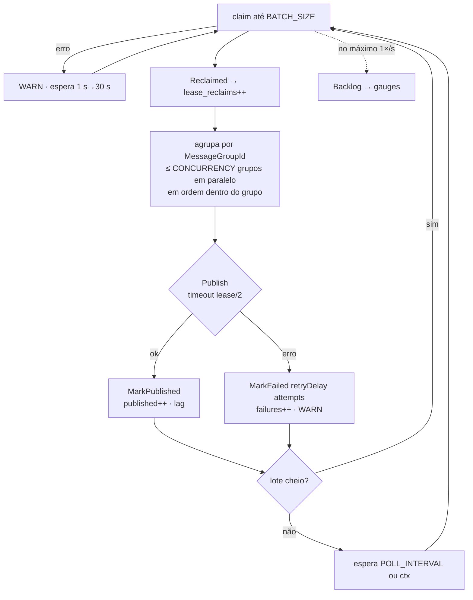

# M4 — Outbox publisher: design

**Data:** 29/09/2026 · **Caminho:** *architectural* ([`development-workflow.md`](../../development-workflow.md) §2) · **Status:** aprovada pelo autor em 29/09/2026; achados da validação do plano incorporados (§2.2)

**Implementa:**
- [`implementation-plan.md`](../../implementation-plan.md) M4;
- D-13 (publisher), com o claim e a confirmação do [`data-model.md`](../../data-model.md) §6;
- [`messaging.md`](../../messaging.md) §5 (parâmetros, mapeamento para o SNS, recuperação), a parte de outbox do §8 (métricas) e o §6 como contrato formal;
- [`test-plan.md`](../../test-plan.md) §5: I05a–e, e o item 8 da verificação de consistência (§6, novo).

**Artefato central (contrato primeiro):** [`api/events.yaml`](../../../api/events.yaml), com os schemas do envelope e dos 4 eventos v1. Ele já foi escrito e validado com o kin-openapi v0.149.0 (documento e 14 amostras, positivas e negativas) e faz parte desta spec: é aprovado junto com ela, **antes** do código.

Esta spec registra só o **delta** em relação a `docs/`.

---

## 1. Objetivo e critério de pronto

**Objetivo:** todo evento confirmado na outbox chega ao `wallet-events.fifo` pelo menos uma vez, com o mesmo `eventId` e o mesmo conteúdo, e publicado por qualquer instância. Nada é publicado antes do commit, e nada se perde com falha do SNS ou queda de um publisher. Fecha o eliminatório **E8**.

**Pronto quando** (evidência no chat, [`development-workflow.md`](../../development-workflow.md) §5):
1. `make check` verde.
2. `make test-integration` verde, com os testes da §8 vistos falhando pelo motivo certo e depois passando. O I05b também passa pela checagem de sensibilidade.
3. `docker compose up --build --wait` sobe as 3 réplicas saudáveis. Um `POST /wallets` com saldo por `curl` faz os 2 eventos da abertura chegarem a `wallet-events-audit.fifo` (lidos com a chave raiz), e a outbox fica sem pendentes.
4. Requisitos da §9 marcados em [`delivery-requirements.md`](../../delivery-requirements.md), citando os testes.
5. `docs/` e `ARCHITECTURE.md` refletem as decisões da §2.

**Fora do escopo** (com o marco de destino):
- os pontos de falha `outbox.after_claim_before_publish` e `outbox.after_publish_before_ack`, e os cenários C05c e C06 com 3 processos (M8). O plano marca os dois locais no código;
- a flag `OUTBOX_PUBLISHER_ENABLED` (M7, junto com as outras 3 flags de papel da D-15). A D-15 exige que um módulo desligado nem entre no grafo, o que pede reorganizar o `bootstrap.Options()` para os 4 papéis de uma vez;
- a inbox e o consumidor SQS (M5).

---

## 2. Decisões desta spec

| # | Decisão | Motivo |
| --- | --- | --- |
| 1 | **ARN do tópico resolvido no start:** `sts:GetCallerIdentity` dá a partição e a conta, o ARN é montado como `arn:<partição>:sns:<AWS_REGION>:<conta>:<SNS_EVENTS_TOPIC_NAME>` e verificado com `sns:GetTopicAttributes`. Se falhar, o start falha (escolha do autor em 29/09) | O SNS não resolve tópico pelo nome, e `ListTopics`/`CreateTopic` exigiriam permissões amplas. `GetCallerIdentity` não precisa de política, na AWS e no MiniStack (verificado com o usuário `pda-wallet-service`). O fail fast segue o `structure.md` §3 |
| 2 | **A política de `pda-wallet-service` ganha `sns:GetTopicAttributes`** no mesmo recurso do `sns:Publish` | É o mínimo necessário para a verificação da decisão 1. O I04f (M5) passa a incluir essa permissão |
| 3 | **O SNS não entra no `/health/ready`** | O R02 espera que o HTTP continue atendendo com o broker fora; a falha de publicação aparece nas métricas e nos logs, e a outbox acumula |
| 4 | **Porta `app.OutboxStore`** em `internal/app/ports.go` (§3.1), implementada por `postgres.OutboxStore`. Cada método é **um único statement no pool**, fora de qualquer UoW | `adapters/outbox` não pode importar `adapters/postgres` (`structure.md` §2), e as portas de persistência ficam no `app` desde o M2. Um statement único é a "transação curta" do claim na D-13 |
| 5 | **O claim devolve também `attempts` e `occurred_at`**. O `previous_owner` preenchido vira `Reclaimed = true` | O backoff é calculado em Go a partir de `attempts` (decisão 6), e o lag da publicação usa `occurred_at` |
| 6 | **Backoff em Go:** `retryIn = min(base · 2ⁿ, max)`, em que `n` é o `attempts` gravado **antes** da falha (a primeira falha espera `base`). A duplicação para ao atingir o teto, então não estoura para nenhum `n`. `base = OUTBOX_RETRY_BASE_DELAY` (**variável nova**, 1 s em produção) e `max = OUTBOX_RETRY_MAX_DELAY` (5 min) | Sem uma base configurável, o I05c esperaria 7 s de backoff real. É uma função pura com teste unitário, e em produção a fórmula continua a de messaging §5.1 |
| 7 | **Todo erro do `Publish` segue o caminho de falha** (`attempts++`, backoff, lease liberado), sem distinguir transitório de permanente | Nenhum evento confirmado pode ser descartado (D-13). Um erro "permanente" do SNS (tópico apagado, política) só se resolve com intervenção, e a outbox acumulando é o sinal visível |
| 8 | **`Publish` com timeout de `lease/2`**, desacoplado do cancelamento do loop | Na maioria dos casos o evento é confirmado antes de o lease vencer, e um stop gracioso não interrompe um envio já iniciado |
| 9 | **Publicação do lote:** agrupada por `MessageGroupId`, com até `OUTBOX_CONCURRENCY` grupos em paralelo e cada grupo em sequência, ordenado por `(occurredAt, eventId)`. Uma falha **não** segura os eventos seguintes do grupo | É o melhor esforço de ordem por carteira. A ordem estrita já não é garantida com vários publishers (D-13), e segurar os eventos só atrasaria sem recuperar a ordem |
| 10 | **Confirmação:** `MarkPublished` com `ok = false` (o lease foi perdido e outra instância confirmou) gera um log INFO e não conta como publicação. Um erro do banco no `MarkPublished` gera um WARN, e o lease vence e o evento é republicado com o mesmo `eventId` | É o caso OUT-06b. O SNS FIFO deduplica dentro de 5 min, e depois disso o consumidor deduplica pelo `eventId` |
| 11 | **Claim com o banco fora:** WARN e nova tentativa com backoff de 1 s a 30 s, que volta ao início no primeiro claim bem-sucedido. O publisher nunca encerra o processo | messaging §5.3 |
| 12 | **Shutdown:** o `OnStop` cancela o loop, e nenhum claim nem `Publish` novo começa. Os `Publish` em andamento terminam e **são confirmados**. Os eventos reservados que não começaram ficam com o lease, que vence e é reassumido. O `OnStop` espera até o prazo do Fx, com logs de início e fim | Um stop gracioso não gera republicação, e o resto segue o que o `ARCHITECTURE.md` §12 já descreve |
| 13 | **Gauges de backlog** (`outbox_pending_events` e `outbox_oldest_pending_age_seconds`) atualizados pelo próprio publisher, no máximo 1×/s, com uma consulta `count`/`min(occurred_at)` sobre as linhas não publicadas | É o que torna o R02 observável sem colocar consultas ao banco no `/metrics`. Com várias réplicas, todas mostram o mesmo valor global |
| 14 | **Identidade da instância:** `<hostname>-<pid>-<8 hex de um UUID>`, gerada uma vez no start do módulo | messaging §5.1. O sufixo diferencia processos no mesmo host (testes, reinícios com o mesmo PID em containers) |
| 15 | **`last_error`:** a mensagem do erro, truncada em 1024 bytes sem cortar um caractere UTF-8 no meio, e nunca o payload | data-model §3.5 |
| 16 | **Contrato formal dos eventos em `api/events.yaml`** (OpenAPI 3.0.3, só schemas). O corpo valida contra `Envelope`, e `data` valida contra `<eventType>V<version>`. O `WagerTransactionProcessedV1` é um `oneOf` com as variantes `INTERNAL` e `EXTERNAL`. Todo objeto usa `additionalProperties: false` (escolha do autor em 29/09) | Contrato primeiro, como na D-20. O arquivo é um artefato para os consumidores (OUT-07), e o `testkit` o reutiliza com o mesmo kin-openapi do contrato HTTP. O messaging §6 continua como a explicação e aponta para ele |
| 17 | **Toda mensagem lida da fila de auditoria pelo `testkit` é validada contra o `events.yaml`** | É o mesmo princípio do validador HTTP (toda troca é verificada), e cada teste que gera eventos também prova o contrato |
| 18 | **Item 8 da verificação de consistência** (test-plan §6): o `AssertWalletConsistent` espera, com prazo, até a outbox da carteira (`message_group_id`) ficar sem pendentes. Depois confere que cada `eventId` dela chegou à auditoria com o conteúdo igual ao do banco, comparado como JSON | Faltava a asserção de outbox vazia e entregue da delivery-requirements §3. Sem ela, um evento confirmado e nunca publicado passaria despercebido |
| 19 | **As métricas de outbox** entram agora no `observability.Metrics`, que implementa a porta `outbox.Metrics` do próprio adapter | O implementation-plan pede as métricas de atraso no M4, e o M7 fecha o resto do catálogo. As portas ficam com quem as consome (`structure.md` §2) |

### 2.2 Achados da validação do plano

O plano foi validado numa cópia descartável do repositório (um `git clone` local, sem worktree nem branch), com o código de todas as tarefas testado contra a infraestrutura do compose. Estes achados completam a §2:

| # | Decisão | Motivo |
| --- | --- | --- |
| 20 | **Os testes de integração do `bootstrap` passam a usar um banco próprio** (`testkit.NewTestEnv`), e o `testkit.AppDatabaseURL`, que apontava para o banco compartilhado `pda`, é removido | Achado central: com o publisher no grafo, o `TestFxLifecycle` e o `TestFxFailFast` publicaram, num tópico de teste depois apagado, os eventos pendentes do ambiente de desenvolvimento. A correção foi provada com um evento pendente no banco compartilhado, que continuou pendente depois dos testes |
| 21 | **Cada teste do publisher e o `TestOutboxStore` têm banco e tópico próprios** (`testkit.NewTestEnv` e `testkit.NewEventsTopic`) | O claim vê a tabela inteira: em paralelo, os publishers de um teste pegariam os eventos de outro |
| 22 | **O módulo `aws` força a resolução do tópico** com `fx.Invoke(func(*Topic) {})` | Sem um dependente, o Fx não constrói o `*Topic`, e o tópico inexistente não falhava o start (o `TestFxFailFast` apontou) |
| 23 | **`testkit.Eventually`**, com teste unitário próprio | É a espera com prazo do test-plan §1, prevista no `structure.md` e ainda inexistente. Um `Eventually` quebrado que retornasse na hora faria o "outbox drained" do I05a passar sem provar nada |
| 24 | **O lease vivo que vence também conta como reclaim** | O `previous_owner` fica preenchido em qualquer lease vencido. O I05d espera 2 reclaims: o abandonado e o que venceu durante o teste |
| 25 | **Testes a mais**, que a §8 não previa: `TestAuditCollector` (o coletor do `testkit`), `TestPublisherSurvivesClaimFailures` (claim com o banco fora, com os intervalos de 1 s e 2 s), `TestOutboxBacklogGauges` (os gauges mostram o pendente e voltam a zero), `TestInstanceID`, `TestEventually` e a verificação de `sns:GetTopicAttributes` no `TestProvisioning` | Cada comportamento da spec ficou com um teste que falha sem ele: o `refreshBacklog`, a espera do claim e a identidade não tinham teste na §8 |
| 26 | **Detalhes de biblioteca e lint:** o pgx codifica `time.Duration` como `interval` sem ajuste (o risco da §11 foi descartado); o kin-openapi aceita `json.Number`, então o validador dos eventos não usa `float`; o G118 do `gosec` pede que o contexto do loop seja criado no construtor do módulo; o `contextcheck` pede `ctx` em `LoadEventContract` e `NewAudit`; o `gofumpt` quebra literais compostos em várias linhas | — |

---

## 3. Componentes

### 3.1 Porta (`internal/app/ports.go`)

```go
// OutboxStore is the publisher's side of outbox_events (D-13). Every method is
// one statement on the pool, outside any unit of work; owner is the instance
// identity written to locked_by. Instants come from the database clock.
type OutboxStore interface {
	// Claim leases up to limit due events (unpublished, next_attempt_at <= now,
	// no live lease) with FOR UPDATE SKIP LOCKED.
	Claim(ctx context.Context, owner string, lease time.Duration, limit int) ([]PendingEvent, error)
	// MarkPublished confirms an event still leased by owner; ok is false when
	// the lease was lost (another instance confirmed or reclaimed it).
	MarkPublished(ctx context.Context, eventID, owner string) (publishedAt time.Time, ok bool, err error)
	// MarkFailed counts the attempt, schedules the next one retryIn from now
	// and releases the lease; ok is false when the lease was lost.
	MarkFailed(ctx context.Context, eventID, owner string, retryIn time.Duration, reason string) (ok bool, err error)
	// Backlog counts the unpublished events and the age of the oldest.
	Backlog(ctx context.Context) (OutboxBacklog, error)
}

// PendingEvent is a leased outbox row, ready to publish as is.
type PendingEvent struct {
	EventID        string
	MessageGroupID string
	EventType      string
	EventVersion   int
	CorrelationID  string
	Payload        []byte // the envelope JSON read from the column
	OccurredAt     time.Time
	Attempts       int
	Reclaimed      bool // the previous owner's lease had expired
}

// OutboxBacklog feeds the outbox lag gauges.
type OutboxBacklog struct {
	Pending   int
	OldestAge time.Duration // 0 when nothing is pending
}
```

### 3.2 `postgres.OutboxStore` (`internal/adapters/postgres/outbox_repo.go`)

- `NewOutboxStore(pool *pgxpool.Pool) *OutboxStore`, registrado no `postgres.Module` com `fx.As(new(app.OutboxStore))`.
- **Claim:** o SQL do data-model §6, com o `RETURNING` acrescido de `o.attempts` e `o.occurred_at`.
- **Confirmação:** o SQL do data-model §6, com `RETURNING published_at`.
- **Falha** (novo no data-model §6):
  ```sql
  UPDATE outbox_events
  SET attempts = attempts + 1, next_attempt_at = now() + $3::interval,
      locked_by = NULL, locked_until = NULL, last_error = $4
  WHERE event_id = $1 AND locked_by = $2 AND published_at IS NULL;
  ```
- **Backlog:**
  ```sql
  SELECT count(*), COALESCE(GREATEST(EXTRACT(EPOCH FROM now() - min(occurred_at)), 0), 0)
  FROM outbox_events WHERE published_at IS NULL;
  ```
- **Erros:** passam por `translate`, como nos demais repositórios. Um `eventID` que não é UUID canônico devolve `ok = false` sem ir ao banco, pela mesma regra de `Get`/`Lock` (M2).

### 3.3 `internal/adapters/outbox`

| Arquivo | Conteúdo |
| --- | --- |
| `publisher.go` | `Publisher`, `Options`, `NewPublisher(store app.OutboxStore, sink Sink, m Metrics, log *slog.Logger, opts Options) *Publisher` e `Run(ctx)` (bloqueia até o `ctx` ser cancelado e as publicações em andamento terminarem). Portas do pacote: `Sink` (`Publish(ctx, app.PendingEvent) error`) e `Metrics` (`Published(eventType string, lag time.Duration)`, `PublishFailed(eventType string)`, `LeaseReclaimed()`, `Backlog(pending int, oldestAge time.Duration)`) |
| `backoff.go` | `retryDelay(attempts int, base, ceiling time.Duration) time.Duration` (decisão 6) e `truncateError(string) string` (decisão 15) |
| `sns_sink.go` | `SNSSink` sobre uma interface `SNSPublishAPI` (subconjunto de `*sns.Client`) e o `*awsclient.Topic`. Mapeamento do messaging §5.2: `Message = string(Payload)`, `MessageGroupId`, `MessageDeduplicationId = EventID`, e os atributos `eventType` (String), `eventVersion` (Number) e `correlationId` (String) |
| `module.go` | `fx.Module("outbox", ...)`: `Options` a partir da `config.Config`, a identidade (decisão 14), o `SNSSink` e o `Publisher`. O lifecycle inicia uma goroutine com `Run` no `OnStart` e cancela e espera no `OnStop` (D-15), e um `fx.Invoke` força a instanciação. É registrado em `bootstrap.Options()` entre `appModule` e `httpapi.Module` (o `references` entra antes dele no M6) |

`Options`: `Owner`, `BatchSize`, `Lease`, `PollInterval`, `Concurrency`, `RetryBaseDelay` e `RetryMaxDelay`.

### 3.4 `internal/adapters/awsclient`

- **`topic.go`:**
  - `Topic{ARN string}`, preenchido no start;
  - `ResolveTopic(ctx, id CallerIdentityAPI, api TopicAPI, region, name string) (Topic, error)`, com interfaces mínimas de `*sts.Client` e `*sns.Client`, como a `QueueAPI` existente.
- **`module.go`:** fornece `*sts.Client` e `*Topic`, com a resolução no `OnStart` (timeout de 5 s, igual ao das filas).

### 3.5 Configuração (`internal/config`)

| Variável | Padrão | Validação |
| --- | --- | --- |
| `SNS_EVENTS_TOPIC_NAME` | `wallet-events.fifo` | termina em `.fifo` |
| `OUTBOX_BATCH_SIZE` | 50 | 1 a 1000 |
| `OUTBOX_LEASE` | 30 s | maior que 0 |
| `OUTBOX_POLL_INTERVAL` | 500 ms | maior que 0 |
| `OUTBOX_CONCURRENCY` | 8 | ≥ 1 |
| `OUTBOX_RETRY_BASE_DELAY` | 1 s | maior que 0 |
| `OUTBOX_RETRY_MAX_DELAY` | 5 min | ≥ `OUTBOX_RETRY_BASE_DELAY` e ≤ 24 h |

Todas têm padrão, então o `.env.example` e o compose não mudam.

### 3.6 Métricas (`internal/observability/metrics.go`)

As 6 métricas de outbox do messaging §8, com os mesmos nomes, tipos e labels:
- `outbox_published_total{event_type}` e `outbox_publish_failures_total{event_type}`;
- `outbox_pending_events` e `outbox_oldest_pending_age_seconds`;
- `outbox_publish_lag_seconds{event_type}`, com buckets de 5 ms a 60 s;
- `outbox_lease_reclaims_total`.

---

## 4. Fluxo do `Run`



O cancelamento do `ctx` é verificado antes de cada claim e antes de iniciar cada `Publish`. Os logs de falha trazem `eventId`, `eventType`, `attempts` e o erro, nunca o payload.

---

## 5. Contrato dos eventos (`api/events.yaml`)

- **Schemas:** `Envelope`, `WalletBalanceChangedV1`, `WagerTransactionProcessedV1` (`oneOf` `Internal` | `External`), `WagerTransactionRejectedV1` e `WagerTransactionPendingReferenceV1`, mais os primitivos `Uuid` (canônico minúsculo), `Text`, `Timestamp` (`.000Z`), `Money`, `PositiveMoney`, `WalletVersion` e `ExternalKind`.
- **Regras codificadas:**
  - `eventId` é UUIDv7;
  - o par `eventType` × `aggregateType` é coerente (`oneOf` no envelope);
  - `causationId` é opcional, mas nunca `null`;
  - os metadados externos são proibidos em `INTERNAL`;
  - o `failureCode` do evento de rejeição exclui `INTERNAL_PERMANENT_FAILURE`;
  - o `money` é positivo em `WalletBalanceChanged` e `PendingReference`, e pode ser `0.00` só em `LOSS`.
- **Uma regra que o schema não expressa:** "`0.00` só em `LOSS`" fica na descrição. O domínio já a garante (U04), e o I05e verifica o LOSS real.

---

## 6. `testkit`

| Arquivo | Conteúdo |
| --- | --- |
| `events.go` | `CreateEventsTopic(ctx, sqs, sns) (EventsTopic, remove func(), error)`: tópico `events-<rand>.fifo` e fila `events-audit-<rand>.fifo`, com a policy renderizada a partir de `deploy/aws/policies/wallet-events-audit.json` e a assinatura `RawMessageDelivery`. Com `PDA_TEST_KEEP=1`, nada é apagado |
| `audit.go` | `Audit`, um coletor da fila de auditoria: `WaitFor(tb, eventIDs...) map[string][]AuditMessage` recebe, apaga e guarda **todas as entregas** por `eventId`, com prazo (padrão 10 s). `AuditMessage` tem `Body`, `GroupID`, `DedupID` e `Attributes`. Toda mensagem é validada pelo `EventContract` ao chegar, e uma violação vira falha do teste que a espera |
| `event_contract.go` | `LoadEventContract()` e `(*EventContract).Validate(body []byte) error` (decisão 16). O documento vem de `api.Events`, embutido em `api/embed.go` como o `openapi.yaml` |
| `app.go` | O `StartApp` cria o tópico isolado, configura `SNSEventsTopicName`, lease 2 s, poll 100 ms e backoff de 100 ms a 1 s (test-plan §3.3), e expõe `App.Audit` |
| `assert.go` | O item 8 (decisão 18), no `AssertWalletConsistent` |

---

## 7. Encaixe com o que já existe

- **Escrita:** nada muda no `app`. `OpenWallet` e `ProcessWager` já gravam os envelopes na outbox dentro da UoW (M3), e a `OutboxRepository.Insert` segue igual.
- **Fx:** `awsclient` (+ `sts`, `Topic`) → `app` → `outbox` → `httpapi`. O I07a (`TestFxGraph`) passa a resolver o módulo `outbox`.
- **Compose:** nenhuma variável nova. Basta o `aws-init` reaplicar a política com `GetTopicAttributes`, o que já acontece a cada `up`.

---

## 8. Testes

TDD em todos: o teste vem antes do código ([`development-workflow.md`](../../development-workflow.md) §4).

| ID | Teste | Pacote | O que prova | Cobre |
| --- | --- | --- | --- | --- |
| — | `TestRetryDelay`, `TestTruncateError` | `outbox` | A fórmula e o teto da decisão 6, o expoente limitado e o corte UTF-8 em 1024 bytes | OUT-04 |
| — | `TestSNSSinkPublishInput` | `outbox` | O `PublishInput` do messaging §5.2, a partir de um `PendingEvent`. O dublê é só da API do SNS, para capturar a entrada | OUT-05, OUT-07 |
| — | `TestResolveTopic` | `awsclient` | ARN montado com partição, região e conta; erro do STS e erro do `GetTopicAttributes` falham o start com o nome do tópico | OUT-07 |
| — | `TestLoad`/`TestValidate` (existentes) | `config` | Padrões e validações das 7 variáveis | — |
| — | `TestMetrics_Outbox` | `observability` | Nomes, labels e valores das 6 métricas | OBS-03 (parcial) |
| — | `TestEventContract` | `testkit` | Os envelopes selados pelos construtores reais do domínio passam; campo faltando, `null`, campo a mais, dinheiro como número, timestamp sem milissegundos e `aggregateType` trocado falham | OUT-08..13 |
| I18+ | `TestOutboxStore` | `postgres` | O claim só pega o que é devido (sem lease vivo e não publicado); dois claims concorrentes pegam conjuntos disjuntos; `Reclaimed`; `MarkPublished` de outro dono dá `ok = false`; `MarkFailed` incrementa `attempts`, agenda `now() + retryIn`, libera o lease e grava `last_error`; `Backlog` | OUT-03, OUT-04 |
| I05a | `TestOutboxConcurrentPublishers` | `outbox` | 2 publishers, cada um com seu pool, e 200 eventos em 20 grupos: todos publicados, todo `eventId` na auditoria com o conteúdo igual ao do banco, nada pendente | TST-I05, OUT-03, OUT-05 |
| I05b | `TestNoPublishBeforeCommit` | `outbox` | Um `uow.Do` fica bloqueado depois do `Outbox().Insert`: em 2 s nada chega à auditoria; depois do commit, o evento chega. **Sensibilidade:** um decorador que publica dentro do `Insert` faz o teste falhar | OUT-10, **E8** |
| I05c | `TestOutboxRetryBackoff` | `outbox` | Um `Sink` que falha nas 3 primeiras chamadas de um evento e depois delega ao `SNSSink` real: `attempts = 3`, intervalos entre chamadas ≥ `base · 2ⁿ` e `last_error` gravado; no fim, o evento é publicado | OUT-04 |
| I05d | `TestOutboxLeaseRecovery` | `outbox` | Um evento com `locked_by = 'dead-instance'` e lease vencido é reassumido, publicado e incrementa `outbox_lease_reclaims_total` (métricas reais, lidas com o `testutil`); um evento com lease válido não é tocado até vencer | OUT-03, OUT-06 (parcial) |
| — | `TestPublisherStop` | `outbox` | Com um `Publish` bloqueado, o `Stop` espera ele terminar, o evento é confirmado e o `goleak.VerifyNone` passa | FX-03 (parcial) |
| I05e | `TestEventContracts` | `test/integration` | Pela API: abertura (`INTERNAL`), BET, WIN, LOSS, rejeição `INSUFFICIENT_FUNDS` e REFUND pendente. Os 4 tipos chegam à auditoria e validam contra o contrato, com `MessageGroupId = walletId`, `MessageDeduplicationId = eventId` e os 3 atributos | OUT-07..13 |
| I07a | `TestFxGraph` (existente) | `bootstrap` | O grafo resolve `sts`, `Topic` e `outbox` | FX-01 |
| I07b | `TestFxLifecycle` (existente) | `bootstrap` | Com o tópico isolado, o publisher inicia e para com o resto do grafo, e o `goleak` continua passando | FX-03, FX-04 |
| I07c | `TestFxFailFast` (existente) | `bootstrap` | Novo caso: tópico inexistente → o start falha com o nome do tópico | FX-02 |
| — | `TestAuditCollector` | `test/integration` | O tópico isolado entrega raw na fila de auditoria; o coletor guarda todas as entregas por `eventId`, na ordem do grupo, e marca a entrega fora do contrato | OUT-07 |
| — | `TestPublisherSurvivesClaimFailures` | `outbox` | Um store que falha nos 2 primeiros claims: o publisher espera ≥ 1 s e depois ≥ 2 s, e publica | OUT-04 |
| — | `TestOutboxBacklogGauges` | `outbox` | Com o broker fora, `outbox_pending_events` mostra 1; depois da publicação, volta a 0 | OUT-04, OBS-03 |
| — | `TestInstanceID`, `TestEventually` | `outbox`, `testkit` | Formato e unicidade da identidade; a espera com prazo falha pelo motivo certo | OUT-03 |
| — | `TestProvisioning` (existente) | `test/integration` | O `pda-wallet-service` lê os atributos de `wallet-events.fifo` | AUTH-09 (parcial) |

- **Pacote `outbox`:** o `TestMain` cria o banco (`NewEnv`) e o tópico isolado. Os publishers são construídos direto, sem Fx, sobre `postgres.NewOutboxStore` e o `SNSSink` real. Os eventos vêm de envelopes selados pelos construtores reais e gravados por `uow.Do`.
- **Todos os testes de `test/integration`** passam pelo item 8 no `Cleanup` de cada carteira. Isso comprova a publicação de ponta a ponta em todo fluxo HTTP.

---

## 9. Requisitos no encerramento

- **Completos:**
  - OUT-02 no que é do M4 (a inbox é do M5: continua parcial);
  - OUT-03, OUT-04, OUT-05, OUT-07 e OUT-10;
  - **E8**.
- **Parciais:**
  - OUT-06: o lease vencido é reassumido no I05d; os cenários com processo interrompido são o C05c e o C06 do M8;
  - TST-I05: outbox concorrente e retry prontos; a DLQ vem no M5;
  - OBS-03: métricas de outbox prontas; o resto do catálogo vem no M7;
  - FX-01 e FX-03: módulo `outbox` e stop do publisher.
- **Já completo desde o M0:** ART-06 (o tópico e a assinatura provisionados). O M4 só acrescenta a permissão `sns:GetTopicAttributes`.

---

## 10. Ajustes em `docs/` (feitos junto com esta spec)

| Documento | Ajuste |
| --- | --- |
| [`decisions.md`](../../decisions.md) | D-13: ARN via STS e verificação no start; backoff com base configurável; todo erro de publicação reagenda; stop que confirma o que está em voo; contrato formal em `api/events.yaml`. D-15: `OUTBOX_PUBLISHER_ENABLED` no M7 |
| [`data-model.md`](../../data-model.md) | §6: `RETURNING` do claim com `attempts` e `occurred_at`, `RETURNING published_at` na confirmação, SQL da falha e do backlog |
| [`messaging.md`](../../messaging.md) | §2.1: `sns:GetTopicAttributes` na tabela e no exemplo. §5.1: `OUTBOX_RETRY_BASE_DELAY` e o timeout do `Publish`. §5.2: `TopicArn` resolvido no start. §5.3: stop gracioso. §6: link para o `api/events.yaml` |
| [`test-plan.md`](../../test-plan.md) | §3.3: `OUTBOX_RETRY_BASE_DELAY` e `OUTBOX_RETRY_MAX_DELAY`. §5.2: I05a–e ajustados e `TestOutboxStore` no I18. §6: item 8 |
| [`structure.md`](../../structure.md) | `outbox/backoff.go`, `awsclient/topic.go`, `testkit/events.go`, `audit.go` e `event_contract.go`, `api/events.yaml` (embutido em `api/embed.go`), e a porta `OutboxStore` |
| [`stack.md`](../../stack.md) | `aws-sdk-go-v2/service/sts` como dependência direta |
| `deploy/aws/policies/pda-wallet-service.json` | **Na execução, não com a spec:** `sns:GetTopicAttributes` no `PublishEvents`. É uma exceção de TDD ([`development-workflow.md`](../../development-workflow.md) §4.4), validada pelo compose (réplicas sobem com o usuário IAM) e pelo I05e; o I04f completo é do M5 |

No encerramento: `ARCHITECTURE.md` §9.2, `delivery-requirements.md`, `implementation-plan.md` e o diário.

---

## 11. Riscos do marco

| Risco | Mitigação |
| --- | --- |
| Latência do fan-out SNS → SQS no MiniStack deixar o I05b ou o item 8 instáveis | Prazos com folga (10 s para a entrega, 2 s de janela negativa no I05b). Se aparecer instabilidade, ela é medida e registrada no plano antes de qualquer ajuste de tempo |
| Asserções de tempo do I05c instáveis | Só limites inferiores (intervalo ≥ `base · 2ⁿ`), com os instantes registrados pelo próprio `Sink` |
| `JSONB` devolver um texto diferente do gravado | Esperado e documentado (data-model §3.5). As comparações são sempre como JSON, e a publicação usa o texto lido da coluna, igual em toda republicação |
| Coletor de auditoria compartilhado entre testes paralelos do mesmo pacote | O `Audit` guarda todas as mensagens recebidas num mapa protegido por mutex, e cada teste espera só os próprios `eventId`s |
| ~~Codificação de `time.Duration` como `interval` no pgx~~ | ✅ Descartado na validação: o pgx codifica sem ajuste (`TestOutboxStore`) |
| `AssertWalletConsistent` mais lento em todos os testes de integração | Uma espera só (a outbox da carteira) e uma leitura do coletor. O impacto é medido na verificação final |
