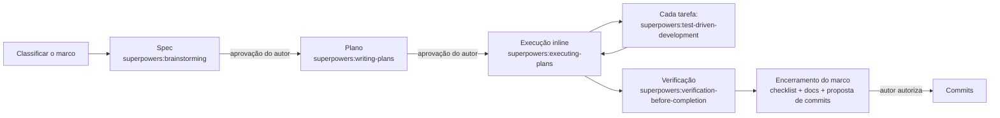

# Fluxo de Desenvolvimento

Regras obrigatórias para garantir a qualidade da entrega. Todo marco de [`implementation-plan.md`](implementation-plan.md) passa por **spec → plano → execução com TDD → verificação**, usando as skills do *superpowers*. As regras valem sob pressão de prazo: a [ordem de corte](implementation-plan.md#4-ordem-de-corte-se-o-prazo-apertar) reduz **escopo**, nunca o processo.

---

## 1. Visão geral

| Etapa | Skill | Artefato | Portão |
| --- | --- | --- | --- |
| Classificação | `superpowers:brainstorming` | Anúncio no chat: *spike*, *bounded* ou *architectural* | O autor pode reclassificar |
| Spec | `superpowers:brainstorming` (caminho *architectural*) | `docs/dev/specs/YYYY-MM-DD-mN-<tema>-design.md` | O autor aprova a spec escrita |
| Plano | `superpowers:writing-plans` | `docs/dev/plans/YYYY-MM-DD-mN-<tema>.md` | O autor aprova o plano |
| Execução | `superpowers:executing-plans` (inline, sem subagentes) | Código + testes | Cada tarefa passa por red → green → refactor |
| TDD | `superpowers:test-driven-development` | Teste que falhou antes do código | Iron Law (§4) |
| Verificação | `superpowers:verification-before-completion` | Saída dos comandos no chat | Nenhuma afirmação de "pronto" sem evidência nova |
| Encerramento | — | Checklist, docs e proposta de commits | O autor autoriza os commits |

---

## 2. Aplicabilidade por marco

| Marco | Caminho | Spec | Plano | TDD | Observações |
| --- | --- | :-: | :-: | :-: | --- |
| M0 — spikes MiniStack/Keycloak | *spike* | — | — | — | Pergunta e plano de investigação no chat. O código é descartável. As conclusões vão para `docs/dev/spike-*.md`, e as decisões resultantes para `decisions.md` |
| M0 — esqueleto e qualidade | *architectural* | ✅ | ✅ | ✅ código Go | TDD em config, health e bootstrap. Compose, Dockerfile, Makefile e YAML são exceções (§4.4) |
| M1 — domínio | *architectural* | ✅ | ✅ | ✅ | TDD completo, com a tabela U de [`test-plan.md`](test-plan.md) como roteiro |
| M2 — persistência | *architectural* | ✅ | ✅ | ✅ | Os testes de integração (I01–I03) vêm **antes** das migrations e dos repositórios |
| M3 — contrato, casos de uso, HTTP e autenticação | *architectural* | ✅ | ✅ | ✅ | **Contrato primeiro:** a spec inclui o `api/openapi.yaml` completo, aprovado antes dos handlers. Os testes A, I e de contrato vêm antes da implementação |
| M4 — outbox | *architectural* | ✅ | ✅ | ✅ | |
| M5 — consumidor SQS | *architectural* | ✅ | ✅ | ✅ | |
| M6 — worker de referências | *architectural* | ✅ | ✅ | ✅ | |
| M7 — observabilidade | *architectural* | ✅ | ✅ | ✅ | |
| M8 — harness e2e | *architectural* | ✅ | ✅ | ✅ | Os testes cobrem comportamento já existente, então vale a checagem de sensibilidade (§4.3) |
| M9 — resiliência | *bounded* | ✅ (curta) | ✅ (curto) | ✅ | Os fluxos já existem, então é *bounded*; spec e plano curtos, como toda tarefa de código. Checagem de sensibilidade obrigatória |
| M10 — documentação de entrega | — | — | Roteiro no chat | — | É documentação. A verificação acontece no M11 |
| M11 — verificação a partir de um clone limpo | — | — | — | — | `verification-before-completion` do começo ao fim |
| M12 — opcionais | Classificar na hora | Conforme o caminho | Conforme o caminho | ✅ | |

**Correções no meio do caminho:** um bug ou ajuste pontual depois que o código existe também passa por **spec → plano → TDD** (decisão do autor em 29/09/2026): spec e plano curtos, proporcionais ao ajuste, mas escritos em `docs/dev/specs|plans/` e aprovados. O TDD começa por um teste que reproduz o problema. Se aparecer uma complexidade escondida, o trabalho sobe de caminho (*bounded* → *architectural*), nunca desce.

**Regra para o agente:** o fluxo está resumido em [`.claude/rules/development-workflow.md`](../.claude/rules/development-workflow.md), carregado automaticamente pelo Claude Code, e o plugin *superpowers* é dependência do projeto em [`.claude/settings.json`](../.claude/settings.json).

---

## 3. Specs e planos

### 3.1 Spec (`superpowers:brainstorming`)

- **Local:** `docs/dev/specs/YYYY-MM-DD-mN-<tema>-design.md`, por exemplo `2026-09-29-m1-domain-design.md`.
- **Conteúdo: o delta em relação a `docs/`.** A documentação em `docs/*.md` já é o contrato do sistema, então a spec **não a repete**. Ela aponta as seções que implementa (ex.: "implementa [`transaction-lifecycle.md`](transaction-lifecycle.md) §2–§4") e se concentra no que falta decidir:
  - interfaces e assinaturas públicas dos pacotes do marco;
  - tipos e erros;
  - como os componentes se encaixam;
  - lacunas e ambiguidades encontradas;
  - riscos do marco.
- **Perguntas** só sobre o que os docs não respondem, uma de cada vez. As decisões já registradas em [`decisions.md`](decisions.md) não são rediscutidas.
- **Decisão nova ou alterada** durante a spec: atualizar `decisions.md` e os documentos afetados **na mesma etapa**, antes de pedir a aprovação da spec.
- **Autorrevisão** da spec antes de pedir a revisão do autor: procurar placeholders, contradições com `docs/`, ambiguidades e escopo além do marco.
- **Sem commit ao salvar.** Esse passo da skill é substituído pela política da §6.

### 3.2 Plano (`superpowers:writing-plans`)

- **Local:** `docs/dev/plans/YYYY-MM-DD-mN-<tema>.md`, com link para a spec correspondente.
- **Tarefas pequenas.** Cada uma tem:
  1. arquivos a criar ou alterar (caminhos exatos, de acordo com [`structure.md`](structure.md));
  2. o **teste a escrever primeiro**, com o nome e o comentário `// Covers:` com os IDs;
  3. o comando que deve **falhar** e o motivo esperado da falha;
  4. a implementação mínima;
  5. o comando que deve **passar**;
  6. o refactor, se houver.
- Os passos de commit do template da skill são trocados por **checkpoints** (ex.: "checkpoint: `go test -race ./internal/domain/money/...` verde"). Ver §6.
- A ordem das tarefas segue a dependência entre camadas: domínio → portas → adaptadores → bordas.
- O plano termina com a **tarefa de verificação do marco** (§5).

---

## 4. TDD

### 4.1 Iron Law

> **Nenhum código de produção sem um teste que falhou antes.**
> Se o código foi escrito antes do teste, ele é apagado e reescrito a partir do teste.

### 4.2 Ciclo em Go

1. **RED:** escrever um teste mínimo com o comportamento esperado.
   - Se o símbolo ainda não existe, criar um **stub** com a assinatura correta que retorna o valor zero ou `errNotImplemented`. Assim o teste falha na **asserção**, e não só na compilação. Um erro de compilação sozinho não conta como red.
   - Rodar `go test -race -run '^TestX$' ./caminho/...` e confirmar que ele falha **pelo motivo esperado**.
2. **GREEN:** escrever o código mínimo para o teste passar. Rodar de novo e confirmar que todos os testes do pacote passam.
3. **REFACTOR:** melhorar o código só com tudo verde. Rodar de novo.
4. Repetir até cobrir a tarefa.

**Níveis de teste:**
- **Integração** (tag `integration`): o teste contra infraestrutura real vem antes. Por exemplo, o teste da constraint falha porque a migration ainda não existe, e então a migration é escrita.
- **Bugs:** primeiro um teste que reproduz o problema e falha. Só depois vem a correção.

### 4.3 Checagem de sensibilidade

Alguns testes são escritos **depois** que o comportamento já existe: o e2e do M8, a resiliência do M9 e testes que cobrem mais de um marco. Esses testes tendem a passar de primeira. Antes de aceitá-los como válidos:
1. **Sabotar** temporariamente o comportamento testado. Exemplos: remover o `DeleteMessage` da inbox, desligar o lock `FOR UPDATE`, publicar antes do commit, desabilitar um ponto de falha.
2. Confirmar que o teste **falha** e que a mensagem aponta o problema.
3. Desfazer a sabotagem e confirmar que o teste volta ao verde.

Registrar a sabotagem usada em um comentário no teste (`// Sensitivity: <como foi verificado>`).

### 4.4 Exceções aprovadas (pelo autor em 28/09/2026)

Estes artefatos não passam por TDD, mas cada um tem uma **validação obrigatória**:

| Artefato | Validação |
| --- | --- |
| `docker-compose.yml`, `Dockerfile`, `.dockerignore` | `docker compose config` + `docker compose up --build --wait` saudável |
| `Makefile`, `.golangci.yml`, `.editorconfig` | `make check` executado e verde |
| `.env.example` | Usado de fato pelo compose e pelos testes |
| `deploy/keycloak/*.json` | Testes A01–A04 com tokens reais |
| `deploy/aws/init.sh` e as políticas | Smoke test do `testkit` confirmando que filas, redrive, tópico e assinatura existem; I04f provando permissões e negações das políticas |
| `deploy/postgres/01-roles.sh` | Teste I02b (permissões de `pda_app`) |
| Código de spike | Nunca é mantido. Se a solução for aproveitada, é reescrita com TDD |
| Documentação | Revisão de links e execução real dos comandos do README no M11 |
| `scripts/*.sh` (aprovado em 30/09/2026, no M11) | Execução real dos exemplos do README que usam o script (§7 e §8) |
| `test/load/*.js` (scripts k6; aprovado em 30/09/2026, no M12) | Execução curta (`DURATION=5s RATE=20`), execução canônica de `make load-test` com saída 0 e checagem de sensibilidade de cada portão (spec do M12, §6) |

Qualquer outra exceção precisa de aprovação explícita do autor.

### 4.5 Qualidade dos testes

- Usam código real. Dublês só quando for inevitável e **nunca** no lugar de toda a infraestrutura ([`test-plan.md`](test-plan.md) §1).
- Todo teste roda com `-race`.
- Tabelas de casos (*table-driven*) nas regras com muitas combinações: `Money`, máquina de estados, regras por tipo.
- Um comportamento por teste, com um nome que o descreva: `TestParseMoney_RejectsScientificNotation`.
- A saída dos testes fica limpa, sem avisos nem logs ruidosos.

---

## 5. Verificação e "pronto" do marco

A skill `superpowers:verification-before-completion` vale para toda afirmação de status: **nenhuma afirmação sem a saída do comando, executado na mesma mensagem.**

Um marco só está **pronto** quando:
1. `make check` foi executado e passou: formatação, lint, vet, `go.mod` limpo, versão do Go e testes unitários com `-race`.
2. Os testes com tag do marco (`make test-integration` e/ou `make test-e2e`) foram executados e passaram.
3. Cada item do checklist de TDD da skill foi atendido. Em especial: todo teste novo foi visto falhando pelo motivo certo.
4. Os itens de [`delivery-requirements.md`](delivery-requirements.md) do marco estão marcados `[x]`, **cada um citando o teste que o comprova**.
5. Os documentos em `docs/` refletem qualquer decisão tomada durante o marco.
6. O [`ARCHITECTURE.md`](../ARCHITECTURE.md) foi revisado. Ele é um documento vivo: se o marco detalhou ou alterou alguma decisão, interpretação ou limitação, isso é refletido nele e em `docs/decisions.md`.
7. O autor recebeu um resumo com a evidência (saída dos comandos) e a **proposta de commits**.

---

## 6. Commits

- **Nenhum commit automático.** Os passos de commit das skills (spec, plano, tarefas) são ignorados. Também não criamos worktree nem branch sem pedido do autor.
- **No encerramento do marco**, propor commits atômicos por responsabilidade, no padrão Conventional Commits (ex.: `feat(money): ...`, `test(postgres): ...`, `docs: ...`). O autor decide se, quando e como commitar.
- A skill `superpowers:finishing-a-development-branch` é adaptada: em vez de fazer merge ou abrir PR, ela produz essa proposta de commits.

---

## 7. Execução

- **Inline**, com `superpowers:executing-plans`, na própria sessão. Subagentes só com pedido explícito do autor.
- **Parar e perguntar** quando surgir um bloqueio, uma lacuna no plano, uma instrução ambígua ou uma divergência entre a spec e `docs/`. Não improvisar.
- **Tamanho do processo:** spec e plano devem ser proporcionais ao marco. A meta é gastar até ~15% do tempo estimado do marco com eles. Como `docs/` já fixa a maior parte das decisões, as specs tendem a ser curtas.
