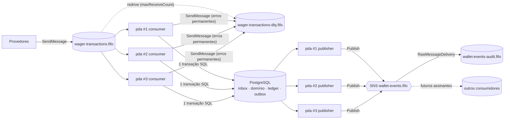

# Mensageria

Topologia, provisionamento, contrato de entrada (SQS), comportamento do consumidor, publicação via outbox e contratos dos eventos de saída (SNS). Complementa [`decisions.md`](decisions.md) (D-02, D-12, D-13), [`transaction-lifecycle.md`](transaction-lifecycle.md) §6–§7 e [`data-model.md`](data-model.md) §3.4–§3.5.

---

## 1. Topologia



- **Entrada:** at-least-once, com uma fila FIFO única para todos os provedores. As três instâncias consomem em paralelo, e a correção não depende de qual instância recebe cada mensagem (CONC-04).
- **Saída:** at-least-once via transactional outbox, com qualquer instância publicando. `wallet-events-audit.fifo` é o consumidor de referência, usado nos testes e na demonstração.

---

## 2. Provisionamento

Um serviço `aws-init` no compose executa `deploy/aws/init.sh` com a imagem `amazon/aws-cli` contra `http://ministack:4566`. O script é **idempotente**: `create-queue` e `create-topic` com os mesmos atributos não falham, as assinaturas e os usuários IAM são verificados antes de serem criados, e as chaves de acesso são recriadas a cada execução (o arquivo de credenciais é reescrito, ver §2.1). A aplicação depende de `aws-init: condition: service_completed_successfully`.

| Recurso | Tipo | Atributos |
| --- | --- | --- |
| `wager-transactions-dlq.fifo` | SQS FIFO | `FifoQueue=true`, `ContentBasedDeduplication=false`, `MessageRetentionPeriod=1209600` (14 dias) |
| `wager-transactions.fifo` | SQS FIFO | `FifoQueue=true`, `ContentBasedDeduplication=false`, `VisibilityTimeout=30`, `ReceiveMessageWaitTimeSeconds=20`, `MessageRetentionPeriod=345600` (4 dias), `RedrivePolicy={"deadLetterTargetArn":"<dlq-arn>","maxReceiveCount":"10"}` |
| `wallet-events.fifo` | SNS FIFO | `FifoTopic=true`, `ContentBasedDeduplication=false` |
| `wallet-events-audit.fifo` | SQS FIFO | `FifoQueue=true`, `MessageRetentionPeriod=345600`. Assina o tópico com `RawMessageDelivery=true` e tem uma política que permite `sqs:SendMessage` a partir do tópico |

**Opcional:** `DeduplicationScope=messageGroup` + `FifoThroughputLimit=perMessageGroupId` (FIFO de alta vazão), aplicados só se o MiniStack aceitar. Não mudam nenhuma garantia.

Todos os nomes vêm de variáveis de ambiente (`SQS_WAGER_QUEUE_NAME`, `SQS_WAGER_DLQ_NAME`, `SNS_EVENTS_TOPIC_NAME` e `SQS_EVENTS_AUDIT_QUEUE_NAME`). Assim os testes criam recursos isolados com sufixo aleatório (ver `test-plan.md`).

### 2.1 Credenciais e políticas (AUTH-09)

O MiniStack roda com `AUTH=true` e **avalia** as políticas (D-02, [`dev/spike-ministack.md`](dev/spike-ministack.md) §3).
- O `aws-init` provisiona tudo com a chave raiz do emulador (`test`).
- Em seguida, cria um **usuário IAM por principal** com uma **política de identidade** (`PutUserPolicy`), gera as chaves e grava `.local/aws/credentials`, em formato INI, com um profile por usuário.
- A aplicação usa `AWS_SHARED_CREDENTIALS_FILE` + `AWS_PROFILE=pda-wallet-service`, e as chaves nunca aparecem no código nem no `.env.example`.

| Principal | Tipo de política | Pode | Recurso |
| --- | --- | --- | --- |
| `user/provider-a`, `user/provider-b` | Identidade | `sqs:SendMessage`, `sqs:GetQueueUrl` | `wager-transactions.fifo` |
| `user/pda-wallet-service` | Identidade | `sqs:ReceiveMessage`, `sqs:DeleteMessage`, `sqs:ChangeMessageVisibility`, `sqs:GetQueueAttributes`, `sqs:GetQueueUrl` | `wager-transactions.fifo` |
| `user/pda-wallet-service` | Identidade | `sqs:SendMessage`, `sqs:GetQueueAttributes`, `sqs:GetQueueUrl` | `wager-transactions-dlq.fifo` |
| `user/pda-wallet-service` | Identidade | `sns:Publish`, `sns:GetTopicAttributes` (verificação do tópico no start, §5.2) | `wallet-events.fifo` |
| `sns.amazonaws.com` (condição `aws:SourceArn = <topic-arn>`) | Recurso (fila) | `sqs:SendMessage` | `wallet-events-audit.fifo` |

Tudo o que não está na tabela é negado implicitamente. Por exemplo: provedor consumindo ou publicando no tópico, serviço enviando na fila de entrada, qualquer principal criando ou apagando recursos.

Exemplo, a política de identidade de `pda-wallet-service` (`deploy/aws/policies/pda-wallet-service.json`, com os ARNs substituídos pelo `init.sh`):

```json
{
  "Version": "2012-10-17",
  "Statement": [
    { "Sid": "ConsumeWagerQueue", "Effect": "Allow",
      "Action": ["sqs:ReceiveMessage","sqs:DeleteMessage","sqs:ChangeMessageVisibility",
                 "sqs:GetQueueAttributes","sqs:GetQueueUrl"],
      "Resource": "<wager-queue-arn>" },
    { "Sid": "SendToDLQ", "Effect": "Allow",
      "Action": ["sqs:SendMessage","sqs:GetQueueAttributes","sqs:GetQueueUrl"],
      "Resource": "<dlq-arn>" },
    { "Sid": "PublishEvents", "Effect": "Allow",
      "Action": ["sns:Publish","sns:GetTopicAttributes"], "Resource": "<topic-arn>" }
  ]
}
```

**Por que política de identidade, e não de recurso:** na AWS, dentro da mesma conta, as duas funcionam. O MiniStack só concede acesso pela de identidade (o `Allow` só na de recurso é negado), embora respeite `Deny` em política de recurso e a política da fila na entrega do SNS. A política de identidade também é o padrão usual para os principals da própria conta.

**O teste I04f** aplica esses mesmos documentos a usuários criados para o teste e verifica as permissões e as negações.

> **Limitações (D-02):**
> - O emulador não verifica a assinatura SigV4: o principal é identificado só pelo access key id. A **autorização** é aplicada de verdade; a **autenticação** no broker é fraca localmente. Em produção, as credenciais viriam de roles IAM (IRSA ou task role), sem chaves estáticas.
> - O consumidor **nunca** confia na origem: aplica todas as validações de domínio (D-07).

---

## 3. Contrato de entrada — `WagerTransactionRequested`

### 3.1 Corpo da mensagem

```json
{
  "messageId": "msg-123",
  "type": "WagerTransactionRequested",
  "occurredAt": "2026-09-08T12:00:00.000Z",
  "data": {
    "providerId": "provider-a",
    "externalTransactionId": "transaction-123",
    "idempotencyKey": "provider-a:transaction-123",
    "playerId": "0192f28f-5dc0-7d58-bdb2-814ad6a0f4a1",
    "walletId": "0192f291-27dd-7d3f-8071-5f8685deef37",
    "roundId": "round-987",
    "gameId": "fortune-chimp",
    "kind": "BET",
    "money": { "amount": "25.00", "currency": "BRL" },
    "referenceExternalTransactionId": "transaction-100"
  }
}
```

| Campo | Regra |
| --- | --- |
| `messageId` | Obrigatório, de 1 a 128 caracteres. É a **identidade durável** da mensagem na inbox (SQS-03) |
| `type` | Deve ser exatamente `WagerTransactionRequested` |
| `occurredAt` | Obrigatório, RFC 3339. Validado, mas **fora** do hash de idempotência |
| `data.idempotencyKey` | Obrigatório, com as mesmas regras do header `Idempotency-Key` |
| `data.*` (demais campos) | Mesmas regras do corpo HTTP ([`transaction-lifecycle.md`](transaction-lifecycle.md) §3.1). `referenceExternalTransactionId` só aparece em WIN (opcional), REFUND e ROLLBACK |
| Campos desconhecidos | Rejeitados (`DisallowUnknownFields`), como no HTTP. Aceitá-los permitiria que duas mensagens diferentes tivessem o mesmo hash |

A aplicação converte `data` no **mesmo comando de domínio** do HTTP, com `received_via = SQS`. Como o hash de negócio é calculado sobre o comando, ele é igual nos dois canais (D-08).

### 3.2 Atributos de envio exigidos do produtor

| Atributo SQS | Valor | Motivo |
| --- | --- | --- |
| `MessageGroupId` | `data.walletId` | Ordem por carteira e paralelismo entre carteiras. Um BET chega antes do REFUND correspondente, o que reduz as pendências de referência |
| `MessageDeduplicationId` | `messageId` | Deduplicação de 5 minutos do FIFO. É **apenas uma otimização**: a garantia vem da inbox e da idempotência (CONC-03) |
| Message attribute `correlationId` (opcional) | String | Propagado para logs e eventos. Se ausente, `correlationId = messageId` |

A correção **não** depende de o produtor seguir essa convenção. Um `MessageGroupId` diferente só afeta a ordem e o paralelismo. Um `MessageDeduplicationId` diferente para o mesmo `messageId` é barrado pela inbox.

### 3.3 Hashes

| Hash | Entrada | Uso |
| --- | --- | --- |
| `payload_hash` (negócio) | JSON canônico dos campos de negócio do comando (D-08) | Idempotência entre HTTP e SQS |
| `message_hash` (inbox) | JSON canônico de `{"type": …, "data": …}` (inclui `idempotencyKey`, exclui `messageId` e `occurredAt`), montado a partir do `data` já decodificado, com as chaves em ordem lexicográfica. Um campo ausente e um `null` geram o mesmo hash | Detecta o mesmo `messageId` com conteúdo diferente, o que resulta em DLQ com `MESSAGE_HASH_MISMATCH` |

---

## 4. Consumidor

### 4.1 Parâmetros

| Parâmetro | Padrão | Env | Observação |
| --- | --- | --- | --- |
| Pollers por instância | 2 | `SQS_CONSUMER_POLLERS` | Cada poller faz long polling |
| Mensagens por `ReceiveMessage` | 10 | `SQS_RECEIVE_BATCH` | Máximo do SQS |
| Long polling | 20 s | `SQS_WAIT_TIME` | Cancelado imediatamente no shutdown |
| Visibility timeout | 30 s | `SQS_VISIBILITY_TIMEOUT` | Enviado em cada `ReceiveMessage` |
| Prazo por mensagem | 10 s | `SQS_PROCESSING_TIMEOUT` | `context.WithTimeout`; o start falha se não for menor que o visibility timeout |
| Processamento simultâneo | 16 | `SQS_MAX_IN_FLIGHT` | Semáforo por instância |
| `maxReceiveCount` | 10 | Provisionamento | Tentativas antes da redrive para a DLQ |
| Backoff transitório | `min(2^receiveCount s, 300 s)` | `SQS_RETRY_MAX_DELAY` | Aplicado com `ChangeMessageVisibility` |
| Nome na inbox | `wager-transactions-consumer` | — | `consumer_name` |

**Tolerância a indisponibilidade:**
- Com o backoff acima, uma mensagem com falha transitória persistente leva cerca de 18 min (2 + 4 + … + 256 + 300 + 300 s = 1.110 s) até ir para a DLQ.
- Uma queda **geral** do PostgreSQL não gasta tentativas por causa da pausa por saúde (§4.3).

### 4.2 Processamento de um lote

1. Agrupa as mensagens por `MessageGroupId` (atributo de sistema pedido no `ReceiveMessage`).
2. Grupos diferentes são processados **em paralelo**, e mensagens do mesmo grupo **em sequência**, na ordem recebida.
3. Se uma mensagem do grupo falhar de forma transitória, as seguintes do mesmo grupo **não** são processadas e voltam com `ChangeMessageVisibility(0)`. O FIFO não entrega as mensagens seguintes de um grupo enquanto houver uma em andamento, então a ordem é preservada. Cada liberação conta um recebimento das seguintes: com uma falha transitória persistente na primeira, as seguintes do grupo também chegam à DLQ pela redrive, junto com ela (comportamento do FIFO).
   - **Liberação por prazo:** antes de começar cada mensagem, se o visibility restante (contado desde o recebimento) é menor que o `SQS_PROCESSING_TIMEOUT`, ela e as seguintes do grupo são liberadas sem processar (`sqs_retries_total{reason="deadline_release"}`). Nenhuma mensagem é processada depois de poder ter sido reentregue.
   - **Orquestração:** o caso de uso `app.ConsumeWager` consulta a inbox, valida e chama o `ProcessWager`, que grava a inbox em todo caminho de conclusão. Uma violação da PK da inbox no commit recomeça pela consulta à inbox.
4. As ações por resultado seguem [`transaction-lifecycle.md`](transaction-lifecycle.md) §6.2. O resumo:

| Resultado | Ação |
| --- | --- |
| `PROCESSED` / `REJECTED` / `PENDING_REFERENCE` / replay | Commit, depois `DeleteMessage` |
| `FAILED` (falha permanente) | `FAILED` + inbox gravados em transação separada; envio explícito para a DLQ (§4.4), depois `DeleteMessage` |
| Duplicata (inbox com o mesmo hash) | `DeleteMessage` + `wager_duplicates_total{channel="sqs",layer="inbox"}` |
| Inválida ou conflito (erro de entrada) | Envio explícito para a DLQ (§4.4), depois `DeleteMessage` |
| Transitória | `ChangeMessageVisibility(backoff)`, sem remover |
| `DeleteMessage` falhou após o commit | Só log e métrica. A reentrega cai na inbox como duplicata |

### 4.3 Pausa por saúde

Quando uma mensagem termina em erro transitório, o consumidor faz um `Ping` no pool (timeout de 1 s). Se o ping falha, a indisponibilidade é de **infraestrutura** e o consumidor marca a dependência como indisponível; se passa, o erro era da mensagem (lock timeout, corrida) e segue o backoff normal:
- Os pollers **param de chamar `ReceiveMessage`** e verificam o PostgreSQL com ping a cada 2 s, voltando a receber quando o ping responde.
- As mensagens já recebidas seguem o backoff normal. As que ainda estão na fila não são recebidas, então não incrementam o `receiveCount`.

Isso evita que uma indisponibilidade temporária mande mensagens válidas para a DLQ (§3 do desafio). `/health/ready` reflete o mesmo estado.

Uma falha do SQS (`ReceiveMessage` com erro) faz o poller tentar de novo com backoff de 1 s a 30 s, com log e métrica `sqs_receive_errors_total`.

### 4.4 DLQ

| Origem | Como chega | Atributos |
| --- | --- | --- |
| Tentativas esgotadas (transitória persistente) | Redrive automática do SQS após `maxReceiveCount` | Os originais |
| Erro permanente: entrada inválida ([`transaction-lifecycle.md`](transaction-lifecycle.md) §5.3–§5.4), conflito de idempotência, `UNKNOWN_WALLET`, falha permanente de infraestrutura (`INTERNAL_PERMANENT_FAILURE`, com `FAILED` gravado no banco) ou falha permanente sem registro possível (`INTERNAL_ERROR`: a operação já gravada com a mesma chave não pode ser lida) | `SendMessage` explícito para a DLQ, depois `DeleteMessage` | `errorCode`, `errorCategory`, `originalMessageId` (id SQS), `consumerName`, `failedAt` |

- **Envio explícito:** usa o `MessageGroupId` original (ou `invalid-messages` se não houver) e `MessageDeduplicationId = <id SQS original>`. Um crash entre o envio e o `DeleteMessage` produz no máximo uma cópia a mais na DLQ, e o FIFO deduplica dentro de 5 min.
- **Se o envio para a DLQ falhar:** a mensagem **não** é removida e o caso é tratado como transitório.
- **Métricas:**
  - `sqs_dlq_sent_total{reason}`: envios explícitos;
  - `sqs_dlq_depth`: gauge de `ApproximateNumberOfMessages`, atualizado a cada 30 s, que cobre também as redrives automáticas.
- **Reprocessamento:** documentado no README. `aws sqs start-message-move-task` devolve a mensagem da DLQ para a fila principal; se o MiniStack não suportar, um script lê da DLQ e reenvia. A mensagem reprocessada cai na inbox ou na idempotência normalmente.

### 4.5 Shutdown (SQS-09)

No `OnStop`, com prazo de `SHUTDOWN_TIMEOUT` (20 s, e `fx.StopTimeout` de 30 s):
1. **Para de buscar:** cancela o contexto dos pollers, o que interrompe o long polling na hora.
2. **Mensagens recebidas e não iniciadas:** `ChangeMessageVisibility(0)`, liberando para outra instância.
3. **Em andamento:** espera terminarem (`WaitGroup`) até o prazo.
4. **Prazo esgotado:** cancela o contexto das restantes. A transação faz rollback e as mensagens recebem `ChangeMessageVisibility(0)`, usando um contexto novo de 2 s.
5. O `OnStop` do consumidor só retorna depois disso. Só então o pool do PostgreSQL é fechado (D-15).

Em nenhum desses caminhos uma mensagem é removida sem commit. Um `SIGKILL` no meio do processamento equivale ao passo 4 sem a liberação: a mensagem reaparece quando o visibility timeout vence.

> **Limitação (achado da validação do M5):** um long polling cancelado pelo cliente no passo 1 continua aberto no broker até o fim do seu `WaitTimeSeconds`. Uma mensagem liberada nesse intervalo pode ser entregue a esse poll órfão e ficar invisível por um visibility timeout antes de voltar à fila. Não há perda nem duplicidade, só um atraso de até um visibility timeout para essa mensagem. Os testes de shutdown usam short polling para observar a liberação em si.

---

## 5. Publicação — transactional outbox

### 5.1 Parâmetros do publisher

| Parâmetro | Padrão | Env |
| --- | --- | --- |
| Tamanho do lote do claim | 50 | `OUTBOX_BATCH_SIZE` |
| Lease | 30 s | `OUTBOX_LEASE` |
| Intervalo de varredura quando ocioso | 500 ms (sem espera se o lote veio cheio) | `OUTBOX_POLL_INTERVAL` |
| Publicações simultâneas | 8 (grupos em paralelo, eventos do mesmo grupo em sequência) | `OUTBOX_CONCURRENCY` |
| Backoff por evento | `min(base × 2^attempts, máx)`, com `attempts` antes da falha: 1 s, 2 s, 4 s… até 5 min | `OUTBOX_RETRY_BASE_DELAY` (1 s), `OUTBOX_RETRY_MAX_DELAY` (5 min) |
| Timeout de cada `Publish` | `lease / 2`, desacoplado do cancelamento do loop | — |
| Identidade da instância | `hostname-pid-<8 hex>` | — (usado em `locked_by`) |

O algoritmo de claim, publicação, confirmação e falha está em [`data-model.md`](data-model.md) §6 e em D-13. **Todo erro do `Publish`** segue o caminho de falha (`attempts++`, backoff e lease liberado): um evento confirmado nunca é descartado.

### 5.2 Mapeamento para o SNS

| Parâmetro do `Publish` | Valor |
| --- | --- |
| `TopicArn` | Resolvido no start: `sts:GetCallerIdentity` dá partição e conta, o ARN é `arn:<partição>:sns:<AWS_REGION>:<conta>:<SNS_EVENTS_TOPIC_NAME>` e é verificado com `sns:GetTopicAttributes`. Se falhar, a aplicação não sobe |
| `Message` | Coluna `payload`: o JSON lido da coluna, enviado sem nenhuma reserialização (o `JSONB` normaliza o texto na gravação, então ele é idêntico em toda republicação) |
| `MessageGroupId` | Coluna `message_group_id`, sempre o `walletId` |
| `MessageDeduplicationId` | `event_id` |
| `MessageAttributes` | `eventType` (String), `eventVersion` (Number), `correlationId` (String) |

### 5.3 Recuperação

| Interrupção | O que acontece | Resultado |
| --- | --- | --- |
| Entre o commit do domínio e o claim | O evento fica pendente no banco | Qualquer publisher o encontra na próxima varredura |
| Entre o claim e o `Publish` | O lease vence (30 s) | Outro publisher, ou a mesma instância reiniciada, reassume o evento |
| Entre o `Publish` e a confirmação | O lease vence e o evento é **republicado** com o mesmo `eventId` e o mesmo conteúdo | Dentro de 5 min, o SNS FIFO deduplica. Depois disso, o consumidor deduplica pelo `eventId` |
| SNS indisponível | `attempts++`, backoff e lease liberado | O evento nunca é descartado, e `outbox_oldest_pending_age_seconds` sobe |
| PostgreSQL indisponível | A varredura falha | O publisher tenta de novo com backoff de 1 s a 30 s |
| Shutdown gracioso (`SIGTERM`) | Nenhum claim nem `Publish` novo começa; os `Publish` em andamento terminam e são confirmados | Os eventos reservados que não começaram ficam com o lease, que vence e é reassumido |

**Garantia E8:** o publisher só enxerga linhas **confirmadas**, porque roda em outra transação sob `READ COMMITTED`. Por isso não há publicação antes do commit. Um teste de integração dedicado comprova isso (`test-plan.md`, TST-I05b).

---

## 6. Contratos dos eventos de saída

**Contrato formal:** [`api/events.yaml`](../api/events.yaml) (OpenAPI 3.0.3, só schemas). O corpo valida contra `Envelope`, e `data` valida contra `<eventType>V<version>`. Os testes validam toda mensagem recebida na fila de auditoria contra ele. Esta seção explica as regras; em caso de dúvida, vale o arquivo.

### 6.1 Envelope

```json
{
  "eventId": "0192f2a0-1c2d-7e3f-8a9b-0c1d2e3f4a5b",
  "eventType": "WalletBalanceChanged",
  "version": 1,
  "aggregateType": "Wallet",
  "aggregateId": "0192f291-27dd-7d3f-8071-5f8685deef37",
  "correlationId": "7f1c9a4e-...",
  "causationId": "msg-123",
  "occurredAt": "2026-09-08T12:00:00.123Z",
  "data": { }
}
```

| Campo | Regra |
| --- | --- |
| `eventId` | UUIDv7, atribuído **ao selar o envelope** (`events.Seal`), antes do `INSERT` na outbox. É estável em todas as republicações |
| `eventType` / `version` | Definidos pelo construtor tipado de cada evento (`NewWalletBalanceChanged(...)`). Não é possível criar um evento com tipo ou versão arbitrários |
| `aggregateType` / `aggregateId` | `Wallet` + `walletId` para `WalletBalanceChanged`, e `WagerTransaction` + `transactionId` para os demais |
| `correlationId` | Vem da origem: HTTP `X-Correlation-Id` (ou gerado); SQS: atributo `correlationId` ou `messageId`. Fica gravado na transação, e o worker de referências reutiliza o valor original |
| `causationId` | Opcional. SQS: `messageId`. Worker de referências: `transactionId` da referência que desbloqueou a operação. HTTP e abertura: omitido |
| `occurredAt` e timestamps em `data` | UTC, RFC 3339 com 3 casas decimais fixas (`2006-01-02T15:04:05.000Z`), inclusive `processedAt`, `rejectedAt`, `nextAttemptAt` e `expiresAt` |
| Dinheiro | Sempre `{"amount":"<decimal>","currency":"<ISO>"}`, com strings |
| Campos inaplicáveis | **Omitidos**, sem `null`. Ex.: metadados externos em eventos de `OPENING` (OUT-13) |

O envelope inteiro é serializado **uma vez**, no momento do `INSERT` na outbox, e gravado em `payload`. É esse snapshot imutável que é publicado (OUT-01).

### 6.2 `WalletBalanceChanged` v1

Emitido quando o saldo muda: BET, WIN, REFUND, ROLLBACK e OPENING com saldo maior que zero.

```json
{
  "walletId": "0192f291-27dd-7d3f-8071-5f8685deef37",
  "transactionId": "0192f298-345e-7e38-af88-e43f851a819d",
  "transactionKind": "BET",
  "direction": "DEBIT",
  "money":         { "amount": "25.00",   "currency": "BRL" },
  "balanceBefore": { "amount": "1000.00", "currency": "BRL" },
  "balanceAfter":  { "amount": "975.00",  "currency": "BRL" },
  "walletVersion": 2
}
```

Os campos exigidos por OUT-11 estão todos presentes. `transactionKind` é um campo a mais, pensado para facilitar a vida dos consumidores.

### 6.3 `WagerTransactionProcessed` v1

Emitido em toda conclusão bem-sucedida, inclusive `LOSS` e `OPENING`.

| Campo | Presença | Descrição |
| --- | --- | --- |
| `transactionId`, `origin`, `kind`, `walletId`, `playerId`, `money` | Sempre | `origin` = `INTERNAL` ou `EXTERNAL` |
| `balanceAfter` | Sempre | Saldo observado ao concluir, o mesmo devolvido no replay |
| `walletVersion` | Sempre | Versão da carteira depois da operação. Em `LOSS`, é a versão corrente, sem incremento |
| `processedAt` | Sempre | RFC 3339 UTC |
| `providerId`, `externalTransactionId`, `roundId`, `gameId` | Só `EXTERNAL` | — |
| `referenceExternalTransactionId`, `referenceTransactionId` | Quando há referência | — |

### 6.4 `WagerTransactionRejected` v1

Emitido em toda rejeição definitiva por regra de negócio, inclusive por expiração de referência.

| Campo | Presença |
| --- | --- |
| `transactionId`, `kind`, `walletId`, `playerId`, `providerId`, `externalTransactionId`, `roundId`, `gameId`, `money` | Sempre (rejeições só ocorrem em operações externas) |
| `failureCode`, `failureCategory` | Sempre (catálogo em [`transaction-lifecycle.md`](transaction-lifecycle.md) §5.1) |
| `balance` | Sempre: saldo observado no momento da rejeição |
| `referenceExternalTransactionId` | Quando há referência |
| `rejectedAt` | Sempre |

### 6.5 `WagerTransactionPendingReference` v1

Emitido **uma vez**, quando a operação entra em `PENDING_REFERENCE`. As novas tentativas não geram evento.

| Campo | Presença |
| --- | --- |
| `transactionId`, `kind`, `walletId`, `playerId`, `providerId`, `externalTransactionId`, `roundId`, `gameId`, `money` | Sempre |
| `referenceExternalTransactionId` | Sempre |
| `nextAttemptAt`, `expiresAt` | Sempre |

---

## 7. Contrato de consumo (para quem assina `wallet-events.fifo`)

1. **At-least-once:** o mesmo `eventId` pode chegar mais de uma vez. Deduplique pelo `eventId`.
2. **Ordem:** o `MessageGroupId` é o `walletId`, mas com vários publishers a ordem entre eventos da mesma carteira **não é estrita**. Para saldo, use `walletVersion`, que cresce de 1 em 1 a cada mudança de saldo. Um salto de versão indica que um evento ainda vai chegar.
3. **Estado da transação:** cada `transactionId` recebe no máximo um evento terminal (`Processed` ou `Rejected`), possivelmente precedido de `PendingReference`. Se o terminal chegar antes do `PendingReference`, prevalece o terminal.
4. **Filtros:** use o message attribute `eventType` em filter policies do SNS para assinar só os tipos de interesse.
5. **Versionamento:** adicionar campos opcionais mantém a `version`. Uma mudança incompatível cria uma `version` nova, publicada em paralelo durante a migração dos consumidores. Consumidores devem ignorar campos desconhecidos.

---

## 8. Métricas de mensageria

| Métrica | Tipo | Labels |
| --- | --- | --- |
| `sqs_messages_received_total` | counter | — |
| `sqs_messages_processed_total` | counter | `outcome` (`processed`, `rejected`, `pending_reference`, `replay`, `failed`) |
| `wager_duplicates_total` | counter | `channel` (`http`, `sqs`), `layer` (`inbox`, `idempotency`) |
| `sqs_retries_total` | counter | `reason` (`transient`, `deadline_release`) |
| `sqs_dlq_sent_total` | counter | `reason` (código de erro) |
| `sqs_dlq_depth` | gauge | `queue` |
| `sqs_receive_errors_total` | counter | — |
| `sqs_delete_errors_total` | counter | — (`DeleteMessage` falhou depois do commit) |
| `sqs_processing_duration_seconds` | histogram | `outcome` |
| `outbox_published_total` | counter | `event_type` |
| `outbox_publish_failures_total` | counter | `event_type` |
| `outbox_pending_events` | gauge | — |
| `outbox_oldest_pending_age_seconds` | gauge | — (atraso da outbox) |
| `outbox_publish_lag_seconds` | histogram | `event_type` (`published_at − occurred_at`) |
| `outbox_lease_reclaims_total` | counter | — (trabalho abandonado reassumido) |
| `reference_pending_transactions` | gauge | — (operações em `PENDING_REFERENCE`, atualizado no máximo 1×/s pelo worker) |
| `reference_retries_total` | counter | — (tentativas reagendadas) |
| `reference_expired_total` | counter | — (rejeições por `REFERENCE_NOT_FOUND`) |
