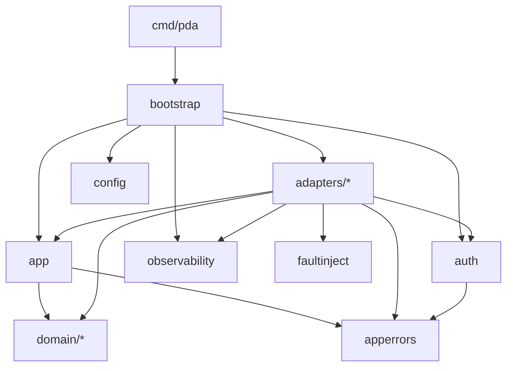

# Estrutura do Projeto

Organização de pastas e arquivos, responsabilidade de cada pacote, regras de dependência entre camadas e convenções de nomes. As tecnologias e ferramentas estão em [`stack.md`](stack.md). A ordem de construção está em [`implementation-plan.md`](implementation-plan.md).

Module path: **`github.com/KaioVinicios/pda`**

---

## 1. Árvore

Arquivos marcados com ⭐ são opcionais (M12). Os `*_test.go` aparecem de forma resumida.

```
pda/
├── api/                                    # contrato HTTP (D-20)
│   ├── openapi.yaml                        # OpenAPI 3.0.3 design-first: fonte única do contrato (M3)
│   ├── swagger.html                        # página do Swagger UI (swagger-ui-dist 5.33.0 via CDN)
│   ├── events.yaml                         # contrato formal dos eventos de saída: envelope + 4 eventos v1 (M4)
│   ├── embed.go                            # package api: //go:embed openapi.yaml swagger.html events.yaml
│   └── requests.http                       # coleção REST Client / JetBrains HTTP Client
│
├── cmd/
│   └── pda/
│       ├── main.go                         # entrypoint: fx.New(bootstrap.Options()...).Run()
│       └── healthcheck.go                  # `pda healthcheck`: sonda /health/ready (healthcheck do compose; imagem distroless)
│
├── internal/
│   ├── bootstrap/                          # composição Fx (único lugar que conhece todos os módulos)
│   │   ├── bootstrap.go                    # Options(): módulos + fx.StopTimeout + logger do Fx
│   │   ├── app_module.go                   # fx.Module("app"): Provide dos casos de uso
│   │   └── bootstrap_integration_test.go   # I07a–c: ValidateApp, Start/Stop, goleak
│   │
│   ├── config/
│   │   ├── config.go                       # struct Config (tags env) + Load()
│   │   ├── validate.go                     # Validate(): fail fast (FX-02)
│   │   ├── module.go                       # fx.Module("config")
│   │   └── config_test.go
│   │
│   ├── domain/                             # SEM fx, net/http, aws, pgx, database/sql (DOM-07); só stdlib
│   │   ├── doc.go                          # package domain: documentação do domínio
│   │   ├── imports_test.go                 # U10: go list -deps sem fx, net/http, aws, pgx
│   │   ├── ident/
│   │   │   ├── ident.go                    # Parse/Valid: UUID canônico em minúsculas (IDs do domínio são string)
│   │   │   └── ident_test.go
│   │   ├── money/
│   │   │   ├── money.go                    # Money (int64 minor units + Currency), Parse, FromMinor, Zero, Add, Sub, Negate, Cmp
│   │   │   ├── currency.go                 # Currency ISO 4217 suportadas (BRL, USD, EUR)
│   │   │   ├── json.go                     # MarshalJSON / UnmarshalJSON ({"amount","currency"})
│   │   │   ├── errors.go                   # ErrInvalidAmount, ErrOverflow, ErrCurrencyMismatch...
│   │   │   ├── money_test.go               # U01a–e
│   │   │   ├── money_fuzz_test.go          # U01f
│   │   │   └── nofloat_test.go             # U01g: varre a AST do pacote em busca de float
│   │   ├── wallet/
│   │   │   ├── wallet.go                   # agregado: Open, Rehydrate, Debit, Credit, OpeningEntry (versão)
│   │   │   ├── ledger_entry.go             # LedgerEntry imutável + Direction
│   │   │   ├── errors.go                   # ErrInsufficientFunds...
│   │   │   └── *_test.go                   # U02, U07, U11
│   │   ├── wagering/
│   │   │   ├── transaction.go              # WagerTransaction: NewExternal, NewOpening, Rehydrate, Snapshot, getters
│   │   │   ├── transitions.go              # Process, Reject, AwaitReference, RescheduleReference, Fail
│   │   │   ├── kind.go                     # Kind + movimento por tipo
│   │   │   ├── status.go                   # Status + terminalidade
│   │   │   ├── origin.go                   # INTERNAL | EXTERNAL e ReceivedVia (HTTP | SQS)
│   │   │   ├── command.go                  # Input cru → Command: validação sem estado (lifecycle §3.1)
│   │   │   ├── payload_hash.go             # JSON canônico + SHA-256 (D-08)
│   │   │   ├── idempotency.go              # CheckIdempotency: replay ou conflito (D-08)
│   │   │   ├── rules.go                    # movimento por tipo e regras R3–R6 da referência
│   │   │   ├── settle.go                   # Settle: §3.4 + R1–R8 + movimento + eventos (HTTP, SQS e worker)
│   │   │   ├── opening.go                  # OpenWallet: carteira + OPENING + lançamento + eventos
│   │   │   ├── retry_policy.go             # ReferenceRetryPolicy: backoff, jitter, TTL, max tentativas
│   │   │   ├── failure.go                  # FailureCode + FailureCategory (catálogo §5)
│   │   │   ├── codes.go                    # InputCode (400/409 nascidos no domínio)
│   │   │   ├── errors.go                   # ErrInvalidTransition, ValidationError, ConflictError...
│   │   │   └── *_test.go                   # U03, U04a–d, U05a–c, U06, U11, U12
│   │   └── events/
│   │       ├── event.go                    # interface Event selada, Type, AggregateType
│   │       ├── envelope.go                 # Envelope + Seal (eventId, correlationId, causationId) + MarshalJSON
│   │       ├── time.go                     # Time: RFC 3339 UTC com 3 casas
│   │       ├── wallet_balance_changed.go
│   │       ├── wager_transaction_processed.go
│   │       ├── wager_transaction_rejected.go
│   │       ├── wager_transaction_pending_reference.go
│   │       └── events_test.go              # U08
│   │
│   ├── apperrors/                          # vocabulário de erros compartilhado (folha, só stdlib)
│   │   ├── kind.go                         # Kind: Input, NotFound, Forbidden, Conflict, Business, Transient, Permanent
│   │   ├── classify.go                     # Classify(err) Kind via errors.As
│   │   └── classify_test.go                # U09a
│   │
│   ├── app/                                # casos de uso + portas (SEM fx, net/http, aws, pgx)
│   │   ├── ports.go                        # UnitOfWork, Repos, WalletRepo... (M2); Clock, IDGenerator, Metrics (M3); OutboxStore (M4)
│   │   ├── errors.go                       # sentinelas (M2) + domainError: erro do domínio → Kind (M3)
│   │   ├── system.go                       # SystemClock e UUIDv7 (implementações padrão das portas)
│   │   ├── seal.go                         # sealEvents: eventos do domínio → envelopes com eventId
│   │   ├── open_wallet.go
│   │   ├── process_wager.go                # caso de uso único para HTTP, SQS e worker (lifecycle §6)
│   │   ├── consume_wager.go                # inbox → validação → ProcessWager, com a inbox na mesma UoW (M5)
│   │   ├── resolve_references.go           # passo do worker (claim → reavaliação)
│   │   ├── queries.go                      # GetWallet, ListLedger, GetTransaction, GetByExternalID
│   │   ├── reconcile.go
│   │   ├── cursor.go                       # cursor opaco do ledger (base64url)
│   │   ├── *_test.go                       # unitários das partes puras (domainError, cursor)
│   │   └── *_integration_test.go           # casos de uso contra o PostgreSQL real, sem fakes (I20–I22, I03b)
│   │
│   ├── auth/
│   │   ├── verifier.go                     # go-oidc: issuer, JWKS URL separada, aud, RS256
│   │   ├── principal.go                    # Principal{Subject, ProviderID, Roles} + contexto
│   │   ├── policy.go                       # matriz de permissões (D-07)
│   │   ├── module.go
│   │   └── *_test.go
│   │
│   ├── adapters/
│   │   ├── postgres/
│   │   │   ├── pool.go                     # pgxpool + OnStart (ping) / OnStop (Close)
│   │   │   ├── querier.go                  # interface interna: pgx.Tx e *pgxpool.Pool
│   │   │   ├── repos.go                    # app.Repos sobre um querier (tx no UoW, pool nas leituras)
│   │   │   ├── uow.go                      # UnitOfWork: Do (lock_timeout) e Snapshot (REPEATABLE READ READ ONLY)
│   │   │   ├── wallet_repo.go
│   │   │   ├── transaction_repo.go
│   │   │   ├── ledger_repo.go
│   │   │   ├── inbox_repo.go
│   │   │   ├── outbox_repo.go              # insert (UoW) + OutboxStore: claim/ack/fail/backlog no pool (publisher)
│   │   │   ├── money_mapping.go            # Money ↔ (BIGINT, CHAR(3))
│   │   │   ├── errors.go                   # SQLSTATE / constraint → apperrors.Kind (U09b)
│   │   │   ├── module.go
│   │   │   └── *_integration_test.go       # I01–I03, I16–I19 (//go:build integration)
│   │   ├── httpapi/
│   │   │   ├── server.go                   # http.Server + lifecycle (Shutdown)
│   │   │   ├── routes.go                   # tabela única de rotas: registra no ServeMux e alimenta o I15
│   │   │   ├── handler.go                  # Services (interfaces pequenas dos casos de uso), Options, handlers
│   │   │   ├── middleware.go               # correlação, log de acesso, recover, fallback 404/405, auth, corpo JSON
│   │   │   ├── wallets_handler.go
│   │   │   ├── wagering_handler.go
│   │   │   ├── health_handler.go
│   │   │   ├── docs_handler.go             # GET /docs e GET /openapi.yaml (públicos, API_DOCS_ENABLED)
│   │   │   ├── dto.go                      # request/response + mapeamento para app/domain
│   │   │   ├── problem.go                  # application/problem+json (RFC 9457)
│   │   │   ├── status.go                   # apperrors.Kind / Status → código HTTP (D-04)
│   │   │   ├── module.go
│   │   │   └── *_test.go
│   │   ├── awsclient/
│   │   │   ├── config.go                   # aws.Config pela cadeia padrão do SDK (AWS_ENDPOINT_URL, AWS_PROFILE...)
│   │   │   ├── queues.go                   # resolve e verifica fila e DLQ no OnStart; checker `sqs`
│   │   │   ├── topic.go                    # ARN do tópico via STS + GetTopicAttributes no OnStart (M4)
│   │   │   └── module.go                   # Provide de *sqs.Client, *sns.Client, *sts.Client, *Queues e *Topic
│   │   ├── sqsconsumer/
│   │   │   ├── consumer.go                 # lifecycle, pollers, semáforo, shutdown em 5 passos
│   │   │   ├── batch.go                    # agrupamento por MessageGroupId
│   │   │   ├── envelope.go                 # WagerTransactionRequested → wagering.Command
│   │   │   ├── handler.go                  # inbox → caso de uso → ação na mensagem
│   │   │   ├── dlq.go                      # envio explícito para a DLQ
│   │   │   ├── backoff.go                  # retryDelay: min(2^receiveCount s, SQS_RETRY_MAX_DELAY)
│   │   │   ├── health_gate.go              # pausa por saúde (messaging §4.3)
│   │   │   ├── module.go
│   │   │   └── *_test.go / *_integration_test.go
│   │   ├── outbox/
│   │   │   ├── publisher.go                # loop claim → publish → ack/fail, lease; portas Sink e Metrics
│   │   │   ├── backoff.go                  # retryDelay (base × 2^attempts, teto) e truncateError
│   │   │   ├── sns_sink.go                 # Publish no SNS FIFO (atributos, group, dedup)
│   │   │   ├── module.go                   # identidade da instância + lifecycle do loop
│   │   │   └── *_test.go / *_integration_test.go
│   │   └── references/
│   │       ├── worker.go                   # loop de claim + app.ResolveReferences
│   │       ├── module.go
│   │       └── *_integration_test.go
│   │
│   ├── observability/
│   │   ├── logger.go                       # slog JSON + helpers de atributos (IDs)
│   │   ├── metrics.go                      # registro Prometheus e catálogo; implementa app.Metrics (fx.As no bootstrap)
│   │   ├── health.go                       # agregador de checkers (value group Fx); os checkers vêm dos adaptadores
│   │   ├── httpserver.go                   # ServeOnLifecycle: Listen síncrono no OnStart, Shutdown no OnStop (API e admin)
│   │   ├── admin_server.go                 # :9090 /metrics
│   │   └── module.go
│   │
│   └── faultinject/
│       ├── faultinject.go                  # API: faultinject.Point("consumer.after_commit_before_delete")
│       ├── faultinject_on.go               # //go:build faultinject → os.Exit(137) quando habilitado
│       └── faultinject_off.go              # //go:build !faultinject → no-op
│
├── migrations/
│   ├── embed.go                            # package migrations: //go:embed *.sql → FS
│   ├── 000001_create_wallets.up.sql / .down.sql
│   ├── 000002_create_wager_transactions.up.sql / .down.sql
│   ├── 000003_create_wallet_ledger_entries.up.sql / .down.sql
│   ├── 000004_create_inbox_outbox.up.sql / .down.sql
│   ├── 000005_protection_triggers.up.sql / .down.sql
│   └── 000006_grant_app_role.up.sql / .down.sql
│
├── deploy/
│   ├── aws/
│   │   ├── init.sh                         # filas, DLQ, redrive, tópico, assinatura, políticas (idempotente)
│   │   └── policies/                       # políticas de identidade por usuário IAM + política da fila de auditoria (messaging §2.1); reutilizadas pelo I04f
│   │       ├── pda-wallet-service.json     # identidade: consumir, DLQ, publicar no tópico
│   │       ├── provider.json               # identidade: SendMessage na fila de entrada (provider-a, provider-b)
│   │       └── wallet-events-audit.json    # recurso: entrega do tópico (aws:SourceArn)
│   ├── keycloak/
│   │   ├── realm-pda.json                  # clients, roles, mappers provider_id e audience (D-07)
│   │   └── realm-other.json                # realm de teste para iss/chaves inválidos
│   └── postgres/
│       └── 01-roles.sh                     # cria pda_owner e pda_app (docker-entrypoint-initdb.d)
│
├── scripts/
│   ├── get-token.sh                        # obtém token client_credentials (fluxos do README)
│   └── dlq-redrive.sh                      # devolve mensagens da DLQ para a fila principal
│
├── test/
│   ├── testkit/                            # utilitários compartilhados (sem build tag)
│   │   ├── env.go                          # NewEnv: banco isolado por pacote (M2); NewTestEnv: banco de um teste só (M4)
│   │   ├── app.go                          # StartApp: Fx em processo com filas e tópico isolados, logs capturados, cliente por identidade e Audit
│   │   ├── root.go                         # RepoRoot: raiz do módulo (go.mod)
│   │   ├── dotenv.go                       # lê .env.example (+ .env) para os testes
│   │   ├── awscreds.go                     # lê .local/aws/credentials (profiles IAM do aws-init)
│   │   ├── aws.go                          # MiniStack com chave raiz ou chaves IAM; filas isoladas
│   │   ├── postgres.go                     # NewDatabase (banco isolado + migrations), AssertLedgerConsistent (parte SQL)
│   │   ├── net.go                          # FreeAddr: porta livre no loopback
│   │   ├── auth.go                         # tokens reais e forjados
│   │   ├── api.go                          # cliente HTTP tipado
│   │   ├── contract.go                     # validação de req/resp contra api/openapi.yaml (kin-openapi)
│   │   ├── event_contract.go               # validação dos eventos contra api/events.yaml (M4)
│   │   ├── events.go                       # tópico + fila de auditoria isolados, com policy e assinatura raw (M4)
│   │   ├── audit.go                        # coletor da fila de auditoria: WaitFor por eventId, todas as entregas (M4)
│   │   ├── sqs.go                          # envelope WagerTransactionRequested, envio, leitura da DLQ, profundidade e fila drenada (M5)
│   │   ├── iam.go                          # políticas de deploy/aws/policies renderizadas e usuários IAM do teste (I04f, M5)
│   │   ├── assert.go                       # AssertWalletConsistent (test-plan §6, itens 1–8), OutboxProblems, OutboxPayloads, SnapshotCounts, Eventually
│   │   └── cluster.go                      # N processos do binário (e2e)
│   ├── integration/                        # //go:build integration — cenários entre componentes
│   ├── e2e/                                # //go:build e2e — multi-instância, falhas, resiliência
│   └── load/ ⭐                            # teste de carga (test-plan §9)
│
├── docs/                                   # documentação do sistema e do projeto
│   ├── delivery-requirements.md
│   ├── decisions.md
│   ├── data-model.md
│   ├── transaction-lifecycle.md
│   ├── messaging.md
│   ├── test-plan.md
│   ├── implementation-plan.md
│   ├── development-workflow.md             # spec → plano → TDD → verificação (regras de qualidade)
│   ├── structure.md
│   ├── stack.md
│   ├── testing.md                          # (M10) preparação e execução dos testes — DOC-04
│   ├── load-test.md ⭐
│   └── dev/                                # anotações do desenvolvedor (ver §6)
│       ├── specs/                          # specs por marco (superpowers:brainstorming)
│       ├── plans/                          # planos por marco (superpowers:writing-plans)
│       └── spike-*.md                      # resultados de spikes
│
├── .github/workflows/ci.yml               # CI só de testes: jobs `unit` (make test) e `integration` (make test-integration com o compose); e2e no M8
├── .dockerignore
├── .editorconfig
├── .env.example
├── .gitignore
├── .golangci.yml
├── ARCHITECTURE.md                         # documento vivo (desde 28/09), fechado no M10
├── CHALLENGE.md
├── Dockerfile
├── docker-compose.yml
├── go.mod
├── go.sum
├── LICENSE
├── Makefile
└── README.md                               # (M10)
```

---

## 2. Camadas e regras de dependência



| Pacote | Pode importar | **Não** pode importar | Verificação |
| --- | --- | --- | --- |
| `domain/*` | stdlib e outros pacotes `domain/*` (`wallet` → `money`, `ident`; `events` → `money`, `ident`; `wagering` → `money`, `wallet`, `events`, `ident`) | `fx`, `net/http`, `aws`, `pgx`, `database/sql`, `app`, `adapters`, `apperrors` | `depguard` + teste U10 |
| `apperrors` | stdlib | Qualquer pacote interno | `depguard` |
| `app` | `domain/*`, `apperrors`, stdlib | `fx`, `net/http`, `aws`, `pgx`, `adapters/*`, `auth` | `depguard` |
| `auth` | `apperrors`, `config`, `go-oidc`, stdlib | `app`, `adapters/*`, `domain/*` | `depguard` |
| `adapters/*` | `app`, `domain/*`, `apperrors`, `auth`, `config`, `observability`, `faultinject`, bibliotecas de infraestrutura | Outros adaptadores (exceção: `sqsconsumer` e `outbox` usam `awsclient`) | Revisão + `depguard` |
| `bootstrap` | Tudo em `internal/` + `fx` | — | — |
| `api` (raiz) | stdlib (`embed`) | Qualquer pacote interno | Revisão. É importado só por `httpapi` e `test/testkit` |
| `cmd/pda` | `bootstrap` e `config` (constante `DefaultHTTPAddr` da sonda `pda healthcheck`) | Qualquer outro pacote interno | Revisão |
| `test/*` | Tudo | — | — |

**Princípios:**
- **As portas pertencem a quem as consome.** As interfaces de repositório e de UoW ficam em `app/ports.go`, e `adapters/postgres` as implementa. O `app` nunca conhece o adaptador.
- **Fx só aparece nas bordas.** `domain` e `app` não importam Fx: os construtores são funções Go comuns, e `bootstrap/app_module.go` os registra com `fx.Provide`. Cada adaptador tem o próprio `module.go` (`fx.Module`), que conecta seus construtores e hooks de `fx.Lifecycle`.
- **Erros atravessam camadas por classificação, não por tipo concreto.** Os adaptadores traduzem erros de infraestrutura (SQLSTATE, erros do SDK AWS) para `apperrors.Kind`. As bordas (`httpapi`, `sqsconsumer`) decidem status HTTP ou ação na mensagem só a partir dessa classificação e do resultado do caso de uso ([`transaction-lifecycle.md`](transaction-lifecycle.md) §8).

---

## 3. Composição Fx

| Módulo | Arquivo | Fornece | Lifecycle |
| --- | --- | --- | --- |
| `config` | `config/module.go` | `config.Config` (validada) | — |
| `observability` | `observability/module.go` | `*slog.Logger`, `*Metrics`, `*Health` | Servidor admin: `OnStart`/`OnStop` |
| `postgres` | `adapters/postgres/module.go` | `*pgxpool.Pool`, repositórios (sobre o pool, para leituras) e `app.UnitOfWork` (que instancia os mesmos repositórios sobre a `pgx.Tx`) | Ping no `OnStart`; `Close` no `OnStop`, depois de todos que o usam |
| `aws` | `adapters/awsclient/module.go` | `*sqs.Client`, `*sns.Client`, `*sts.Client`, `*Queues`, `*Topic` | Verificação da fila, da DLQ e do tópico no `OnStart` (fail fast) |
| `auth` | `auth/module.go` | `*auth.Verifier`, `auth.Policy` | Busca inicial do JWKS no `OnStart` (fail fast) |
| `app` | `bootstrap/app_module.go` | Casos de uso | — |
| `httpapi` | `adapters/httpapi/module.go` | `*http.Server` | `ListenAndServe` / `Shutdown` |
| `sqsconsumer` | `adapters/sqsconsumer/module.go` | `*Consumer` | Pollers / shutdown em 5 passos |
| `outbox` | `adapters/outbox/module.go` | `*Publisher` | Loop / cancelamento + espera |
| `references` | `adapters/references/module.go` | `*Worker` | Loop / cancelamento + espera |

- **Ordem de registro** em `bootstrap.Options()`: config → observability → postgres → aws → auth → app → references → outbox → sqsconsumer → httpapi. O Fx executa os `OnStart` nessa ordem e os `OnStop` na ordem inversa:
  - o HTTP é o último a iniciar, então só aceita tráfego com tudo pronto, e o primeiro a parar;
  - em seguida param o consumidor, o publisher e o worker de referências;
  - o pool do PostgreSQL e os clientes AWS fecham depois de todos os componentes que os usam (FX-04, FX-05).
- **Papéis habilitáveis:** os módulos `httpapi`, `sqsconsumer`, `outbox` e `references` só são incluídos se `HTTP_ENABLED`, `CONSUMER_ENABLED`, `OUTBOX_PUBLISHER_ENABLED` e `REFERENCE_WORKER_ENABLED` forem verdadeiros (D-15).
- **`fx.Invoke`:** força a instanciação dos componentes com lifecycle (servidor, consumidor, publisher, worker), que de outra forma não seriam construídos por falta de dependentes.

---

## 4. Convenções

### 4.1 Nomes

| Item | Convenção | Exemplo |
| --- | --- | --- |
| Pacotes | Minúsculo, singular, sem `_` | `wagering`, `sqsconsumer` |
| Arquivos | `snake_case.go` | `process_wager.go` |
| Construtor com validação | `NewX(...) (X, error)` | `money.Parse`, `wallet.New` |
| Reidratação | `Rehydrate(...)`, sem validações de transição nem eventos | `wagering.Rehydrate(snapshot)` |
| Erros sentinela | `ErrX` | `ErrInsufficientFunds` |
| Erros tipados | `XError`, com `errors.As` | `*ValidationError{Code, Field}` |
| Interfaces (portas) | Substantivo do papel, sem prefixo `I` | `UnitOfWork`, `WalletRepository` |
| Métricas | `snake_case` com unidade no sufixo | `outbox_publish_lag_seconds` |
| Chaves de log | `camelCase` | `correlationId`, `walletId` |
| JSON | `camelCase` | `externalTransactionId` |
| SQL | `snake_case` | `balance_minor` |

### 4.2 Código

- `context.Context` é sempre o primeiro parâmetro de qualquer função com I/O (DOM-06).
- **Sem `panic`** para regra de negócio. `panic` só para bugs de programação, e o middleware de recover o converte em 500 com log.
- **Tempo:** o domínio recebe `now time.Time` como parâmetro e não chama `time.Now()`. `app` usa a porta `Clock`, e os testes injetam um relógio fixo.
- **IDs:** o domínio recebe os IDs prontos, e `app` gera os UUIDv7 pela porta `IDGenerator`.
- **Getters sem prefixo `Get`** (`w.Balance()`) e **campos sempre privados** nas entidades.

### 4.3 Testes

| Tipo | Local | Nome do arquivo | Build tag |
| --- | --- | --- | --- |
| Unitário | Junto ao código | `*_test.go` | — |
| Fuzz | Junto ao código | `*_fuzz_test.go` | — |
| Integração de adaptador | Junto ao adaptador | `*_integration_test.go` | `integration` |
| Integração entre componentes | `test/integration/` | `*_test.go` | `integration` |
| E2E / multi-instância | `test/e2e/` | `*_test.go` | `e2e` |

- **Rastreabilidade:** todo teste que cobre requisito tem o comentário `// Covers: <IDs>` ([`test-plan.md`](test-plan.md) §1).
- **Pacote do teste:** testes unitários de domínio usam o pacote externo (`package money_test`) para testar só a API pública. As exceções usam `package money`, com justificativa no arquivo.

### 4.4 Migrations

- **Formato:** `NNNNNN_verbo_objeto.{up,down}.sql`, numeração sequencial com 6 dígitos.
- **Uma migration aplicada nunca é editada.** Qualquer correção é feita em uma migration nova.
- Todo `up` tem um `down` que o desfaz por completo, e o teste I01 verifica isso.

---

## 5. Build tags

| Tag | Efeito | Usado por |
| --- | --- | --- |
| `integration` | Inclui os testes de integração | `make test-integration` |
| `e2e` | Inclui os testes e2e | `make test-e2e` |
| `faultinject` | Troca o no-op pelos pontos de falha reais | Binário do e2e (`go build -tags faultinject`) |

O binário de produção e a imagem Docker são compilados **sem nenhuma tag**.

---

## 6. `docs/` e `docs/dev/`

| Diretório | Conteúdo | Público |
| --- | --- | --- |
| `docs/` | Documentação do sistema e do projeto: requisitos, decisões, modelo, contratos, testes, planos, estrutura, stack | Avaliadores e mantenedores |
| `docs/dev/` | **Anotações do desenvolvedor** que não documentam o sistema: specs e planos por marco (`specs/`, `plans/`), resultados de spikes, rascunhos, diário de progresso, pendências anotadas e investigações | O autor |

**Regra:** se o conteúdo descreve **como o sistema é ou funciona**, vai para `docs/`. Se descreve **o processo de construção** (o que foi testado, tentado ou anotado), vai para `docs/dev/`. Exemplo: o resultado do spike do MiniStack fica em `docs/dev/spike-ministack.md`, e a decisão que resultar dele entra em `docs/decisions.md`. Do mesmo jeito, uma spec de marco fica em `docs/dev/specs/`, e qualquer decisão nova que ela gere também é registrada em `docs/decisions.md` ([`development-workflow.md`](development-workflow.md) §3.1).
