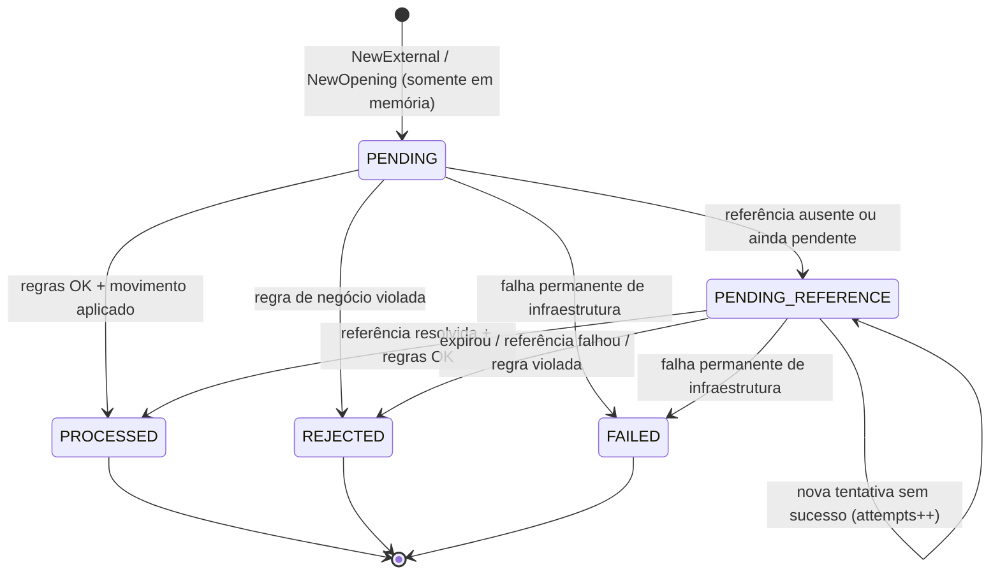

# Ciclo de Vida das Transações

Máquina de estados, regras por tipo de operação, resolução de referências, catálogo de `failureCode` e o pipeline de processamento compartilhado entre HTTP, SQS e o worker de referências. Complementa [`decisions.md`](decisions.md) (D-04 a D-11) e [`data-model.md`](data-model.md).

---

## 1. Máquina de estados



| De | Para | Método do domínio | Gatilho | Eventos na outbox |
| --- | --- | --- | --- | --- |
| — | `PENDING` | `NewExternal(cmd, …)` / `NewOpening(…)` | Comando externo validado, ou abertura interna | — (nunca persistido, D-05) |
| `PENDING` / `PENDING_REFERENCE` | `PROCESSED` | `Process(balanceAfter)` | Regras e movimento OK | `WagerTransactionProcessed` + `WalletBalanceChanged` (se houve movimento) |
| `PENDING` / `PENDING_REFERENCE` | `REJECTED` | `Reject(code, observedBalance)` | Regra de negócio | `WagerTransactionRejected` |
| `PENDING` | `PENDING_REFERENCE` | `AwaitReference(now, policy)` | Referência ausente ou pendente | `WagerTransactionPendingReference` (uma única vez) |
| `PENDING_REFERENCE` | `PENDING_REFERENCE` | `RescheduleReference(now, policy)` | Tentativa sem sucesso, limite não atingido | — |
| `PENDING` / `PENDING_REFERENCE` | `FAILED` | `Fail(code)` | Falha permanente (§8) | — (log `ERROR` + métrica) |
| `PROCESSED` / `REJECTED` / `FAILED` | qualquer | — | — | `ErrInvalidTransition` no domínio e `PDA02` no banco |

**Regras do domínio:**
- Toda transição inválida devolve `ErrInvalidTransition`, verificável com `errors.Is`, e nunca causa `panic`.
- `Rehydrate(snapshot)` reconstrói a transação no estado persistido **sem** passar por transições e **sem** gerar eventos.
- `OPENING` tem um construtor próprio, `NewOpening(id, walletID, playerID, money, now)`. Como toda transação, ela nasce em `PENDING` e é concluída por `Process` na mesma transação SQL da abertura. Não existe atalho que pule a máquina de estados.
- Os eventos são **retornados** pelos métodos de transição como `[]events.Event` (dados tipados, sem `eventId` nem metadados de transporte). O caso de uso monta o envelope (`events.Seal`) e grava na outbox, e a entidade não tem acesso à outbox.
- Cada transição valida os próprios argumentos (ex.: `Process` exige o lançamento coerente com o tipo), então chamá-la diretamente não quebra invariantes.
- A orquestração das §3.4, §4 e §7 fica em funções puras do domínio: `wagering.Settle` (HTTP, SQS e worker) e `wagering.OpenWallet` (abertura). Elas movimentam a carteira só pelo agregado (`Debit`/`Credit`) e devolvem o lançamento e os eventos; o caso de uso só faz I/O.

---

## 2. Regras por tipo

| Tipo | Movimento | `amount` | Referência | Regras com estado (além de jogador e moeda) | `failureCode` possíveis |
| --- | --- | --- | --- | --- | --- |
| `BET` | Débito | `> 0` | Proibida | Saldo `>= amount` | `INSUFFICIENT_FUNDS` |
| `WIN` | Crédito | `> 0` | Opcional → `BET` | Se houver referência: `BET` `PROCESSED`, mesma rodada, carteira, jogador e moeda. O valor pode ser diferente | `REFERENCE_*`, `INVALID_REFERENCE_KIND` |
| `LOSS` | Nenhum | `== 0.00` | Proibida | Nenhuma: não cria ledger nem altera a versão | — (além de jogador e moeda) |
| `REFUND` | Crédito | `> 0` | Obrigatória → `BET` | Referência `PROCESSED`, concordante, valor igual, sem compensação anterior | `REFERENCE_*`, `INVALID_REFERENCE_KIND`, `REVERSAL_AMOUNT_MISMATCH`, `ALREADY_REVERSED` |
| `ROLLBACK` | Contrário ao da referência | `> 0` | Obrigatória → `BET`, `WIN` ou `REFUND` | Igual ao REFUND. Quando o movimento é débito (referência `WIN`/`REFUND`), exige saldo | Os do REFUND + `REVERSAL_INSUFFICIENT_FUNDS` |
| `OPENING` | Crédito | `> 0` | — | Somente interno (`POST /wallets`). Por HTTP ou SQS resulta em 400 `OPENING_NOT_ALLOWED` | — |

**Movimento do ROLLBACK:**

| Referência | Movimento original | Movimento do ROLLBACK |
| --- | --- | --- |
| `BET` | Débito | Crédito |
| `WIN` | Crédito | Débito |
| `REFUND` | Crédito | Débito (volta a cobrar a aposta) |
| `ROLLBACK` | — | Não permitido → `INVALID_REFERENCE_KIND` |

**Compensação única (D-10):**
- Uma `BET` aceita no máximo uma compensação `PROCESSED`, seja `REFUND` ou `ROLLBACK`.
- `WIN` e `REFUND` aceitam no máximo um `ROLLBACK` cada.
- Uma segunda tentativa resulta em `ALREADY_REVERSED`.

**Resultado de `LOSS`:**
- `result_balance_minor` recebe o saldo atual, que é devolvido ao provedor.
- É emitido apenas `WagerTransactionProcessed`, sem `WalletBalanceChanged`.

---

## 3. Ordem de avaliação

A ordem é fixa, para que o `failureCode` seja **determinístico**: a mesma entrada, no mesmo estado, gera sempre o mesmo código.

### 3.1 Sem estado (antes de qualquer I/O de domínio; resulta em 400 e não é persistido)

1. JSON bem formado, sem campos desconhecidos (`DisallowUnknownFields`) e corpo de até 64 KB. Um valor com tipo JSON errado (ex.: `"amount": 25.00`) é detectado aqui e responde com o código do próprio campo (`INVALID_AMOUNT`, `INVALID_CURRENCY`, `INVALID_KIND` ou `INVALID_FIELD`); `null` equivale a ausente.
2. `Idempotency-Key` presente, uma única vez, com 1 a 255 caracteres ASCII visíveis, `^[\x21-\x7E]{1,255}$` (só HTTP; no SQS, é `data.idempotencyKey`).
3. Campos obrigatórios presentes; `playerId` e `walletId` são UUIDs válidos; `providerId`, `externalTransactionId`, `roundId` e `gameId` têm de 1 a 128 caracteres.
4. `kind` válido, e `OPENING` é rejeitado.
5. `money`: formato estrito (D-03) e moeda suportada.
6. Política de valor por tipo: zero só em `LOSS`, e `LOSS` só com zero.
7. Política de referência por tipo: obrigatória, opcional ou proibida. A autorreferência (`reference == externalTransactionId`) é rejeitada.

### 3.2 Autorização (HTTP)

8. `body.providerId == token.provider_id`, ou 403 `PROVIDER_MISMATCH` (D-07).

### 3.3 Idempotência (D-08)

9. Busca por `(providerId, idempotencyKey)`, seguida da busca por `(providerId, externalTransactionId)`. O resultado é replay ou 409. Uma transação achada só pela segunda busca com a **mesma chave** confirmou entre as duas leituras: é replay (D-08).

### 3.4 Com estado (dentro da transação SQL, com a carteira travada)

10. A carteira existe, ou 400 `UNKNOWN_WALLET` (não persistido, D-06).
11. Idempotência verificada de novo, agora sob o lock. Isso evita o caminho de exceção quando há corrida.
12. `playerId` do comando igual ao da carteira, ou `PLAYER_WALLET_MISMATCH`.
13. `currency` igual à da carteira, ou `CURRENCY_MISMATCH`.
14. Resolução da referência (§4), quando aplicável.
15. Saldo suficiente para débitos: `INSUFFICIENT_FUNDS` para `BET`, `REVERSAL_INSUFFICIENT_FUNDS` para `ROLLBACK`.

Os passos 12 a 15 resultam em `REJECTED` persistido (422). No worker de referências, apenas os passos 14 e 15 são reavaliados, porque os dados de 12 e 13 não mudam.

---

## 4. Resolução de referências

A busca é por `(providerId, referenceExternalTransactionId)`, então uma referência de outro provedor simplesmente não é encontrada. O resultado de cada verificação, em ordem:

| # | Situação da referência | Resultado |
| --- | --- | --- |
| R1 | Não encontrada | `PENDING_REFERENCE`. No worker, se o limite se esgotou: `REJECTED` com `REFERENCE_NOT_FOUND` |
| R2 | Encontrada, em `PENDING_REFERENCE` | `PENDING_REFERENCE` (continua aguardando; conta para o limite) |
| R3 | Encontrada, em `REJECTED` ou `FAILED` | `REJECTED` com `REFERENCE_NOT_PROCESSED` |
| R4 | `PROCESSED`, mas de um tipo não aceito pela operação (§2) | `REJECTED` com `INVALID_REFERENCE_KIND` |
| R5 | Jogador, carteira, moeda ou rodada divergentes | `REJECTED` com `REFERENCE_MISMATCH` |
| R6 | Valor diferente (só REFUND e ROLLBACK) | `REJECTED` com `REVERSAL_AMOUNT_MISMATCH` |
| R7 | Já existe uma compensação `PROCESSED` para essa referência | `REJECTED` com `ALREADY_REVERSED` |
| R8 | Tudo OK | Segue para o passo 15 (saldo) |

**Agenda de retentativa (D-11):**

| Parâmetro | Padrão | Env |
| --- | --- | --- |
| Atraso base | 1 s | `REFERENCE_RETRY_BASE_DELAY` |
| Fator | 2 | — |
| Atraso máximo | 60 s | `REFERENCE_RETRY_MAX_DELAY` |
| Jitter | ±20% | — |
| Máximo de tentativas | 8 | `REFERENCE_MAX_ATTEMPTS` |
| TTL | 10 min desde `created_at` | `REFERENCE_TTL` |

- **Expiração:** a operação expira quando `attempts >= max` **ou** `now >= expires_at`, o que vier primeiro. Com os padrões, as 8 tentativas se esgotam em cerca de 3 min. O TTL limita a espera em tempo de relógio, inclusive em períodos sem worker ativo.
- **Retomada antecipada:** quando uma operação chega a um estado terminal (`PROCESSED`, `REJECTED` ou `FAILED`), as pendências que a referenciam são antecipadas para `now()` (data-model §6). Na prática, a pendência é resolvida (ou rejeitada com `REFERENCE_NOT_PROCESSED`) menos de 1 s depois da chegada da referência.

---

## 5. Catálogo de códigos

**Categorias:**

| Categoria | Significado para o provedor |
| --- | --- |
| `CORRECTABLE` | Erro na entrada. Se **não foi persistido** (4xx `problem+json`), corrija e reenvie com a mesma chave. Se **foi persistido** (`REJECTED`), o `externalTransactionId` já está consumido: envie uma nova operação, com novo id, corrigida. |
| `DEFINITIVE` | Resultado de negócio para essa operação. Reenviar não altera o resultado. |
| `TRANSIENT` | Nada foi persistido. Reenvie a mesma requisição, com a mesma chave, depois do `Retry-After`. |

Os corpos de rejeição e de falha incluem `failureCode` e `failureCategory`. Os `problem+json` incluem `code` e `category`.

### 5.1 Rejeições persistidas: `REJECTED` (HTTP 422, corpo de resultado)

| `failureCode` | Categoria | Quando | Tipos |
| --- | --- | --- | --- |
| `INSUFFICIENT_FUNDS` | DEFINITIVE | Aposta maior que o saldo disponível | BET |
| `REVERSAL_INSUFFICIENT_FUNDS` | DEFINITIVE | ROLLBACK que precisaria debitar mais que o saldo | ROLLBACK |
| `ALREADY_REVERSED` | DEFINITIVE | A referência já tem uma compensação `PROCESSED` | REFUND, ROLLBACK |
| `REFERENCE_NOT_FOUND` | DEFINITIVE | A referência não chegou dentro do limite ou TTL | WIN, REFUND, ROLLBACK |
| `REFERENCE_NOT_PROCESSED` | DEFINITIVE | A referência terminou `REJECTED` ou `FAILED` | WIN, REFUND, ROLLBACK |
| `PLAYER_WALLET_MISMATCH` | CORRECTABLE | A carteira pertence a outro jogador | Todos externos |
| `CURRENCY_MISMATCH` | CORRECTABLE | A moeda difere da moeda da carteira | Todos externos |
| `REFERENCE_MISMATCH` | CORRECTABLE | A referência diverge em jogador, carteira, moeda ou rodada | WIN, REFUND, ROLLBACK |
| `REVERSAL_AMOUNT_MISMATCH` | CORRECTABLE | O valor difere do referenciado (não há reversão parcial) | REFUND, ROLLBACK |
| `INVALID_REFERENCE_KIND` | CORRECTABLE | O tipo da referência não é aceito pela operação | WIN, REFUND, ROLLBACK |

### 5.2 Falha permanente persistida: `FAILED` (HTTP 500, corpo de resultado)

| `failureCode` | Categoria | Quando |
| --- | --- | --- |
| `INTERNAL_PERMANENT_FAILURE` | DEFINITIVE | Erro não transitório e fora das regras de negócio: dado corrompido, violação de constraint imprevista (`PDA0x`, `23xxx`) ou overflow |

A transação é gravada como `FAILED` em uma transação SQL **separada**, sem efeito financeiro, para auditoria. Se nem essa gravação for possível, a falha é tratada como transitória. No SQS, essa mesma transação grava a inbox (`outcome = FAILED`), e a mensagem é enviada explicitamente à DLQ com `errorCode = INTERNAL_PERMANENT_FAILURE`, porque o desafio exige que erros permanentes cheguem à DLQ.

### 5.3 Erros não persistidos (`application/problem+json`)

| HTTP | `code` | Categoria | Quando |
| --- | --- | --- | --- |
| 400 | `MALFORMED_REQUEST` | CORRECTABLE | JSON inválido, campo desconhecido ou corpo acima do limite |
| 400 | `MISSING_IDEMPOTENCY_KEY` | CORRECTABLE | Header ausente |
| 400 | `INVALID_IDEMPOTENCY_KEY` | CORRECTABLE | Chave vazia, longa demais ou com caracteres inválidos |
| 400 | `MISSING_FIELD` | CORRECTABLE | Campo obrigatório ausente (`detail` e `field` indicam qual) |
| 400 | `INVALID_FIELD` | CORRECTABLE | Formato inválido: UUID, tamanho etc. |
| 400 | `INVALID_AMOUNT` | CORRECTABLE | Viola `^(0\|[1-9][0-9]*)\.[0-9]{2}$` ou estoura o `int64` |
| 400 | `INVALID_CURRENCY` | CORRECTABLE | Não é ISO 4217 ou não é suportada |
| 400 | `INVALID_KIND` | CORRECTABLE | Tipo desconhecido |
| 400 | `OPENING_NOT_ALLOWED` | CORRECTABLE | `OPENING` enviado por HTTP ou SQS |
| 400 | `ZERO_AMOUNT_NOT_ALLOWED` | CORRECTABLE | Valor zero em BET, WIN, REFUND ou ROLLBACK |
| 400 | `LOSS_AMOUNT_MUST_BE_ZERO` | CORRECTABLE | `LOSS` com valor diferente de `0.00` |
| 400 | `REFERENCE_REQUIRED` | CORRECTABLE | REFUND ou ROLLBACK sem referência |
| 400 | `REFERENCE_NOT_ALLOWED` | CORRECTABLE | BET ou LOSS com referência |
| 400 | `SELF_REFERENCE` | CORRECTABLE | A referência é igual ao próprio `externalTransactionId` |
| 400 | `UNKNOWN_WALLET` | CORRECTABLE | O `walletId` do corpo não existe |
| 401 | `UNAUTHENTICATED` | CORRECTABLE | Token ausente, inválido ou expirado. O `WWW-Authenticate: Bearer error="invalid_token"` não diz qual dos três |
| 403 | `FORBIDDEN` | CORRECTABLE | Role insuficiente para a rota |
| 403 | `PROVIDER_MISMATCH` | CORRECTABLE | O `providerId` do corpo ou do path difere do token |
| 404 | `WALLET_NOT_FOUND` | CORRECTABLE | `GET/POST /wallets/:id…` inexistente |
| 404 | `TRANSACTION_NOT_FOUND` | CORRECTABLE | Transação inexistente **ou de outro provedor** |
| 404 | `ROUTE_NOT_FOUND` | CORRECTABLE | Caminho que não existe na API |
| 405 | `METHOD_NOT_ALLOWED` | CORRECTABLE | Método não aceito pelo caminho (header `Allow`) |
| 409 | `IDEMPOTENCY_KEY_REUSED` | CORRECTABLE | Mesma chave com hash diferente |
| 409 | `EXTERNAL_TRANSACTION_ID_CONFLICT` | CORRECTABLE | `(providerId, externalTransactionId)` já registrado com outra chave |
| 409 | `WALLET_ALREADY_EXISTS` | DEFINITIVE | Já existe carteira para o par `(playerId, currency)` |
| 415 | `UNSUPPORTED_MEDIA_TYPE` | CORRECTABLE | `Content-Type` diferente de `application/json` |
| 500 | `INTERNAL_ERROR` | TRANSIENT | Erro interno sem registro: `panic`, ou falha permanente ao ler uma operação já gravada com a mesma chave. Nada foi persistido, e reenviar com a mesma chave é seguro. Não confundir com o 500 de `FAILED`, que é um corpo de resultado (§5.2) |
| 503 | `TEMPORARILY_UNAVAILABLE` | TRANSIENT | PostgreSQL ou SQS indisponível, timeout ou lock timeout. Inclui `Retry-After: 1` |

### 5.4 Códigos exclusivos do SQS (atributo `errorCode` na DLQ)

| `errorCode` | Categoria | Quando |
| --- | --- | --- |
| `MALFORMED_MESSAGE` | CORRECTABLE | O corpo não é JSON válido, o envelope está incompleto ou tem campo desconhecido |
| `UNSUPPORTED_MESSAGE_TYPE` | CORRECTABLE | `type` diferente de `WagerTransactionRequested` |
| `MESSAGE_HASH_MISMATCH` | CORRECTABLE | O mesmo `messageId` já foi tratado com conteúdo diferente |

Os demais motivos de DLQ reutilizam os códigos de §5.2 e §5.3, por exemplo `INVALID_AMOUNT`, `OPENING_NOT_ALLOWED`, `UNKNOWN_WALLET`, `IDEMPOTENCY_KEY_REUSED` e `INTERNAL_PERMANENT_FAILURE`.

Os códigos são **estáveis**: fazem parte do contrato, e renomear um código conta como quebra de contrato.

---

## 6. Pipelines

Os três canais chamam o **mesmo caso de uso** (`ProcessWagerTransaction`). Só a borda muda.

### 6.1 HTTP — `POST /wagering/transactions`

```
autenticar (401) → autorizar role (403)
→ validar sem estado (400)                       §3.1
→ providerId do corpo == token (403)             §3.2
→ calcular payloadHash
→ buscar idempotência → replay (200/202/422/500) | 409
→ uow.Do:
     SET LOCAL lock_timeout; SELECT wallet FOR UPDATE  (400 UNKNOWN_WALLET)
     verificar idempotência de novo (sob o lock)
     avaliar §3.4 e §4 → PROCESSED | REJECTED | PENDING_REFERENCE
     INSERT wager_transactions
     UPDATE wallets + INSERT ledger     (se houve movimento)
     INSERT outbox_events               (eventos retornados pelo domínio)
     antecipar pendências dependentes   (se terminal)
  COMMIT
→ responder 200 | 202 | 422
  (falha permanente: FAILED gravado em transação separada → 500)
```

Uma violação de unicidade de idempotência (ou de reversão) resulta em rollback e em uma nova execução desde a busca de idempotência, que termina em replay, 409 ou `ALREADY_REVERSED`; são no máximo 3 tentativas, e esgotá-las resulta em 503. Um erro transitório em qualquer ponto resulta em rollback e 503.

A falha permanente é gravada como `FAILED` quando acontece depois do lock da carteira. Se ela vier da própria busca de idempotência (a linha já gravada com essa chave não pode ser lida), não há o que gravar, porque a chave está ocupada: a resposta é 500 `problem+json` `INTERNAL_ERROR`.

### 6.2 SQS — `wager-transactions.fifo`

```
receber → parsear o envelope (inválido → DLQ)
→ calcular messageHash
→ buscar inbox (consumerName, messageId):
     mesmo hash      → DeleteMessage (duplicata; métrica)
     hash diferente  → DLQ (MESSAGE_HASH_MISMATCH)
→ validar sem estado (inválido → DLQ com o code de §5.3)
→ buscar idempotência:
     replay          → uow.Do { INSERT inbox (IDEMPOTENT_REPLAY) } → DeleteMessage
     conflito        → DLQ (IDEMPOTENCY_KEY_REUSED | EXTERNAL_TRANSACTION_ID_CONFLICT)
→ uow.Do: igual ao HTTP + INSERT inbox (outcome) na mesma transação
→ COMMIT → DeleteMessage
```

| Resultado | Ação na mensagem |
| --- | --- |
| `PROCESSED`, `REJECTED`, `PENDING_REFERENCE`, replay | `DeleteMessage` **depois** do commit |
| Duplicata (inbox com o mesmo hash) | `DeleteMessage` |
| Inválida, hash divergente, conflito de idempotência, `UNKNOWN_WALLET` | `SendMessage` para a DLQ com o atributo `errorCode`, seguido de `DeleteMessage` |
| `FAILED` persistido (com a inbox, em transação separada) | Envio explícito para a DLQ (`INTERNAL_PERMANENT_FAILURE`), seguido de `DeleteMessage` |
| Transitória | Nada é removido. `ChangeMessageVisibility` com backoff; após `maxReceiveCount = 10`, a redrive leva à DLQ. Numa queda geral do banco, os pollers pausam (`messaging.md` §4.3) |
| Violação da PK da inbox no commit (dois consumidores, mesma mensagem) | Rollback e tratamento como duplicata: `DeleteMessage` |

### 6.3 Worker de referências

```
tx curta: SELECT id … WHERE status='PENDING_REFERENCE' AND next_attempt_at <= now()
          FOR UPDATE SKIP LOCKED LIMIT n     → lista de IDs
para cada ID, uow.Do:
     SELECT wallet FOR UPDATE → SELECT transaction FOR UPDATE
     se status != PENDING_REFERENCE → ignorar (outra instância já tratou)
     reavaliar §3.4 passos 14–15:
        resolvida      → PROCESSED (+ movimento, ledger, eventos)
        falha de regra → REJECTED
        ainda ausente  → expirou? REJECTED REFERENCE_NOT_FOUND : RescheduleReference
  COMMIT
falha permanente → FAILED (transação separada)
```

### 6.4 Abertura de carteira — `POST /wallets`

```
autenticar + role wallet-internal
→ validar (playerId UUID, initialBalance >= 0, moeda suportada)
→ uow.Do:
     INSERT wallets (version = 1, balance = inicial)   (409 WALLET_ALREADY_EXISTS)
     se inicial > 0:
        NewOpening (PENDING) → Process → INSERT wager_transactions (OPENING, INTERNAL, PROCESSED)
        INSERT ledger (CREDIT, before = 0, after = inicial, wallet_version = 1)
        INSERT outbox: WagerTransactionProcessed + WalletBalanceChanged
  COMMIT
→ 201
```

`POST /wallets` não tem `Idempotency-Key`. A idempotência vem da unicidade `(playerId, currency)`: repetir a abertura resulta em 409, conforme o desafio.

---

## 7. Eventos por resultado

| Resultado | `WagerTransactionProcessed` | `WalletBalanceChanged` | `WagerTransactionRejected` | `WagerTransactionPendingReference` |
| --- | :-: | :-: | :-: | :-: |
| `PROCESSED` BET, WIN, REFUND ou ROLLBACK | ✅ | ✅ | | |
| `PROCESSED` LOSS | ✅ | | | |
| `PROCESSED` OPENING (saldo > 0) | ✅ | ✅ | | |
| Abertura com saldo 0 | | | | |
| `REJECTED` (inclusive por expiração) | | | ✅ | |
| Entrada em `PENDING_REFERENCE` | | | | ✅ |
| Nova tentativa sem sucesso | | | | |
| `FAILED` | | | | |
| Replay (HTTP ou SQS) | | | | |

Os contratos dos eventos (envelope, payloads e roteamento) ficam em `messaging.md`.

---

## 8. Falhas transitórias × permanentes

| Classe | Exemplos | HTTP | SQS | Worker de referências / outbox |
| --- | --- | --- | --- | --- |
| **Transitória** | Erro de conexão ou rede, `context.DeadlineExceeded`, SQLSTATE `08*`, `40001`, `40P01`, `55P03`, `57P01`, `53300`, throttling ou 5xx do SQS/SNS | 503 + `Retry-After`, sem persistir | Não remove a mensagem; `ChangeMessageVisibility` com backoff | Rollback; o item volta na próxima varredura |
| **Permanente** | `PDA01`–`PDA05`, `23xxx` imprevisto, `22003` (overflow), falha de reidratação | 500 + `FAILED` persistido | `FAILED` + inbox persistidos, envio à DLQ e `DeleteMessage` | `FAILED` persistido |
| **Negócio** | §5.1 | 422 | `DeleteMessage` | `REJECTED` |
| **Entrada** | §5.3 (400/409) | 4xx | DLQ + `DeleteMessage` | — |

`context.Canceled` durante o shutdown **não** é tratado como falha: a transação é desfeita e a mensagem tem a visibilidade liberada (D-12).

A classificação fica em um único ponto, `apperrors.Classify(err)`, e é testada com os SQLSTATEs reais nos testes de integração. Um erro que nenhuma camada classificou é tratado como **transitório** (D-05).

---

## 9. Cenários de referência

Estes cenários servem de roteiro para os testes de concorrência e recuperação (TST-C*).

**C1 — 100.00 vs 2 × 80.00 (CONC-05)**
A e B chegam juntas e disputam o `FOR UPDATE`. A trava a carteira, debita e fica com saldo 20.00 (versão 2, 1 lançamento). B espera, lê 20.00 e recebe `REJECTED` com `INSUFFICIENT_FUNDS` e `result_balance = 20.00`. Os reenvios de A e B devolvem os mesmos resultados com `idempotentReplay: true`.

**C2 — REFUND antes da BET (TST-C07)**
O REFUND chega, R1 se aplica e ele fica `PENDING_REFERENCE` (202). Quando a BET chega e é `PROCESSED`, a mesma transação antecipa a pendência. O worker trava a carteira, resolve R8 e o REFUND vira `PROCESSED`. Resultado: dois lançamentos (débito e crédito) e saldo igual ao inicial.

**C3 — REFUND sem BET**
As tentativas se esgotam, ou o TTL vence. O REFUND vira `REJECTED` com `REFERENCE_NOT_FOUND`, é emitido `WagerTransactionRejected` e não há lançamento.

**C4 — REFUND e ROLLBACK sobre a mesma BET**
O REFUND é processado e ocupa o espaço de compensação. O ROLLBACK da BET cai em R7 e recebe `REJECTED` com `ALREADY_REVERSED`. O débito foi devolvido uma única vez.

**C5 — ROLLBACK do REFUND e depois um novo REFUND**
O ROLLBACK que referencia o REFUND debita de novo o valor, e a BET volta a ficar cobrada. Um novo REFUND da BET cai em R7 (o espaço continua ocupado pelo primeiro REFUND) e é rejeitado. O saldo líquido é o da BET debitada, e nenhum crédito é devolvido duas vezes.

**C6 — Mesma operação por HTTP e SQS (TST-C10)**
O HTTP processa com a chave K. Depois chega pelo SQS a mensagem M1 com a mesma chave K e o mesmo conteúdo. Como a inbox não conhece M1, a busca de idempotência encontra K com o mesmo hash, e o caminho é o de replay: a inbox registra M1 como `IDEMPOTENT_REPLAY` e a mensagem é removida. Resultado: um único lançamento.

**C7 — Crash depois do commit e antes do `DeleteMessage` (TST-C05)**
Depois do visibility timeout, a mensagem M1 é reentregue e a inbox já tem M1 com o mesmo hash. A mensagem é tratada como duplicata e removida, sem novo lançamento.
